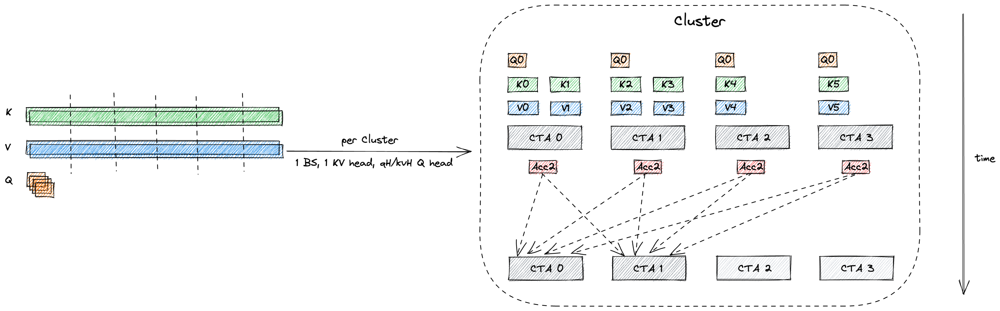
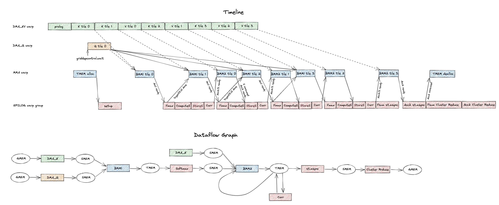
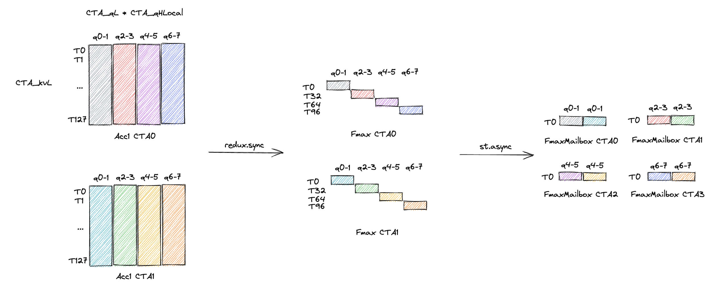
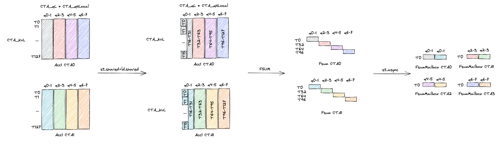
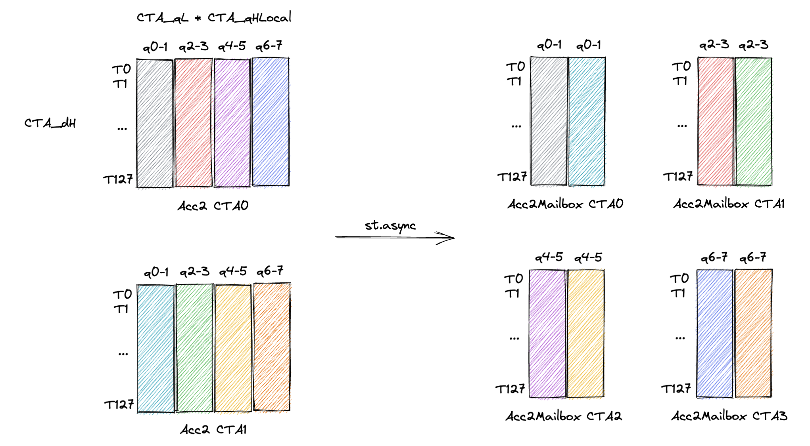

# Blackwell Low Latency GQA

This example introduces TGV GQA, a CuTe C++-based Blackwell kernel optimized for low latency (low batch) generation phase GQA.
To compile and run this example:
```bash
# in cutlass top level directory
mkdir build && cd build
cmake .. -DCUTLASS_NVCC_ARCHS=100a -DCUTLASS_ENABLE_TESTS=OFF -DCUTLASS_ENABLE_EXAMPLES=ON -DCUTLASS_ENABLE_LIBRARY=OFF
cd examples/93_blackwell_low_latency_gqa
make
./93_blackwell_low_latency_gqa --kvL 8192 --kvH 8 --qH 64 --BS 1
```

Supported configs are:
- dH = 64/128
- bf16/fp8 non block scaling kv cache, fp32/bf16/fp8 output
- QKVO are all dH major
- Arbitrary seq len and batch size
- CUDA graph support
- Flash decoding, configurable number of splits
- Cluster reduction with configurable number of reduction cta
- Attention sink and sliding window

Unsupported features are:
- Persistent schedule
- MTP
- Paged KV cache

## Kernel Design

Each cluster (of size `1x1xMAX_SPLITS`) works on a single kv head in a batch.
It divides the kvL (kv sequence length) evenly into each CTA in the cluster in flash decoding style.
And the final reduction is performed by `NUM_REDUCTION_CTA` number of CTAs in the cluster in parallel.



The example figure above shows a problem size of 1 batch, 2 KV heads, 4 Q heads.
Each cluster processes 1 batch, 1 KV head, 2 Q heads.
And the KV sequence length is divided into 6 128-length tiles, and we evenly distribute the 6 tiles to 4 CTAs in the cluster.
CTA0 and CTA1 will get 2 tiles while CTA2 and CTA3 will get 1 tile each.
In the reduction phase of flash decoding, in this configuration, only 2 CTAs in the cluster will participate in the final reduction.
So each of CTA in the cluster will send their partial results (`Acc2`) to the 2 reduction CTAs in the cluster.

We have 7 warps in total, 1 for DMA_Q, 1 for DMA_KV, 1 for MMA, 4 for EPILOG (softmax + cluster reduction).
The imagine below shows the how the data flows across the warps as well as how the control dependencies are established between the warps.



## Fmax Reduction Mapping

We want to get fmax for each column (q token) of the fmax tensor.
Each thread individually get fmax for all q tokens using credux (and inter warp reduction). 
Then T0,32,64,96 stores the local fmax to destination cta's dsmem for whole cluster wide fmax reduction.
Each reduction cta will hold the cluster wide fmax values of 2 q tokens (8 q tokens in total, divided by 4 reduction ctas).



## Fsum Reduction Mapping

We want to get fsum for each column (q token) of the fsum tensor.
Do a reswizzle of fsum tensor in rmem through smem such that each thread holds a partial column of the fsum tensor.
Then do intra-thread and intra-warp reduction to get the fsum for each column (q token).
Then T0,32,64,96 stores the local fsum to destination cta's dsmem for whole cluster wide fsum reduction.
Each reduction cta will hold the cluster wide fsum values of 2 q tokens (8 q tokens in total, divided by 4 reduction ctas).



## Acc2 Reduction Mapping

Each thread in the reduction cta will be responsible for generating 2 q tokens in the final output tensor (8 q tokens in total, divided by 4 reduction ctas).
The reduction is a scaled accumulation (similar to the correction step in attention mainloop).


