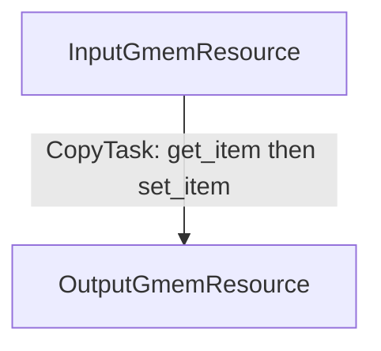
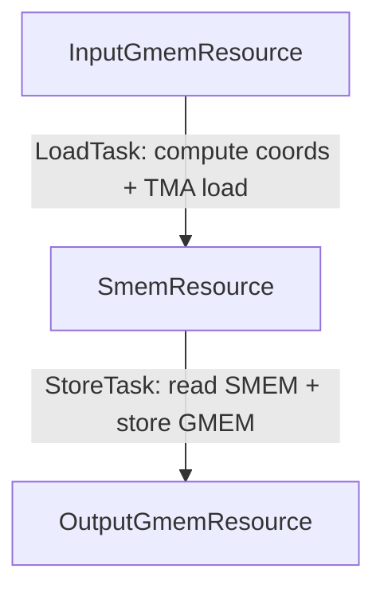

These kernels are intended only for TS educational purposes. State-of-the-art performance is not guaranteed.

# Tutorial 01: Copy Basics

## Contents

- [The Mental Model](#the-mental-model)
- [Kernel 01: GMEM Grid-Stride Copy](#kernel-01-gmem-grid-stride-copy)
- [Kernel 02: TMA Copy](#kernel-02-tma-copy)
- [Kernel 03: Conditional Schedule Guards](#kernel-03-conditional-schedule-guards)
- [PipelineConfig](#pipelineconfig)
- [SMEM Allocation](#smem-allocation)
- [`try_*` Versus Blocking Calls](#try_-versus-blocking-calls)
- [Warp Specialization and Padding](#warp-specialization-and-padding)
- [Raw Kernel Comparison](#raw-kernel-comparison)
- [What To Remember](#what-to-remember)
- [How To Run](#how-to-run)

This is the first TS tutorial. It is written for someone who can already read
CUDA, CuTe DSL or CUTLASS Primitives kernels, including warp-specialized kernels, but has
not used TS before.

The purpose of TS is not to hide GPU programming behind the abstractions. The kernel developer 
still writes the actual memory loading logic, calls tensor cores, etc. 
TS provides a structured way to express the asynchronous schedule in warp-specialized kernels
that can be statically verified for correctness.

This tutorial has three kernels:

| # | File | Why it exists |
|---:|---|---|
| 01 | [01_copy_grid_stride.py](01_copy_grid_stride.py) | The smallest useful TS shape: two GMEM resources, one task. |
| 02 | [02_copy_tma.py](02_copy_tma.py) | The first real producer/consumer pipeline: a TMA load task asynchronously loads from global memory to shared memory, a store task reads from shared memory and stores to global, and TS validates the pipeline ordering. |
| 03 | [03_copy_tma_conditional.py](03_copy_tma_conditional.py) | Same TMA pipeline as kernel 02, plus guarded schedule blocks: ``d.first_iter()``, ``d.every()``, ``when_true(aux-work-token)``, and ``d.last_iter()``. |

Read kernel 01 first even if it looks trivial. It introduces the vocabulary used
by every GEMM, FMHA, MoE, etc. kernel later.

## The Mental Model

A hand-written warp-specialized kernel usually looks like this:

```text
if warp_idx == load_warp:
    compute coords
    acquire empty stage
    issue TMA
    commit full stage
else:
    wait full stage
    consume SMEM
    release empty stage
```

TS breaks it down and structures the patterns:

| Hand-written kernel | TS concept |
|---|---|
| Physical memory buffer | A `MemoryResource` subclass. |
| This group of warps does this work | A `Task` with `warp_idx`, `num_warps`, and `schedule`. |
| In this warp group, wait for a barrier, then call some instruction, then arrive to the barrier, etc. | An explicit schedule function decorated with `@schedule` with explicit synchronization and work methods. |
| This data must be ready before that data is produced | An edge in the `resource_dependency_graph` map. |

The split is deliberate. TS encourages the developer to be explicit about the roles, data ownership and operations order
in the producer-consumer pipeline, and it checks the correctness of the schedule
and pipeline initializations before lowering the schedule to the selected warp
branches.

## Kernel 01: GMEM Grid-Stride Copy

[01_copy_grid_stride.py](01_copy_grid_stride.py) copies a 1D `int16`
tensor from one global memory location to another global memory location via
registers. There is no SMEM, no pipeline, and a single task. It is the smallest
kernel that still exercises every core TS declaration, so we use it to
introduce the whole vocabulary.

The dataflow we want to express is one element moving from source GMEM to
destination GMEM per loop iteration. CUTLASS Primitives bare metal code without TS:
```python
@cute.kernel
def gmem_copy_naive_kernel(
    num_entries: cutlass.Int32,
    source_tensor: cute.Tensor,
    destination_tensor: cute.Tensor,
    num_warps: cutlass.Constexpr,
):
    gdimx, _, _ = cute.arch.grid_dim()
    bx, _, _ = cute.arch.block_idx()
    tx, _, _ = cute.arch.thread_idx()
    gid = bx * num_warps * 32 + tx
    for i in cutlass.range(gid, num_entries, gdimx * num_warps * 32):
        destination_tensor[i] = source_tensor[i]
```

It can be viewed as:

```text
InputGmemResource -- item --> OutputGmemResource
```



### Step 1: What resources are needed, and why

For this copy, there are two separate physical resources:
the source global memory and the destination global memory. So we declare one resource for
each. Neither owns SMEM or a pipeline here; they only own a tensor handle and the
logic to read an element from resource or write an element to the resource. 

```python
@dataclass(kw_only=True)
class InputGmemResource(MemoryResource):
    source_tensor: cute.Tensor
    num_entries: cutlass.Int32
    num_warps: int
    ...

@dataclass(kw_only=True)
class OutputGmemResource(MemoryResource):
    destination_tensor: cute.Tensor
    num_entries: cutlass.Int32
    num_warps: int
    ...
```

### Step 2: How to define the work on each resource (producer vs consumer)

The kernel developer is still responsible for providing the logic 
how the data is written to resource (producer work) and 
how it is read from the resource (consumer work).

The work each resource does is declared as methods decorated with
`@producer_work` or `@consumer_work`.

- `@consumer_work` reads a value **out of** the resource.
- `@producer_work` writes a value **into** the resource.

So in this kernel:

- `InputGmemResource.get_item()` is `consumer_work`, because it reads an element
  out of the input tensor.
- `OutputGmemResource.set_item()` is `producer_work`, because it writes an
  element into the output tensor.

```python
@consumer_work(returns=item)
@cute.jit
def get_item(self, stage_info: StageInfo) -> cutlass.Int16:
    gid = stage_info.loop_offset
    val = cutlass.Int16(0)
    if gid < self.num_entries:
        val = self.source_tensor[gid]
    return val
```

```python
@producer_work
@cute.jit
def set_item(self, stage_info: StageInfo, data: cutlass.Int16) -> None:
    gid = stage_info.loop_offset
    if gid < self.num_entries:
        self.destination_tensor[gid] = data
```

For every resource the kernel developer must spell out how it is produced and consumed by writing
these work methods themselves; TS does not generate them. Each work method has two
requirements:

- It must be decorated with `@producer_work` or `@consumer_work` on the outside
  and `@cute.jit` on the inside, in that order. The TS decorator registers the
  method with the resource, and `@cute.jit` compiles its body.
- Its signature follows a fixed shape. The first parameter is `self`, the second
  is always `stage_info: StageInfo`, which TS injects to carry the current loop
  and pipeline context (here `stage_info.loop_offset`). Any additional value the
  work needs as input is declared later as keyword or positional argument (for example
  `data: cutlass.Int16` on `set_item`), and any value the work emits downstream
  is declared with `returns=...` on the decorator plus a matching Python
  `return`.

So the two methods describe a complete contract: `get_item()` takes no extra
input and returns the loaded `item`, while `set_item()` takes that value as
`data` and returns nothing. `stage_info.loop_offset` is the active coordinate of
the loop that drives the schedule. For this grid-stride copy it is the global
element id. We will see this later in the schedule specification.

### Step 3: How a value flows between resources (captured values)

`get_item()` produces a value that `set_item()` must consume. That value is
declared as a `TaskLocalVariable` on the resource that *owns* the value (the
input resource, which produces it):

```python
@dataclass(kw_only=True)
class InputGmemResource(MemoryResource):
    item: cutlass.Constexpr[TaskLocalVariable] = TaskLocalVariable.uninitialized()

    def __post_init__(self) -> None:
        self.item = TaskLocalVariable(
            dtype=cutlass.Int16,
            default=cutlass.Int16(0),
            docs="Input element loaded for the current grid-stride iteration.",
        )
```

The consumer work declares that it emits this variable with `returns=item`, and
its Python `return` statement supplies the runtime value.

One rule: do **not** read or write `self.item` inside
producer or consumer work. The field is metadata the schedule builder uses to
track the dataflow edge; it is not the live runtime payload. The payload travels
through the method `return` value and the schedule's named binding, which we set
up next.

### Step 4: How to define the schedule

The schedule is the explicit set of operations specified for each asynchronous task. 
It is specified as a function decorated with
`@schedule` that calls resource work methods in order. This is the TS version of
the grid-stride loop:

```python
@schedule
def schedule_fn(
    input_gmem: InputGmemResource,
    output_gmem: OutputGmemResource,
) -> None:
    threads_per_block = num_warps * 32
    start = bx * threads_per_block + tx
    step = gdimx * threads_per_block
    with domain_loop(start, num_entries, step, unroll=unroll):
        res = input_gmem.get_item()
        output_gmem.set_item(data=res)
```

Two things are happening here, and both are captured rules rather than ordinary
Python execution:

- `domain_loop(...)` is captured loop control flow. It does not run a Python
  loop during capture; it records the loop bounds and exposes the active
  coordinate to every work method as `stage_info.loop_offset`.
- `res = input_gmem.get_item()` does not load an `int16` during capture.
  TS records that `get_item()` produces a
  task-local value and that `set_item(data=res)` consumes that same value later
  in the same task.

It helps to read the schedule as a description of the loop that TS will
generate. The `domain_loop` becomes the actual grid-stride loop with the `start`,
`num_entries`, `step`, and `unroll` you passed, and each work-method call is
inlined at the point where it appears. For this kernel the captured schedule
lowers to roughly the plain CUTLASS-primitives loop you would have written by
hand:

```python
threads_per_block = num_warps * 32
start = bx * threads_per_block + tx
step = gdimx * threads_per_block
for gid in cutlass.range(start, num_entries, step, unroll=unroll):
    # inlined input_gmem.get_item(), with stage_info.loop_offset == gid
    res = cutlass.Int16(0)
    if gid < num_entries:
        res = source_tensor[gid]
    # inlined output_gmem.set_item(data=res)
    if gid < num_entries:
        destination_tensor[gid] = res
```

The schedule body looks like normal imperative code but must follow
the capture rules: the value names connect a producer call to a consumer call,
and the call order defines the ordering TS will enforce. In the later examples
the schedule will be more complicated, calling pipeline operations and several
resources.

### Step 5: How to define the dependency graph

Separately from the captured value, TS needs to know the resource-level
ordering. The dependency graph states that the output resource depends on the
input resource:

```python
resource_dependency_graph = {
    output_gmem_resource: [input_gmem_resource],
}
```

The graph is not a replacement for passing `res` through the schedule, and it
does not always mean the same thing. The graph records a dependency between the resources:
the output resource can not be produced before the input resource is consumed.
While the captured value says *which scalar value* moves from `get_item()` to
`set_item()`. Sometimes developer might choose to not return any variable from `consumer_work`
to the downstream `producer_work` for several reasons, but the dependency graph
still must record the relation between two resources.

### Step 6: How to define the task

A task is the unit of warp specialization. It binds a captured schedule to a
range of warps and declares which resources it consumes and produces:

```python
task = Task(
    name="CopyTask",
    src_resources=[input_gmem_resource],
    dst_resources=[output_gmem_resource],
    warp_idx=0,
    num_warps=num_warps,
    schedule=schedule_fn(input_gmem_resource, output_gmem_resource),
)
```

The same producer/consumer-from-the-resource rule decides where each resource
goes:

- If a task calls a resource's **consumer** work (the task reads out of the resource), this resource goes into the task's `src_resources`;
- If a task calls a resource's **producer** work (the task writes into the resource), this resource goes into the task's `dst_resources`;

This task reads out of input GMEM and writes into output GMEM, so input is a
source and output is a destination. `schedule` is the object returned by
*calling* `schedule_fn(...)`, i.e. the captured schedule itself.

### Step 7: TaskManager and the fixed lifecycle

`TaskManager` validates the skeleton and executes the selected schedule for each
warp:

```python
task_manager = TaskManager(
    tasks=[task],
    resource_dependency_graph=resource_dependency_graph,
)
task_manager.setup_resources_and_tasks()
task_manager.run()
```

The lifecycle is always the same, and it needs to be in the order in which the steps above
appear in the kernel:

1. Create resources.
2. Create the dependency graph.
3. Capture schedules.
4. Create tasks.
5. Create `TaskManager` (this is where TS validates and wires the
   skeleton).
6. Call `setup_resources_and_tasks()` (this is where TS initializes shared memory barriers)
7. Call barrier init fences and synchronize threads.
8. Call `run()`. This is where the appropriate Tasks are selected for each warp and those tasks run attached explicit schedule.

This same lifecycle appears in every later tutorial.

## Kernel 02: TMA Copy

[02_copy_tma.py](02_copy_tma.py) copies a 2D FP16 matrix by staging one
128-column tile through SMEM. It reuses every concept from kernel 01 and adds the
first true producer/consumer pipeline. Walk through it as "kernel 01, but the
value now travels through a shared buffer instead of a register."

### Why the resource layout changes

In kernel 01 the values go straight from one global memory (GMEM) resource to another via registers. Here the
hardware path is different: TMA copies from GMEM **into shared memory (SMEM)**, and then store
warps read **out of SMEM** and write to GMEM. SMEM is a buffer that two
different warp groups touch, so it has its own resource:

```text
InputGmemResource -> SmemResource -> OutputGmemResource
    coordinates       staged tile       GMEM output
```

The key new idea is that `SmemResource` is *both* a destination and a source:

- TMA writes into SMEM  -> `SmemResource` is a producer target (`tma_load` is `producer_work`)
- load values from SMEM to registers -> `SmemResource` is a consumer source (`read_smem` is `consumer_work`)

The same resource-point-of-view rule from kernel 01 applies, but now one resource
plays both roles depending on which task you look at.

### Why there are now two tasks

In kernel 01 a single task did everything. Here the load side and the store side
run on different warps and on different sides of the SMEM pipeline.
Due to the staged shared memory, TMA loading task can run ahead of store task
as long as there is a free stage of shared memory. So we split
the work into two asynchronous tasks. The first task moves data GMEM -> SMEM; the second moves
it SMEM -> GMEM:

- `LoadTask`:  acquire empty SMEM stage -> `tma_load()`  -> commit full stage
- `StoreTask`: wait full SMEM stage     -> `read_smem()` -> release empty stage

Each task gets its own captured schedule. The load schedule runs on warp 4. It
computes a tile coordinate and issues TMA into SMEM:

```python
@schedule
def load_schedule(input_gmem: MemoryResource, smem: MemoryResource) -> None:
    smem.init_load_state()
    with domain_loop(0, num_rows, box_dim[1]):
        gmem_idx = input_gmem.compute_coords()
        smem.try_acquire()
        smem.acquire()
        smem.tma_load(gmem_idx=gmem_idx)
        smem.commit()
```

`gmem_idx` is the same kind of captured dataflow edge as `res` was in kernel 01:
`compute_coords()` (consumer work on the input resource) emits it, then `smem` resource is acquired -- there must be free slot for data to be written to.
`tma_load(gmem_idx=...)` (producer work on the SMEM resource) consumes coordinates and runs the TMA
for them. Then the buffer is committed signaling that the data was written to the `smem` resource.

The store schedule runs on warps 0-3. It waits for the full SMEM stage, reads
each thread's element, releases the stage, and stores to output GMEM:

```python
@schedule
def store_schedule(smem: MemoryResource, output_gmem: MemoryResource) -> None:
    smem.init_read_state()
    with domain_loop(0, num_rows, box_dim[1]):
        smem.try_wait()
        smem.wait()
        smem_val = smem.read_smem()
        output_gmem.store(smem_val=smem_val)
        smem.release()
```

Notice the difference between the two kinds of calls in these schedules. Methods
like `compute_coords()`, `tma_load()`, `read_smem()`, and `store()` are *kernel developer's*
producer/consumer work, named by developer and defined on the resources. The calls
`try_acquire`, `acquire`, `commit`, `try_wait`, `wait`, and `release` are
**not** work methods the developer defines. They are fixed, TS-managed pipeline operations
that every pipelined resource exposes, and their names are reserved: they always
mean the same thing for every asynchronous producer/consumer pipeline.

- Producer side: `try_acquire` -> `acquire` (claim an empty stage) -> ... ->
  `commit` (publish the filled stage).
- Consumer side: `try_wait` -> `wait` (wait for a full stage) -> ... ->
  `release` (free the stage back to the producer).

Because these names are reserved for the pipeline protocol, the developer cannot name producer or consumer work `acquire`, `commit`, `wait`, `release`, etc.
The work methods (the TMA load, the SMEM read, the GMEM store) must be placed *inside* these
brackets.

That is also why the pipeline calls live in the captured schedule, not hidden
inside the TMA work method. Keeping the synchronization calls visible in the
schedule serves several purposes:
- Schedule is explicitly defined by the user and TS can verify its correctness.
- Performance optimization is easier -- the developer can experiment with the schedule and move waits/acquires/commits/releases around in order to better overlap stages or hide latencies without fear of breaking the code.
TS will fail before emitting the kernel if new schedule is invalid.
- Resource producing and consuming logic is separate from the execution order what gives better code readability and maintainability.

The dependency graph now has two edges, SMEM resource depends on
input GMEM, output GMEM depends on the SMEM:

```python
resource_dependency_graph = {
    smem_resource: [input_gmem_resource],
    output_gmem_resource: [smem_resource],
}
```



#### Schedule correctness note

```python
@schedule
def store_schedule(smem: MemoryResource, output_gmem: MemoryResource) -> None:
    smem.init_read_state()
    with domain_loop(0, num_rows, box_dim[1]):
        smem.try_wait()
        smem.wait()
        smem_val = smem.read_smem()
        smem.release()
        output_gmem.store(smem_val=smem_val)
```

I.e. calling `smem.release()` before `output_gmem.store` is also a valid schedule and is allowed by the TS verifier. 
Releasing before the `store` provides potentially better performance -- 
SMEM resource becomes available earlier so loading data in load task can happen in 
parallel to storing to GMEM in store task. 

We can do that because the data consumed from shared memory is read into registers.
So the resource can be released after the consumer work. However, it is not always possible,
e.g. when the producer work of the dependent resource is doing DMA operation --
tensor-core MMA, issuing TMA, etc. The pipeline can't be released before the respective producer work.
See [Tutorial 02: Schedule correctness note: release ordering with DMA consumers](../02_gemm_simple_ts/README.md#schedule-correctness-note-release-ordering-with-dma-consumers)
for a concrete example of a schedule that TS rejects for this reason.


### PipelineConfig

A shared buffer touched by two warp groups needs a pipeline to guard it. We
declare what kind of pipeline by giving `SmemResource` a `PipelineConfig`:

```python
pipeline_config = PipelineConfig.create_tma_async_pipeline_cfg(
    num_stages=num_stages,
    num_bytes=box_dim[0] * box_dim[1] * cutlass.Float16.width // 8,
    producer_group=pipeline.CooperativeGroup(pipeline.Agent.Thread),
    consumer_group=pipeline.CooperativeGroup(
        pipeline.Agent.Thread,
        num_warps_epilogue * 32,
    ),
)
```

We use the `create_tma_async_pipeline_cfg` factory because of how both ends of
this pipeline behave, and the name reflects both. The `tma` part is the producer:
TMA writes into SMEM asynchronously and signals completion through an mbarrier
with a transaction-byte count. This factory builds exactly that protocol: the
producer `commit` arms the mbarrier with an expected byte count, and the consumer
`wait` blocks until the hardware reports that many bytes have landed. The `async`
suffix is the consumer side: the consumer is asynchronous threads, so its `release` is
ordered through the mbarrier. A different producer or consumer (for example warps that write
SMEM directly, or an async `cp.async` copy, or tensor cores as consumer of the data) 
would use a different factory, because the way "the stage is full" or "the stage is free" 
is signalled is different. We will cover this in the next tutorials.

The arguments tell TS what guards the SMEM storage:

- `num_stages` — how many in-flight SMEM buffers the pipeline rotates through.
  More stages let the producer run ahead of the consumer. Here it is `1` to keep
  the example simple; the schedule shape is identical when a later kernel uses
  more stages.
- `num_bytes` — bytes transferred per stage, computed from the tile shape and the
  element width (`box_dim[0] * box_dim[1] * cutlass.Float16.width // 8`). This is
  the transaction-byte count the consumer `wait` watches, so it must match what
  `tma_load` actually transfers.
- `producer_group` — the cooperative group that fills a stage. The producer is
  the load task, and only one elected thread issues the TMA and signals the
  barrier, so the group is a single `Agent.Thread`.
- `consumer_group` — the cooperative group that drains a stage. The consumer is
  the store task running on the 4 epilogue warps, so the group is
  `num_warps_epilogue * 32` threads. All of those threads must reach `release`
  before the stage is handed back to the producer.

TS cross-checks these group sizes against the warp counts of the tasks that
call the producer/consumer work, so a mismatch between the pipeline config and
the actual schedule is caught during setup.

### SMEM Allocation

TS manages shared memory allocations and tracks how much shared memory is used
by each resource. It uses `SmemAllocation` to define the shared memory region.
And it specifies how much shared memory it needs via `get_smem_requirements()`:

```python
self._alloc_smem = SmemAllocation(
    "smem_data",
    dtype=cutlass.Float16,
    count=num_stages * tile_size,
    alignment=128,
)

def get_smem_requirements(self):
    return [self._alloc_smem]
```

The kernel hands that resource to a `SmemAllocator`:

```python
allocator = SmemAllocator()
allocator.add_resource(smem_resource)
allocator.compute_layout()
```

The allocator packs the SMEM payload and the pipeline barrier storage into one
shared-memory block. The resource materializes its typed `cutlass.Array` view in
auxiliary work methods:

```python
@producer_work(work_attrs=WorkAttr.AUXILIARY)
def init_load_state(...):
    ...

@consumer_work(work_attrs=WorkAttr.AUXILIARY)
def init_read_state(...):
    ...
```

Auxiliary work is special type of producer and consumer works. They are still captured in the schedule, 
but their order in the schedule is not verified against dependency graph, waits/releases/acquires/commits
etc. Auxiliary work is only used for helper code that does not touch the actual resource data, e.g. to hoist pointer setup code from the loop. 
Do not mark work as auxiliary if it reads or writes the resource payload. TMA loads,
SMEM reads, MMA, GMEM stores, and etc. should stay as normal producer or
consumer work so TS can validate their ordering.

### `try_*` Versus Blocking Calls

The minimal producer bracket is:

```python
smem.acquire()
smem.tma_load(...)
smem.commit()
```

The minimal consumer bracket is:

```python
smem.wait()
smem_val = smem.read_smem()
smem.release()
```

The tutorial uses `try_acquire()` and `try_wait()` before the blocking calls:

```python
smem.try_acquire()
smem.acquire()
```

The `try_*` call starts an asynchronous barrier query early.
If it succeeds, the matching `acquire()` or `wait()` call immediately falls through,
otherwise that call blocks until the barrier flips.
Use the split form when there is independent work to place between the early query
and the blocking call, or if several `try_*` calls for different resources can be
grouped to run concurrently.

In this example, these optional calls merely serve an illustrative purpose,
to match the schedule shape in more realistic GEMM examples.

### Warp Specialization and Padding

The TMA copy uses 8 warps:

| Task | Warps | Registers | Role |
|---|:--:|---:|---|
| `StoreTask` | 0-3 | 160 | Waits on SMEM, reads each element, stores output GMEM. |
| `LoadTask` | 4 | 40 | Computes coordinates and issues TMA into SMEM. |
| `PaddingTask` | 5-7 | 40 | Covers the rest of the warp group for register-budget validation. |

CUDA register reallocation operates on warp groups of four contiguous warps.
TS therefore checks that every warp in the same group has a declared
`num_registers` value. Warps 4-7 are one group; only warp 4 does useful load
work, so `PaddingTask` gives warps 5-7 the same register budget and an empty
captured schedule. Padding task is not needed if `num_registers` is `None`.

### Raw Kernel Comparison

The same file contains `tma_copy_raw_kernel`, a hand-written CUTLASS Python Primitives
version. It manually creates SMEM storage, mbarrier storage, TMA pipeline
participants, and `if warp_idx == 4` branching.

The TS version computes the same result, but expresses the branch structure and
barrier protocol through:

- `SmemResource` with a `PipelineConfig`,
- `LoadTask`, `StoreTask`, and `PaddingTask`,
- `load_schedule` and `store_schedule`,
- `resource_dependency_graph={smem: [input_gmem], output_gmem: [smem]}`,
- `TaskManager.setup_resources_and_tasks()` and `TaskManager.run()`.

That is the reason TS exists: the low-level work remains explicit, but the
schedule is now a checked object instead of scattered control flow.

## Kernel 03: Conditional Schedule Guards

[03_copy_tma_conditional.py](03_copy_tma_conditional.py) extends kernel 02 with
guarded regions inside ``domain_loop``. The TMA load/store pipeline is
unchanged; a side ``trace`` tensor records when each guard fires so the host can
verify the schedule after launch.

The copy grid launches one CTA per 128-column tile. Trace markers are global
schedule evidence rather than per-column-tile data, so only CTA ``blockIdx.x ==
0`` writes them. Store-side trace calls run in a four-warp store task, so those
markers are further gated to the first store warp before ``elect_sync()``
elects one active lane for the scalar marker store.

| Guard kind | Syntax | Task | Purpose |
|---|---|---|---|
| First iteration | ``with d.first_iter():`` | Load | Write a begin marker on row 0 |
| Periodic | ``with d.every(4, start=0):`` | Load | Heartbeat marker every four rows |
| Opaque runtime | ``with when_true(smem.is_highlight_tile()):`` | Store | Tag the host-selected ``highlight_row`` |
| Last iteration | ``with d.last_iter():`` | Store | Write an end marker on the final row |

The opaque guard uses ordinary auxiliary consumer work on ``SmemResource``, a
source resource of the store task. ``TraceGmemResource`` owns only the marker
writes:

```python
is_highlight: cutlass.Constexpr[TaskLocalVariable] = TaskLocalVariable.uninitialized()

@consumer_work(work_attrs=WorkAttr.AUXILIARY, returns=is_highlight)
@cute.jit
def is_highlight_tile(self, stage_info: StageInfo) -> cutlass.Boolean:
    return stage_info.loop_offset == cutlass.Int32(self.highlight_row)
```

During capture, ``smem.is_highlight_tile()`` returns the work-call token backed
by the ``is_highlight`` task-local slot; at runtime TS evaluates the method
once, stores the result, and runs the guarded block only when that stored value
is true. The verifier enumerates opaque
assignments (here a single key, so two schedule variants) in addition to
unrolling iteration predicates exactly.

Load schedule (iteration guards):

```python
with domain_loop(0, num_rows, box_dim[1]) as d:
    with d.first_iter():
        trace.mark_begin()
    with d.every(4, start=0):
        trace.record_heartbeat()
    gmem_idx = input_gmem.compute_coords()
    smem.try_acquire()
    smem.acquire()
    smem.tma_load(gmem_idx=gmem_idx)
    smem.commit()
```

Store schedule (opaque + last iteration):

```python
with domain_loop(0, num_rows, box_dim[1]) as d:
    smem.try_wait()
    smem.wait()
    smem_val = smem.read_smem()
    smem.release()
    is_highlight = smem.is_highlight_tile()
    with when_true(is_highlight):
        trace.mark_highlight()
    output_gmem.store(smem_val=smem_val)
    with d.last_iter():
        trace.mark_end()
```

When ``num_rows == 1``, the first and last iteration coincide, so both
``d.first_iter()`` and ``d.last_iter()`` blocks run on that single iteration.

## What To Remember

- A resource is the unit of ownership. It may own physical storage, a pipeline,
  task-local values, or only coordinate logic.
- A task is the unit of warp specialization. It owns a warp range and a captured
  schedule.
- A captured schedule is an ordering contract. It records resource method calls,
  pipeline brackets, loop structure, and captured value flow.
- The dependency graph is a resource-ordering contract. It is separate from
  captured scalar values.
- Producer and consumer names are from the resource's point of view: producer
  work writes into the resource, consumer work reads out of it.
- Pipelined producers use `acquire` then `commit`; pipelined consumers use
  `wait` then `release`.
- `TaskManager.setup_resources_and_tasks()` is where TS validates and wires the
  resource/task skeleton before `run()`.

## How To Run

```bash
python 01_copy_grid_stride.py
python 02_copy_tma.py --rows_cols 256,512
python 02_copy_tma.py --rows_cols 256,512 --run-raw-kernel
python 03_copy_tma_conditional.py --rows_cols 256,512 --highlight-row 128
```
