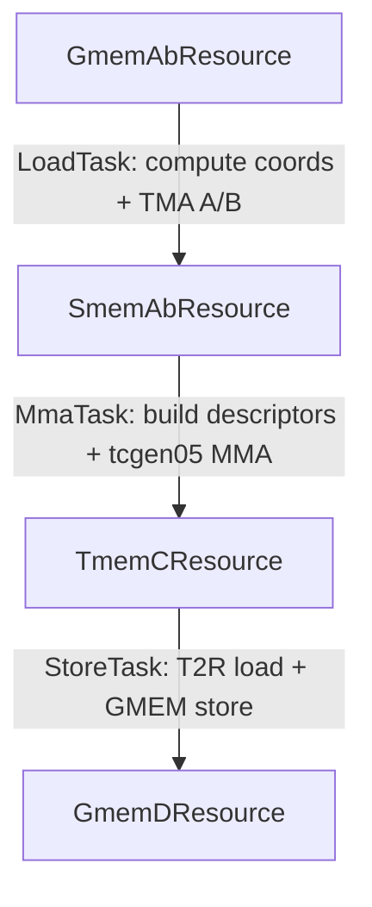

These kernels are intended only for TS educational purposes. State-of-the-art performance is not guaranteed.

# Tutorial 02: Simple FP16/BF16 GEMM

## Contents

- [What Changes After Tutorial 01](#what-changes-after-tutorial-01)
- [Kernel Shape](#kernel-shape)
- [Pipeline Types And `PipelineConfig`](#pipeline-types-and-pipelineconfig)
- [Resources](#resources)
- [Tasks](#tasks)
- [Schedule Walkthrough](#schedule-walkthrough)
- [Reading The Extra Validation Output](#reading-the-extra-validation-output)
- [Captured Values](#captured-values)
- [Allocators and Setup](#allocators-and-setup)
- [How To Run](#how-to-run)

This tutorial applies the TS model from tutorial 01 to a real
warp-specialized GEMM. The kernel is
[01_fp16_bf16_gemm_3.py](01_fp16_bf16_gemm_3.py).

It computes:

```text
D = A @ B
```

The host creates:

- `A` with shape `(M, K)`,
- `B` with shape `(N, K)`,
- `D` with shape `(M, N)`.

The validation reference uses `torch.nn.functional.linear`, so `B` uses the
same row-major `(N, K)` layout that PyTorch linear expects.

## What Changes After Tutorial 01

The TMA copy had one staged resource:

```text
GMEM coordinates -> SMEM tile -> GMEM output
```

This GEMM has a deeper chain and more resources:

```text
GmemAbResource -> SmemAbResource -> TmemCResource -> GmemDResource
```

That chain corresponds to the hardware pipeline:

1. Compute A/B tile coordinates from CTA id and K-loop position.
2. TMA-load A and B for these coordinates into staged SMEM.
3. Build SMEM descriptors and issue Tensor Cores with the accumulation results in tensor memory (TMEM).
4. Load TMEM subtiles into registers, and store the result to GMEM.

`TmemCResource` is a new resource that calls Tensor Cores (that write to TMEM) on the producer side (mma task) and 
loads data from TMEM to registers on the consumer side (in store task).

## Kernel Shape

One CTA computes one `128 x 256` output tile. The K dimension is processed in
`64`-element TMA stages.

```text
CTA output tile:      128 rows x 256 columns
K stage:              64 elements
MMA instruction:      128 x 256 x 16
SMEM A stages:        3
SMEM B stages:        3
TMEM accumulator:     2 stages
```

The resource dependency graph is linear:

```python
resource_dependency_graph = {
    smem_ab_resource: [gmem_ab_resource],
    tmem_c_resource: [smem_ab_resource],
    gmem_d_resource: [tmem_c_resource],
}
```

Read it as:

```text
before SMEM A/B can be produced, the GMEM coordinates must be consumed
before TMEM C can be produced, SMEM A/B must be written
before GMEM D can be produced, TMEM C must be produced
```



## Pipeline Types And `PipelineConfig`

Tutorial 01's TMA copy used a single `TmaAsync` pipeline. This GEMM introduces
two more pipeline shapes: a TMA-to-MMA pipeline for the SMEM operands and an
MMA-to-thread pipeline for the TMEM accumulator. This is a good point to explain
the TS pipeline naming convention before walking through the resources that use
them.

TS pipeline names use:

```text
<producer mechanism><consumer mechanism>
```

The producer side is the task side that calls:

```text
ProducerAcquire -> ProducerWork -> ProducerCommit
```

The consumer side is the task side that calls:

```text
ConsumerWait -> ConsumerWork -> ConsumerRelease
```

The names describe the hardware mechanism that signals each side of the
pipeline.

Another way to read the name is: the first half describes how the resource is
filled, and the second half describes how the resource is drained.

The pipeline types used here are:

| Pipeline type | Producer side | Consumer side | Typical use |
|---|---|---|---|
| `TmaUmma` | TMA transaction | UMMA consumer | GEMM mainloop: TMA fills SMEM A/B tiles, MMA consumes them. This tutorial uses this for `SmemAbResource`. |
| `UmmaAsync` | UMMA producer | Thread/async consumer | MMA writes an accumulator, epilogue threads later consume it. This tutorial uses this for `TmemCResource`. |

Choose the pipeline type from the operations in the resource's work methods.
In this file:

- If `producer_work` issues TMA and the consumer is MMA, use `TmaUmma`.
- If `producer_work` issues MMA and the consumers are just threads that are doing work on SM, use
  `UmmaAsync`.

TS does not infer this from the Python body of `producer_work` or
`consumer_work`. `PipelineConfig` is a declarative promise: the user says what
kind of hardware protocol the resource is using, how many stages it has, how
many bytes a transaction covers when that matters, and which producer and
consumer groups participate.

Use the factory methods rather than constructing `PipelineConfig` directly:

```python
PipelineConfig.create_tma_umma_pipeline_cfg(...)
PipelineConfig.create_umma_async_pipeline_cfg(...)
```

The common fields are:

| Field | What to provide |
|---|---|
| `num_stages` | Pipeline depth, usually the number of buffered SMEM/TMEM stages. |
| `num_bytes` | Transaction bytes per stage for TMA and CLC-style transaction barriers. |
| `producer_group` | Cooperative group for the task side that commits full stages. |
| `consumer_group` | Cooperative group for the task side that releases empty stages. |
| `cta_layout_vmnk` | Cluster layout for cluster-scoped, UMMA, and CLC pipelines. |
| `producer_signaling_threads` / `consumer_signaling_threads` | Optional narrowing of which CTA/thread subset signals barriers. |

The cooperative groups are not decorative. They describe how many barrier
arrivals the pipeline should see from the tasks that touch the resource. TS
derives the actual participants from task warp ranges, task resource lists, the
pipeline type, signaling-thread settings, and the dependency graph. The rough
arrival model is:

| Mechanism | Arrival shape |
|---|---|
| Thread/async side | One arrival per participating thread, unless signaling is narrowed. |
| TMA side | One elected arrival/transaction for the TMA producer path. |
| UMMA side | One `tcgen05` commit-style arrival for the UMMA operation. |
| CLC fetch side | One scheduler transaction arrival for the fetched tile. |

If the config says "128 consumer threads" but the consuming task owns only one
warp, or if a resource is declared as a TMA producer while no task actually
backs that dependency edge, validation should fail before the kernel runs.

Then pass the config to the resource:

```python
smem_resource = SmemResource(
    name="SmemAb",
    pipeline_config=PipelineConfig.create_tma_umma_pipeline_cfg(...),
    ...
)
```

Once the declaration is present, TS checks the consistency it can know
statically:

- the task that produces the resource uses producer stages, and the task that
  consumes it uses consumer stages;
- producer work is bracketed by acquire/commit and consumer work is bracketed by
  wait/release;
- the dependency graph has task-backed edges for the declared resource flow;
- the producer and consumer task warp counts match the cooperative group sizes
  expected by the chosen pipeline;
- DMA-style ordering is safe, for example an upstream SMEM stage is not released
  before the downstream async operation that reads it has been launched.

These checks catch many bad schedules early, but they do not make an incorrect
pipeline type correct. If a work method issues TMA but the resource is declared
as `AsyncAsync`, TS will validate the wrong protocol and the resulting kernel will either hang or have a race condition. 
Pick the pipeline type to match the hardware operation in the producer and consumer work.

## Resources

### `GmemAbResource`

`GmemAbResource` has no memory allocation and no pipeline: its readiness is
implicitly implied by the kernel launch itself. Inside the kernel, it provides
the coordinates to the global memory: its consumer work computes three
task-local values:

| Value | Meaning |
|---|---|
| `coord_k` | K offset for the current TMA stage. |
| `coord_m` | M offset for the CTA output tile. |
| `coord_n` | N offset for the CTA output tile. |

```python
@consumer_work(returns=(coord_k, coord_m, coord_n))
def compute_coords(self, stage_info: StageInfo):
    bx, by, _ = cute.arch.block_idx()
    coord_k = stage_info.loop_offset * mma_tiler_mnk[2]
    coord_m = bx * mma_tiler_mnk[0]
    coord_n = by * mma_tiler_mnk[1]
    return coord_k, coord_m, coord_n
```

The schedule passes those captured values into the SMEM producer work:

```python
coord_k, coord_m, coord_n = gmem_ab.compute_coords()
smem_ab.tma_load(coord_k=coord_k, coord_m=coord_m, coord_n=coord_n)
```

This is the same pattern as tutorial 01's `item` value, just with three
coordinates instead of one scalar payload.

### `SmemAbResource`

`SmemAbResource` owns the staged shared-memory tiles for both operands. It has
one TMA-to-UMMA pipeline guarding the combined A/B payload.

| Allocation | Per stage | Stages |
|---|---:|---:|
| `smem_a` | `128 x 64` elements | 3 |
| `smem_b` | `256 x 64` elements | 3 |

It has producer work for the load task:

```python
smem_ab.try_acquire()
smem_ab.acquire()
smem_ab.tma_load(coord_k=coord_k, coord_m=coord_m, coord_n=coord_n)
smem_ab.commit()
```

and consumer work for the MMA task:

```python
smem_ab.try_wait()
smem_ab.wait()
desc_a_base, desc_b_base = smem_ab.build_descriptors()
tmem_c.mma(desc_a_base=desc_a_base, desc_b_base=desc_b_base)
smem_ab.release()
```

`stage_info.stage_idx` is the current pipeline stage. TMA writes to the SMEM at that stage;
descriptor construction reads from the stage after the wait.

Auxiliary methods such as `init_load_state()` and `init_descriptors()` create
typed SMEM views from the allocator-owned `stage_info.context.smem_base`.

### `TmemCResource`

`TmemCResource` owns the FP32 accumulator tile in TMEM. Its pipeline is between
the MMA task and the store task:

```text
MmaTask:   acquire accumulator -> tcgen05_mma            -> commit accumulator
StoreTask: wait accumulator    -> TMEM to register loads -> release accumulator
```

The TMEM allocation is declared on the resource:

```python
TmemAllocation("tmem_acc", mma_tiler_mnk[1] * acc_stages)
```

With `mma_tiler_mnk[1] == 256` and `acc_stages == 2`, this is 512 TMEM columns.
TS tracks that ownership through `TmemAllocator`, but the hardware allocation
and deallocation still happen explicitly in `_run_gemm_execution()` with
`nvvm.tcgen05_alloc()` and `nvvm.tcgen05_dealloc()`.

The MMA producer work issues one `tcgen05_mma` per `16`-wide K block inside the
current `64`-wide TMA stage. `scale_d` is false for the first block and true for
later blocks so the instruction accumulates into the existing output tile.

The store task consumes TMEM through `load_subtile()`. Each call returns a
register fragment `t2r_rmem`, which is passed into `GmemDResource.store(...)`.

### `GmemDResource`

`GmemDResource` is the output sink. Its `store()` method is `producer_work` because
it writes into the output GMEM resource.

The `store()` method uses:

- `block_idx()` for the CTA output tile,
- `thread_idx()` for the row inside the output tile,
- a `subtile_idx: cutlass.Constexpr[int]` argument for the 32-column subtile index.

`subtile_idx` matters because the same `load_subtile()` and `store()` work methods
are called repeatedly in a constexpr loop to drain all `N` subtiles. The schedule
passes the subtile ordinal explicitly as a compile-time argument
(`load_subtile(subtile_idx=subtile_idx)`, `store(..., subtile_idx=subtile_idx)`).

## Tasks

The CTA uses 8 warps. TS assigns them as follows:

| Task | Warps | Registers | Resource edge | Role |
|---|:--:|---:|---|---|
| `StoreTask` | 0-3 | 160 | `TmemCResource -> GmemDResource` | Drains accumulator subtiles and stores output. |
| `LoadTask` | 4 | 40 | `GmemAbResource -> SmemAbResource` | Computes A/B coordinates and TMA-loads to SMEM. |
| `MmaTask` | 5 | 40 | `SmemAbResource -> TmemCResource` | Builds descriptors and issues MMA. |
| `PaddingTask` | 6-7 | 40 | none | Covers the remaining warps in the 4-7 warp group. |

The padding task exists for the same reason as in tutorial 01: register
reallocation requires full four-warp groups.

## Schedule Walkthrough

### Load Task

The load task fills SMEM A/B stages:

```python
@schedule
def load_schedule(gmem_ab: MemoryResource, smem_ab: MemoryResource) -> None:
    smem_ab.init_load_state()
    with domain_loop(0, num_k_tiles, 1):
        coord_k, coord_m, coord_n = gmem_ab.compute_coords()
        smem_ab.try_acquire()
        smem_ab.acquire()
        smem_ab.tma_load(coord_k=coord_k, coord_m=coord_m, coord_n=coord_n)
        smem_ab.commit()
```

This is the TMA copy producer pattern from tutorial 01, now with two TMA loads
inside one producer work method.

### MMA Task

The MMA task consumes each full SMEM stage and accumulates into TMEM:

```python
@schedule
def mma_schedule(smem_ab: MemoryResource, tmem_c: MemoryResource) -> None:
    smem_ab.init_descriptors()
    tmem_c.init_accumulator_state()
    tmem_c.init_work_tile_state()
    tmem_c.try_acquire()
    tmem_c.acquire()
    with domain_loop(0, num_k_tiles, 1):
        smem_ab.try_wait()
        smem_ab.wait()
        desc_a_base, desc_b_base = smem_ab.build_descriptors()
        tmem_c.mma(desc_a_base=desc_a_base, desc_b_base=desc_b_base)
        smem_ab.release()
    tmem_c.commit()
```

Notice the nested producer/consumer role:

- for `SmemAbResource`, the MMA task is a consumer;
- for `TmemCResource`, the same task is a producer.

That is why the task lists SMEM as a source resource and TMEM as a destination
resource.

The accumulator is acquired before the K loop and committed after the K loop.
That schedule says "all K stages contribute to this one output tile before the
store task may consume it."

#### Schedule correctness note: release ordering with DMA consumers

Tutorial 01 showed that `smem.release()` can be moved *before* the dependent
`output_gmem.store(...)`, because the store task consumes the SMEM data into
registers first (`smem_val = smem.read_smem()`). Once the bytes are in
registers, the SMEM stage is free to be refilled, so releasing early lets the
load task run ahead.

The MMA task here looks structurally similar, but the rule is the opposite.
`smem_ab` is consumed by a tensor-core MMA operation (tensor cores read the operands
directly out of shared memory), so this release ordering is **required**:

```python
smem_ab.try_wait()
smem_ab.wait()
desc_a_base, desc_b_base = smem_ab.build_descriptors()
tmem_c.mma(desc_a_base=desc_a_base, desc_b_base=desc_b_base)
smem_ab.release()
```

Moving the release before the MMA, the way tutorial 01 moved it before the
store, produces an invalid schedule that would raise a failure in TS verification:

```python
smem_ab.try_wait()
smem_ab.wait()
desc_a_base, desc_b_base = smem_ab.build_descriptors()
smem_ab.release()                                              # WRONG
tmem_c.mma(desc_a_base=desc_a_base, desc_b_base=desc_b_base)   # reads SMEM
```

`build_descriptors()` does not move any data; it only computes the SMEM
descriptor bases. The tensor cores read the actual A/B tiles out of shared
memory *asynchronously* during `tmem_c.mma(...)`. Releasing the SMEM stage
first publishes an empty-slot credit to the load task, which is then free to
TMA-load the next K tile over the same SMEM that the in-flight MMA is still
reading. That is a read/write race on the SMEM buffer.

This is exactly the DMA-style ordering check from the
[tutorial 01 PipelineConfig section](../01_copy_basics_ts/README.md): an
upstream resource must not be released before the downstream DMA operation
that reads it (here, the `TmaUmma` pipeline's UMMA consumer) has been launched.
TS knows `SmemAbResource` uses a `TmaUmma` pipeline, so its consumer side is a
DMA reader, not a register read. It rejects the schedule above before emitting
the kernel rather than letting the race reach the GPU.

The general rule: a consumed resource may be released right after the consumer
work only when that consumer work has fully drained the data (typically into
registers). When the consumer work merely *launches* an async operation that
keeps reading the resource (tensor cores, an issued TMA, etc.), the
release must come after that operation, and TS enforces it.

### Store Task

The store task waits for the completed accumulator and drains it:

```python
@schedule
def store_schedule(tmem_c: MemoryResource, gmem_d: MemoryResource) -> None:
    tmem_c.init_store_state()
    with domain_loop(0, num_k_tiles, 1):
        pass
    tmem_c.try_wait()
    tmem_c.wait()
    for _i in cutlass.range_constexpr(subtile_cnt):
        t2r_rmem = tmem_c.load_subtile()
        gmem_d.store(t2r_rmem=t2r_rmem)
    tmem_c.release()
```

The empty K loop is intentional. It places store work in the tail phase of the
task schedule so the store task consumes TMEM only after the MMA task commits the
complete accumulator.

## Reading The Extra Validation Output

`TaskManager` also reports register budgeting, SMEM/TMEM allocator usage, and
the exhaustive interleaving checker result. For this tutorial, the important
outcome is that all four tasks fit the 8-warp CTA, the allocator stays within
hardware capacity, and the checker reports no deadlocks or resource-aliasing
races for the declared producer/consumer schedule.

## Captured Values

The kernel uses captured values to connect resource work:

| Captured value | Produced by | Consumed by |
|---|---|---|
| `coord_k`, `coord_m`, `coord_n` | `GmemAbResource.compute_coords()` | `SmemAbResource.tma_load()` |
| `desc_a_base`, `desc_b_base` | `SmemAbResource.build_descriptors()` | `TmemCResource.mma()` |
| `t2r_rmem` | `TmemCResource.load_subtile()` | `GmemDResource.store()` |

All of these are declared as `TaskLocalVariable` fields on the producing
resource. Work methods pass them through return values and keyword arguments.
They are not read directly from `self.<field>` inside work methods.

## Allocators and Setup

`_create_gemm_pipeline()` builds the TS skeleton:

1. Create `SmemAllocator`.
2. Add a small SMEM allocation for the TMEM pointer mailbox.
3. Create all resources.
4. Add SMEM resources to `SmemAllocator` and compute the SMEM layout.
5. Add TMEM resources to `TmemAllocator` and compute the TMEM layout.
6. Create tasks.
7. Create the resource dependency graph.
8. Create `TaskManager`.

`_run_gemm_execution()` then performs the runtime setup:

1. Call `task_manager.setup_resources_and_tasks()`.
2. Fence mbarrier initialization.
3. Allocate TMEM columns with `nvvm.tcgen05_alloc()` and relinquish
   the right to allocate with `nvvm.tcgen05_relinquish_alloc_permit()`.
4. Synchronize the MMA and store tasks on the TMEM allocation.
5. Call `task_manager.run()`.
6. Synchronize store warps to complete any outstanding TMEM loads.
7. Deallocate TMEM with `nvvm.tcgen05_dealloc()`

This split is worth remembering. TS owns schedule validation and resource
layout. Some hardware actions, such as TMEM allocation, still remain explicit in
the kernel.

## How To Run

```bash
python 01_fp16_bf16_gemm_3.py --mnk 512,512,512 --dtype fp16
python 01_fp16_bf16_gemm_3.py --mnk 512,512,512 --dtype bf16
```

Supported options:

| Option | Meaning |
|---|---|
| `--mnk M,N,K` | GEMM problem size. |
| `--dtype fp16\|bf16` | Input, output, and validation dtype. |
| `--tolerance VALUE` | Absolute tolerance for `torch.testing.assert_close`. |

Shape constraints:

- `M % 128 == 0`
- `N % 256 == 0`
- `K % 64 == 0`
