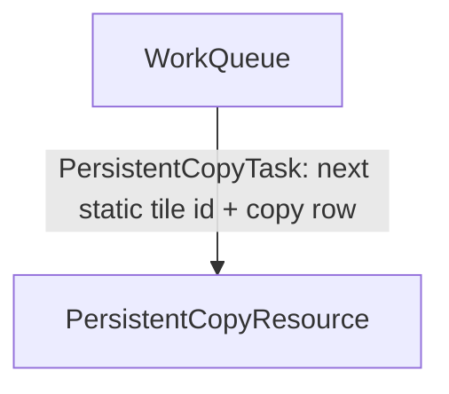
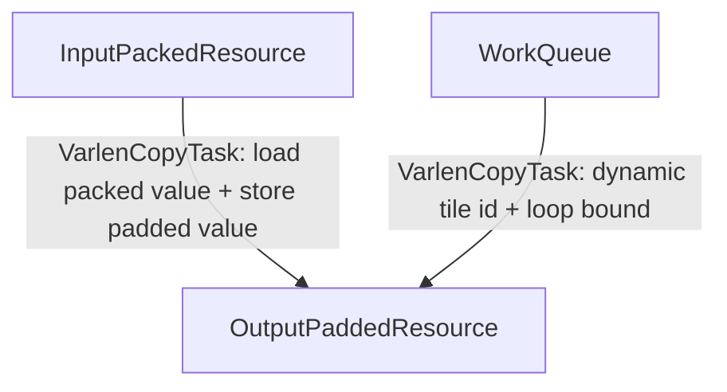

These kernels are intended only for TS educational purposes. State-of-the-art performance is not guaranteed.

# Tutorial 03: Persistent Scheduling and Dynamic Domains

## Contents

- [Why Persistent Scheduling Changes the TS Shape](#why-persistent-scheduling-changes-the-ts-shape)
- [Kernel 01: Persistent Copy With Skipped Tiles](#kernel-01-persistent-copy-with-skipped-tiles)
- [Static `WorkQueue`](#static-workqueue)
- [Skipped Tiles](#skipped-tiles)
- [`StageInfo.work_tile`](#stageinfowork_tile)
- [Kernel 02: Variable-Length Copy With Dynamic Domain](#kernel-02-variable-length-copy-with-dynamic-domain)
- [Resource Graph for Dynamic Domain](#resource-graph-for-dynamic-domain)
- [How To Run](#how-to-run)

Tutorials 01 and 02 used direct CTA mapping: the launch grid determined the
logical tile. Tutorial 03 introduces the TS way to express kernels where a CTA
gets work from a scheduler resource instead.

The two examples are still copy kernels. The copy kernel is
simple so the scheduling mechanism is easy to explain.

| # | File | What it teaches |
|---:|---|---|
| 01 | [01_copy_persistent_skip_tile.py](01_copy_persistent_skip_tile.py) | Static persistent scheduling, `WorkQueue`, overlaunched tiles, `skip_if`, and `wtwl.skippable()`. |
| 02 | [02_copy_varlen_dynamic_domain.py](02_copy_varlen_dynamic_domain.py) | A dynamic `domain_loop` bound computed from the current persistent work tile. |

There are no benchmark scripts in this tutorial.

## Why Persistent Scheduling Changes the TS Shape

In a non-persistent kernel, each CTA can derive its tile from `cute.arch.block_idx()`:

```text
tile = block_idx
```

In a persistent kernel, the launched CTA is not the same thing as the logical
work tile. The kernel takes over CTA scheduling responsibility from hardware,
and each CTA repeatedly asks a scheduler for tile ids:

```text
while scheduler has work:
    tile = next scheduled tile
    process tile
```

TS represents that scheduler as a resource: `WorkQueue`.

That has two consequences:

1. Tasks that use the current tile must list `WorkQueue` in `src_resources`.
2. The schedule uses `work_tile_loop(...)` outside the per-tile data loop.

The inner data work still uses `domain_loop(...)`, just like tutorials 01 and
02. The outer loop is new.

## Kernel 01: Persistent Copy With Skipped Tiles

[01_copy_persistent_skip_tile.py](01_copy_persistent_skip_tile.py)
copies a 2D FP16 matrix from GMEM to GMEM. Each logical work tile owns a
128-column slice.

The resource graph is:

```text
WorkQueue -> PersistentCopyResource
```

The dependency graph is:

```python
resource_dependency_graph = {
    copy_resource: [work_queue],
}
```



The task shape is:

```python
copy_task = Task(
    name="PersistentCopyTask",
    src_resources=[work_queue],
    dst_resources=[copy_resource],
    warp_idx=0,
    num_warps=4,
    schedule=copy_result,
)
```

The schedule looks as following:

```python
@schedule
def copy_schedule(copy_res: MemoryResource, wq: WorkQueue) -> None:
    with work_tile_loop(
        wq, skip_if=OversubscribedCopyWorkQueue.skip_work_tile_if
    ) as wtwl:
        with wtwl.skippable(), domain_loop(0, num_rows, 1):
            copy_res.copy_tile_row()
        wq.try_wait()
        wq.wait()
        wq.get_and_advance_work_tile()
        wq.release()
```

`with work_tile_loop` is the outer loop over work tiles. It executes while the scheduler still has valid tiles.
At the end of the inner `domain_loop`, we wait for the work queue pipeline and advance the tile id.

Inside it, four calls on the `WorkQueue` do the tile id bookkeeping:

| Call | Meaning |
|---|---|
| `wq.try_wait()` | Start checking whether the next tile id is available. |
| `wq.wait()` | Block until the next tile id is ready. |
| `wq.get_and_advance_work_tile()` | Read the current tile id into `StageInfo` and advance the queue to the next one. |
| `wq.release()` | Free the queue slot so scheduling can continue. |

Just like the pipeline `acquire`/`commit`/`wait`/`release` brackets in tutorial
01, these are fixed TS schedule operations, not work methods you define. They
are the reserved vocabulary for consuming a `WorkQueue`, so they must appear in
the schedule whenever a task uses one. The important consequence for multi-task
kernels: when a `WorkQueue` is consumed by *any* task, every task that takes part
in the same persistent loop must run this `work_tile_loop` bracket, so all warps
advance through the same tiles in lockstep. This kernel has a single task, so the
bracket appears once.

### Static `WorkQueue`

The host builds a static persistent tile scheduler:

```python
tile_grid = (launch_tiles, 1, 1)
grid = (1, 1, launch_tiles)
tile_sched_params = utils.PersistentTileSchedulerParams(tile_grid, (1, 1, 1))
```

The kernel wraps those params in a TS config:

```python
tile_scheduler_config = (
    TileSchedulerConfig.create_static_persistent_tile_scheduler_params(
        tile_scheduler_params=tile_sched_params,
    )
)
```

Then it creates a `WorkQueue` subclass:

```python
work_queue = OversubscribedCopyWorkQueue(
    logical_tiles=logical_tiles,
    tile_scheduler_config=tile_scheduler_config,
    name="WorkQueue",
)
```

TS supports several flavors of persistent scheduling, and they differ in *how*
the next tile id is produced:

- **Static persistent scheduling** (this kernel). The tile space is fixed up
  front, and each launched CTA walks a statically assigned slice of it, exactly
  like a grid-stride loop over tile ids. Nothing is fetched at runtime, so there
  is no fetch pipeline and no separate scheduler task. The `WorkQueue` here is
  a thin resource that just hands out the next statically computed tile id.
- **Dynamic (CLC) persistent scheduling** (used by later advanced GEMM
  tutorials). This is based on a hardware "work stealing" feature known as
  Cluster Launch Control: a CTA steals a tile id from the work queue, preventing
  it from being launched as a new CTA. The next tile id is fetched at runtime
  through a CLC transaction pipeline, which needs a dedicated scheduler task
  that produces tile ids for the worker tasks to consume.

Both flavors share the same `work_tile_loop` schedule shape, so moving from
static to dynamic scheduling later changes the resource implementation, not the
structure of the schedule.

### Skipped Tiles

What if the kernel launches more tiles than needed by the algorithm or data?

```python
launch_tiles = logical_tiles + overlaunch_tiles
```

Inside the kernel, skipped-tile support lets overlaunched CTAs skip work and
proceed to the next iteration. This kernel does not need it for correctness, but
includes it for educational purposes.

The custom queue marks surplus tile ids as skipped:

```python
def skip_work_tile_if(self, work_tile: WorkTileInfo) -> cutlass.Boolean:
    tile_x, _, _ = work_tile.tile_idx
    return tile_x >= self.logical_tiles
```

The schedule uses that predicate:

```python
@schedule
def copy_schedule(copy_res: MemoryResource, wq: WorkQueue) -> None:
    with work_tile_loop(
        wq, skip_if=OversubscribedCopyWorkQueue.skip_work_tile_if
    ) as wtwl:
        with wtwl.skippable(), domain_loop(0, num_rows, 1):
            copy_res.copy_tile_row()
        wq.try_wait()
        wq.wait()
        wq.get_and_advance_work_tile()
        wq.release()
```

`wtwl.skippable()` is a region marker inside the persistent loop. It wraps only
the data work for the current tile. When the `skip_if` predicate reports that the
current tile is surplus (an overlaunched id beyond the real matrix), TS skips
the body of the `skippable()` region for that tile while still running everything
outside it.

The rule is therefore strict:
- Only data work goes inside `wtwl.skippable()`;
- `WorkQueue` bookkeeping stays outside.

Skipped tiles should not copy data. They still must advance and release the
queue. If a skipped tile skipped the queue bookkeeping too, other tasks or CTAs
could wait for a scheduler transition that never happens.

### `StageInfo.work_tile`

The copy work reads the active scheduled tile from `StageInfo`:

```python
@producer_work
def copy_tile_row(self, stage_info: StageInfo) -> None:
    tx, _, _ = cute.arch.thread_idx()
    tile_x, _, _ = stage_info.work_tile.tile_idx
    col = tx + tile_x * tile_size
    self.matrix_b[stage_info.loop_offset, col] = self.matrix_a[
        stage_info.loop_offset, col
    ]
```

Two coordinates come from two different TS loop levels:

- `stage_info.work_tile.tile_idx` comes from `work_tile_loop`.
- `stage_info.loop_offset` comes from the inner `domain_loop`.

For this example, the persistent tile selects the column tile and the domain
loop selects the row.

## Kernel 02: Variable-Length Copy With Dynamic Domain

[02_copy_varlen_dynamic_domain.py](02_copy_varlen_dynamic_domain.py)
copies packed 1D segments into padded 2D rows:

```text
A[offsets[i] : offsets[i + 1]] -> B[i, 0 : segment_length]
segment_length = offsets[i + 1] - offsets[i]
```

Each persistent work tile owns one output row. The problem is that each row has
a different length, so the inner loop bound is not a compile-time constant and
not the same for every tile.

TS handles that with a task subclass:

```python
class DynamicDomainTask(Task):
    def __init__(self, offsets, **kwargs):
        super().__init__(**kwargs)
        self._offsets = offsets

    @cute.jit
    def get_domain(self, tile_coord):
        return self._offsets[tile_coord[0] + 1] - self._offsets[tile_coord[0]]
```

The schedule passes that method to `domain_loop`:

```python
with domain_loop(tx, DynamicDomainTask.get_domain, threads_per_block):
    val = src.load()
    dst.store(val=val)
```

For each current work tile, TS calls `get_domain(tile_coord)` to get the loop
bound. The bounds are positional `(start, end, step)`; passing
`DynamicDomainTask.get_domain` as the `end` makes the domain dynamic, while
`start=tx` and `step=threads_per_block` make the loop a block-local grid-stride
loop inside the variable-length segment.

The outer persistent shape remains the same:

```python
with work_tile_loop(wq):
    with domain_loop(tx, DynamicDomainTask.get_domain, threads_per_block):
        val = src.load()
        dst.store(val=val)
    wq.try_wait()
    wq.wait()
    wq.get_and_advance_work_tile()
    wq.release()
```

Again, WorkQueue advancement happens after the per-tile data loop. The data loop
length is dynamic, but the queue protocol stays uniform.

## Resource Graph for Dynamic Domain

The dynamic-domain example has three resources:

```text
InputPackedResource
        \
         -> OutputPaddedResource
        /
WorkQueue
```

The dependency graph is:

```python
resource_dependency_graph = {
    dst_resource: [src_resource, work_queue],
}
```



## How To Run

```bash
python 01_copy_persistent_skip_tile.py --rows_cols 256,512 --overlaunch-tiles 4
python 02_copy_varlen_dynamic_domain.py
python 02_copy_varlen_dynamic_domain.py --N 16
```
