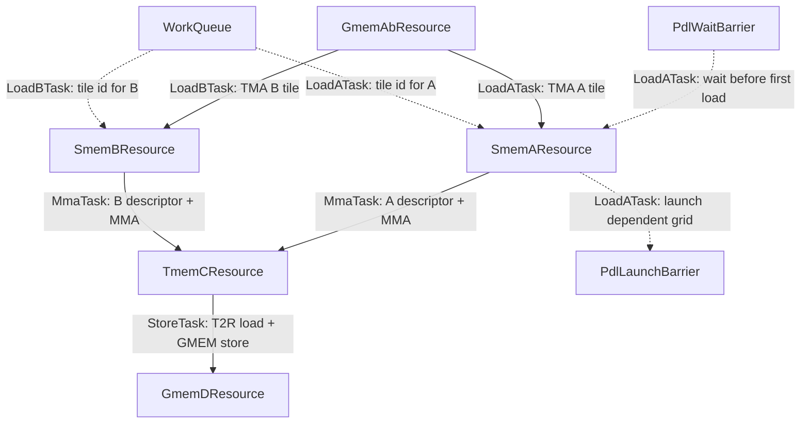

These kernels are intended only for TS educational purposes. State-of-the-art performance is not guaranteed.

# Tutorial 04: Advanced FP16/BF16 GEMM

## Contents

- [Kernels](#kernels)
- [Features](#features)
- [Resource And Task Schedule](#resource-and-task-schedule)
- [How To Run](#how-to-run)
- [Benchmark Against PyTorch](#benchmark-against-pytorch)
- [Constraints](#constraints)

This tutorial contains clustered FP16/BF16 GEMM kernels with persistent
scheduling, cluster behavior, dependent launch, optional bias, and benchmark
sweeps.

## Kernels

| # | File | What it demonstrates |
|---:|---|---|
| 01 | [`01_fp16_bf16_gemm_3_cluster.py`](01_fp16_bf16_gemm_3_cluster.py) | Clustered CUTLASS Python DSL GEMM with persistent scheduling, optional CLC, optional PDL, optional bias, split A/B resources, and multicast. |
| 02 | [`02_fp16_bf16_gemm_3_cute_cluster.py`](02_fp16_bf16_gemm_3_cute_cluster.py) | CuTe DSL version of the same clustered TS shape. |

## Features

- Persistent scheduling through `WorkQueue`.
- Optional CLC dynamic scheduling and `WorkScheduleTask`.
- PDL wait/launch resources for CUDA graph chains.
- Optional bias in the epilogue.
- Separate A and B SMEM resources and separate load tasks.
- Cluster-scoped TMA multicast.
- 2-CTA MMA pairs.
- Multi-cluster tile mapping and fallback clusters.
- CuTe DSL versions of TMA, MMA, T2R, and TMEM operations.

## Resource and Task Schedule

Both files use the same high-level TS graph. `01_fp16_bf16_gemm_3_cluster.py`
spells out the CUTLASS Python DSL work bodies, while
`02_fp16_bf16_gemm_3_cute_cluster.py` implements equivalent bodies with
CuTe DSL operations.



The dependency graph therefore includes `WorkQueue` edges for persistent tile
ownership, optional CLC self-dependency on the queue, and the data path
`GmemAbResource -> SmemA/SmemB -> TmemCResource -> GmemDResource`.

## How To Run

Clustered CUTLASS Python DSL:

```bash
python 01_fp16_bf16_gemm_3_cluster.py --mnk 512,512,512 --dtype fp16
```

Clustered CuTe DSL:

```bash
python 02_fp16_bf16_gemm_3_cute_cluster.py --mnk 512,512,256 --dtype fp16
```

Common advanced options include `--has_bias`, `--clc-dynamic-scheduler`,
`--cluster M,N,K`, and `--fallback-cluster M,N,K` where supported.

## Benchmark Against PyTorch

Use `bench_bf16_gemm_ts_vs_pytorch.py` to benchmark the advanced clustered
BF16/FP16 TS variants against PyTorch `torch.mm` on the same input tensors.
The benchmark uses CUDA graphs by default, rotates workspace buffers to keep L2
cold, and prints the best TS config per shape next to PyTorch.

```bash
python bench_bf16_gemm_ts_vs_pytorch.py

python bench_bf16_gemm_ts_vs_pytorch.py \
  --configs 1024,1024,4096 2048,2048,4096 \
  --clusters 2,1,1 4,1,1 \
  --dtype bf16
```

These tutorial kernels are intended for TS comparison and do not guarantee
speed-of-light performance.

## Constraints

- Clustered CUTLASS Python DSL supports primary cluster shapes with M and N
  dimensions in `{1, 2, 4}` and K dimension equal to 1.
- Because the kernel uses 2-CTA MMA pairs along M, `cluster_m` must be divisible
  by 2, so practical primary cluster M values are 2 or 4.
- Fallback clusters follow the same shape rules and must divide the primary
  cluster in every dimension.
- Clustered CuteDSL currently supports only primary cluster `(2,1,1)` and does
  not support fallback clusters.
- Clustered kernels require M to be divisible by `super_tile_m`, and N to be
  divisible by `super_tile_n` and 32.
