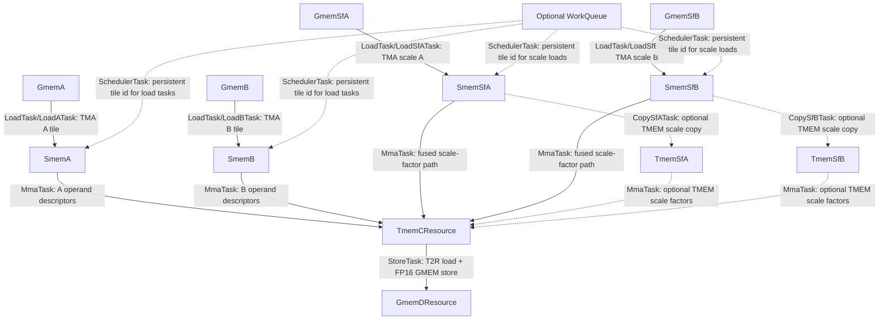

These kernels are intended only for TS educational purposes. State-of-the-art performance is not guaranteed.

# Tutorial 05: NVFP4 block-scaled GEMM

## Contents

- [Source Organization](#source-organization)
- [Kernel](#kernel)
- [Resource diagram](#resource-diagram)
- [Tasks (default configuration)](#tasks-default-configuration)
- [TS Details](#ts-details)
- [How to run](#how-to-run)
- [Benchmark against PyTorch](#benchmark-against-pytorch)

## Source Organization

Read `01_gemm_nvfp4.py` in this order:

1. Module flags at the top (`use_two_tma_warps`, `fuse_sf_copy_to_mma`, ...).
   These choose which `create_*_task` factories `kernel()` wires up.
2. Resource classes. Each memory stage has `@producer_work` /
   `@consumer_work` methods for the per-warp bodies.
3. `create_*_task` and `@schedule`. These define the captured
   acquire/wait/commit/release schedules for each warp-specialized task.
4. `kernel()`. `TaskManager.setup_resources_and_tasks()` followed by `run()`
   owns TS setup and task dispatch. TMEM alloc/dealloc is explicit.
5. Host `gemm` / `run_nvfp4_gemm`. These functions set up tensors, TMA
   descriptors, compile-time flags, and validation.

Easy mistake: the dependency graph appears twice. Each `Task(...)` declares
`src_resources` / `dst_resources`, and `resource_dependency_graph` repeats the
edges for validation. Also set compile-time flags before `cute.compile()`;
`cutlass.const_expr` branches are already fixed by then.

## Kernel

`01_gemm_nvfp4.py` computes batched block-scaled NVFP4 GEMM:
`C[l,m,n] = (A[l,m,k] ⊙ SFA) @ (B[l,n,k] ⊙ SFB)` with FP16 output,
256×256×256 tile, **2-CTA cluster MMA** (`cluster_shape_mnk = (2,1,1)`).

## Resource diagram



There are 12 resources: coordinate sources (`GmemResource`, `GmemSfResource`),
TMA SMEM stages (`SmemResource`, `SmemSfResource`), TMEM scale-factor resources
(`TmemSfResource`), block-scaled accumulator (`TmemCResource`), epilogue sink
(`GmemDResource`). Optional `WorkQueue` when `--clc-dynamic-scheduler` is set.

## Tasks (default configuration)

| Task | Warps | Role |
|------|:-----:|------|
| `LoadTask` | 5 | TMA A + B + SFA + SFB → SMEM |
| `MmaTask` | 4 | S2T scale-factor copies (when fused) + block-scaled MMA |
| `StoreTask` | 0-3 | TMEM → registers → FP16 GMEM |
| `PaddingTask` | 6-7 | Register-budget alignment (static mode) |
| `WorkScheduleTask` | 7 | CLC fetch (only with `--clc-dynamic-scheduler`) |

**Configurable decomposition** (compile-time module flags, set before
`cute.compile()`):

| Flags | Task decomposition |
|-------|------------------------|
| `--use-two-tma-warps` | Separate `LoadATask` and `LoadBTask` |
| `--use-two-sf-load-warps` | `LoadSfATask` + `LoadSfBTask` (requires two TMA warps) |
| `--no-fuse-sf-copy-to-mma` | Dedicated `CopySfATask` and `CopySfBTask` for S2T scale-factor copies |

## TS Details

- Block-scaled operands use separate GMEM/SMEM/TMEM resource chains for matrix
  data and per-block scale factors (SFA/SFB).
- Scale-factor SMEM-to-TMEM copies can run inside `MmaTask` or in dedicated
  `CopySf*` tasks. The dependency graph changes with `fuse_sf_copy_to_mma`.
- The 2-CTA MMA uses cluster-scoped TMA multicast and splits M/N coordinates
  across `cta_rank_in_cluster`.
- `SmemAllocator` owns the operand buffers, `tmem_ptr_i32`, and the TMEM
  deallocation mbarrier storage.
- `--clc-dynamic-scheduler` enables `WorkQueue` and `WorkScheduleTask`.

## How to run

Requires Blackwell (sm_100+). Prints validation via `torch.testing.assert_close`.

```bash
python 01_gemm_nvfp4.py \
  --mnkl 256,256,256,1

python 01_gemm_nvfp4.py \
  --use-two-tma-warps --use-two-sf-load-warps --no-fuse-sf-copy-to-mma
```

### Benchmark against PyTorch

Use `bench_nvfp4_gemm_ts_vs_pytorch.py` to benchmark the NVFP4 TS kernel
against PyTorch `torch._scaled_mm` on the same packed FP4 inputs and scale
factors. The benchmark uses CUDA graphs by default, rotates workspace buffers
to keep L2 cold, and prints the best TS result per shape next to PyTorch.

```bash
python bench_nvfp4_gemm_ts_vs_pytorch.py

python bench_nvfp4_gemm_ts_vs_pytorch.py \
  --configs 256,256,256,1 512,512,512,1 \
  --use-two-tma-warps --use-two-sf-load-warps
```

These tutorial kernels are intended for TS comparison and do not guarantee
speed-of-light performance.
