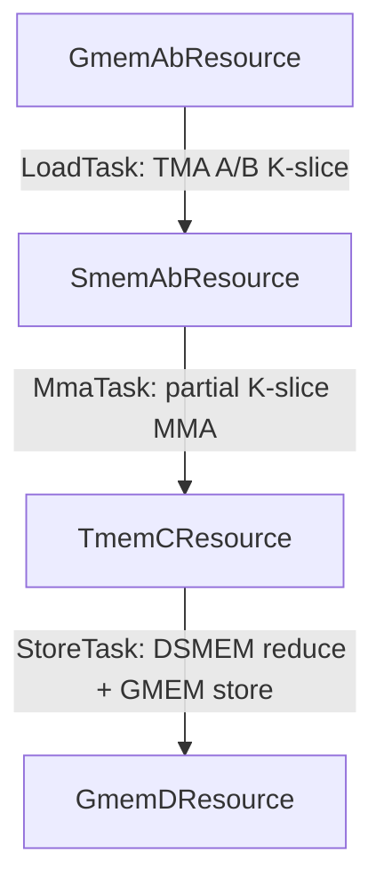

These kernels are intended only for TS educational purposes. State-of-the-art performance is not guaranteed.

# Tutorial 06: Split-K FP16 GEMM with DSMEM reduce-scatter

## Contents

- [Kernel](#kernel)
- [Resource diagram](#resource-diagram)
- [Tasks](#tasks)
- [TS Details](#ts-details)
- [TS verification limits (inter-CTA communication)](#ts-verification-limits-inter-cta-communication)
- [How to run](#how-to-run)
- [Benchmark against PyTorch](#benchmark-against-pytorch)

## Kernel

`01_gemm_split_k_fp16.py` is an FP16 GEMM where `split_k_factor` CTAs in a
cluster each accumulate a disjoint K slice. The CTAs exchange partials through
DSMEM reduce-scatter, then reduce and store the final `N/split_k_factor`
column slice per CTA.

Default tile: 128×16 K-tile per CTA, `split_k_factor=2`, `cluster_shape =
(1,1,split_k_factor)`.

## Resource diagram



There are 4 resources in a linear chain. There is no `WorkQueue`: one cluster
launch owns a fixed K slice per CTA.

The kernel uses one combined `SmemAbResource` for A and B because a single
`LoadTask` loads both operands and `MmaTask` consumes the combined full stage.

## Tasks

| Task | Warps | Role |
|------|:-----:|------|
| `LoadTask` | 4 | TMA A + B into the combined SMEM resource |
| `MmaTask` | 5 | 1-CTA `tcgen05` MMA over `num_k_tiles_per_cta` |
| `StoreTask` | 0-3 | Multi-phase epilogue in `GmemDResource.store` |
| `PaddingTask` | 6-7 | Warp-group register alignment |

## TS Details

- Split-K mainloop: `num_k_tiles_per_cta = num_k_tiles_total //
  split_k_factor`, and `GmemAbResource` adds a K offset from
  `block_idx_in_cluster`.
- Multi-call producer work: `GmemDResource.store` runs `subtile_cnt + 1` times
  per tile. A `subtile_idx: cutlass.Constexpr[int]` argument, passed explicitly by
  the schedule (`store(..., subtile_idx=subtile_idx)`), selects T2R staging (calls
  0..`subtile_cnt-1`) or the final scatter/sync/reduce/store call.
- DSMEM epilogue work lives inside producer work. Cluster `mapa` stores,
  `mbarrier` remote arrivals, and local reduction are not modeled as a separate
  pipelined SMEM resource.
- `SmemAllocator.add_alias_group` aliases shared memory for tile A and B to
  epilogue staging after the mainloop. AB SMEM is not used after MMA completes.
- The allocator also places `tmem_ptr_i32` and the `dsmem_sync_mbar` used by the
  epilogue cluster barrier.

## TS verification limits (inter-CTA communication)

TS schedule validation checks pipelined resource schedules and task/resource
declarations. For resources on an TS-managed pipeline, it checks
acquire/commit/wait/release ordering and barrier signaling, even for
cluster-scoped pipelines. This split-K epilogue uses manual DSMEM
communication, so that communication is outside TS pipeline validation.

This split-K kernel's epilogue is not on an TS pipeline. DSMEM scatter, remote
`mbarrier` arrives, named barriers, and the local reduce all live inside
`GmemDResource.store` producer work. TS treats that call as opaque producer
work; it does not verify:

- that every peer CTA issues the matching arrive/wait pair,
- cluster-wide ordering between scatter, sync, and reduce,
- or correctness of `mapa` / bulk-copy counts.

If you omit an arrive, wait on the wrong phase, or mismatch remote/local
arrival counts, the kernel can **hang or race** with no TS diagnostic.
Review and test that logic manually.

## How to run

Requires Blackwell (sm_100+). Constraints: `m % 128 == 0`, `n % 16 == 0`,
`k % (split_k_factor * 64) == 0` with default tile constants.

```bash
python 01_gemm_split_k_fp16.py \
  --mnk 256,256,256
```

### Benchmark against PyTorch

Use `bench_splitk_gemm_ts_vs_pytorch.py` to benchmark split-K TS variants
against PyTorch `torch.mm` on the same input tensors. The benchmark uses CUDA
graphs by default, rotates workspace buffers to keep L2 cold, and prints the
best TS split-K/tile config per shape next to PyTorch.

```bash
python bench_splitk_gemm_ts_vs_pytorch.py

python bench_splitk_gemm_ts_vs_pytorch.py \
  --configs 256,256,512 512,256,1024 \
  --split-k 2 4
```

These tutorial kernels are intended for TS comparison and do not guarantee
speed-of-light performance.
