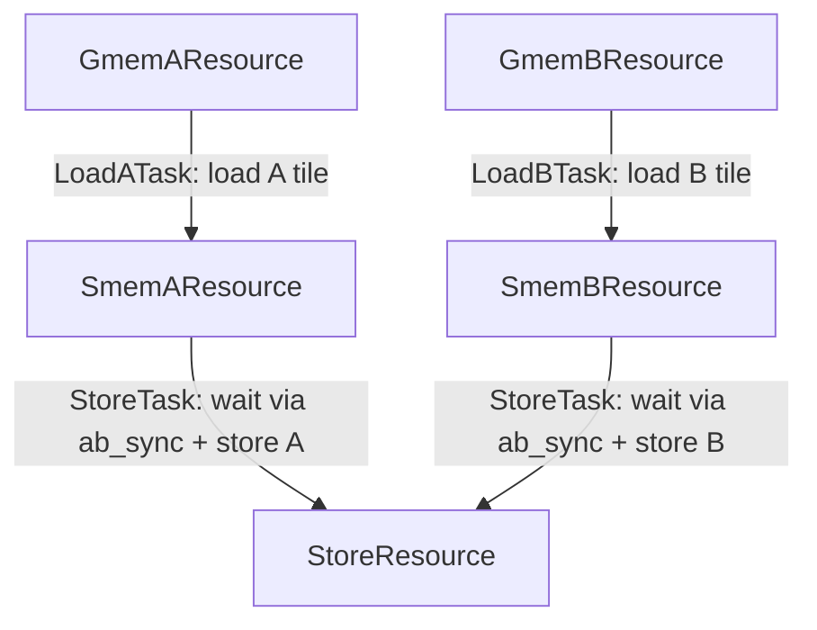
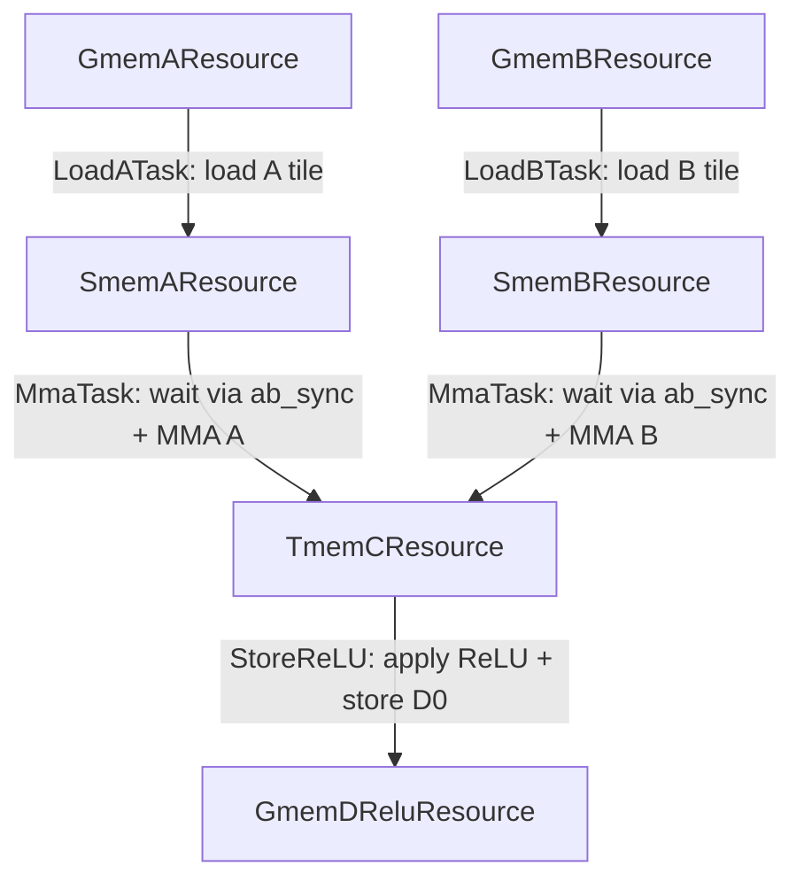
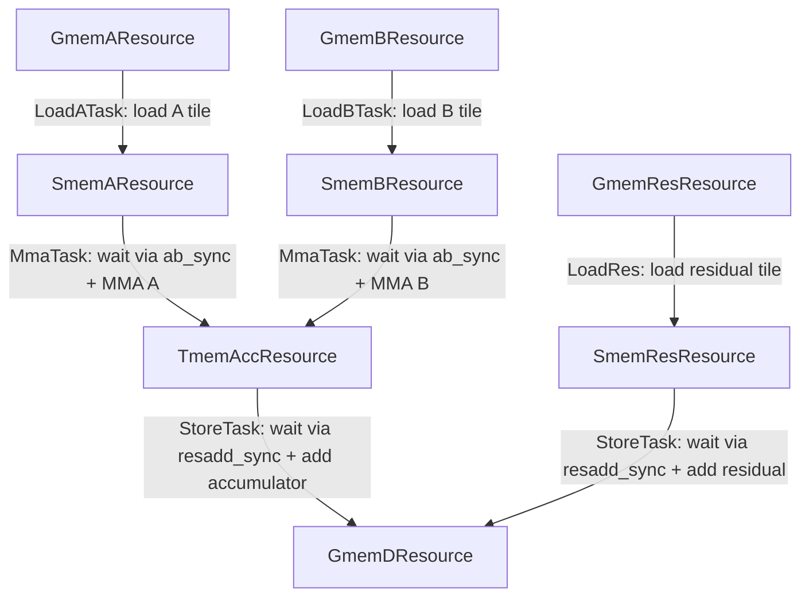
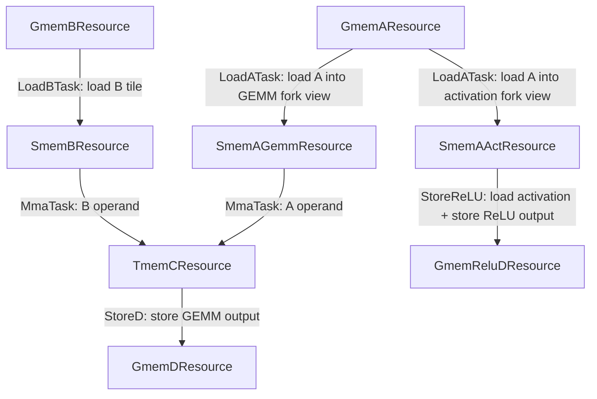

These kernels are intended only for TS educational purposes. State-of-the-art performance is not guaranteed.

# Tutorial 07: PipelineGroup (merge / fork)

## Contents

- [What PipelineGroup is](#what-pipelinegroup-is)
- [Homogeneous side vs heterogeneous side](#homogeneous-side-vs-heterogeneous-side)
- [How to set it up](#how-to-set-it-up)
- [Captured schedule convention](#captured-schedule-convention)
- [Kernels](#kernels)
- [Example Resource Graphs](#example-resource-graphs)
- [How to run](#how-to-run)

Full reference: [`docs/prim-ts-skill/patterns/pipeline_group.md`](../docs/prim-ts-skill/patterns/pipeline_group.md).

## What PipelineGroup is

Several pipelined resources that always synchronize together can share
one mbarrier instead of issuing one arrive per member:

- Merge: N producers -> 1 consumer. One shared empty barrier; the
  consumer calls `group.release()` once.
- Fork: 1 producer -> N consumers. One shared full barrier; the
  producer calls `group.commit()` once.
- FusedMerge: same dataflow as Merge, but the producer side is collapsed
  too — one shared full *and* one shared empty barrier. The consumer calls
  `group.wait()` and `group.release()` once; producers still `commit()`
  individually.

This is a performance optimization. Per-resource barriers are still correct;
the group is optional.

## Homogeneous side vs heterogeneous side

TS only requires the collapsed ("one") side to be homogeneous in kind:

| Mode | Must be same kind on… | Other side can differ |
|------|------------------------|------------------------|
| Merge | Consumer side (`async` or `umma`) | Producers, any mix (`TmaAsync`, `AsyncAsync`, `TmaUmma`, ...) |
| Fork | Producer side (`tma` or `async`) | Consumers, any mix (`TmaUmma`, `AsyncAsync`, `UmmaAsync`, ...) |

Examples in this tutorial: Merge(`AsyncUmma` + `TmaUmma`), Merge(`AsyncAsync` +
`TmaAsync`), Fork(`TmaUmma` + `TmaAsync`), Fork(`AsyncUmma` + `AsyncAsync`).

The producer side in Merge and the consumer side in Fork do not need to match
each other. Only the side that shares the group-wide barrier must agree on kind.

## How to set it up

Define pipelines as usual: each member gets its own `PipelineConfig` on the
resource. Then declare which resources form a group. TS never auto-groups.

```python
smem_a = SmemAResource(..., pipeline_config=cfg_a, name="smem_a")
smem_b = SmemBResource(..., pipeline_config=cfg_b, name="smem_b")

ab_sync = PipelineGroup(
    name="ab_sync",
    members=[smem_a, smem_b],
    mode=PipelineGroupMode.Merge,  # or Fork
)

allocator.add_resource(smem_a)
allocator.add_resource(smem_b)
allocator.add_pipeline_group(ab_sync)  # group owns barrier SMEM, not members
```

TS rebuilds the barrier layout from the member pipeline types: per-member
barriers on the many side plus one shared barrier on the one side (`(N + 1) *
num_stages` mbarriers total). `TaskManager` assigns `barrier_ptr`s before
`resource.create()`, so you do not lay out group barriers by hand.

## Captured schedule convention

In `@schedule`, pass members as `group.member` (for example,
`ab_sync.smem_a`). Use that wrapper for per-member acquire/wait/work. Use
`group` itself only for the collapsed stage: `group.release()` in Merge,
`group.commit()` in Fork.

| Operation | Write | Why |
|-----------|--------|-----|
| try_acquire, acquire, try_wait, wait, work | `group.smem_a.acquire()`, `group.smem_b.wait()`, ... | Per-member; each keeps its own barrier cursor on the many side. |
| commit (Merge producers) | `group.smem_a.commit()` | Each producer commits its own full barrier, not the group barrier. |
| release (Fork consumers) | `group.smem_a_act.release()` | Each consumer releases its own empty barrier, not the group barrier. |
| release (Merge consumer) | `group.release()` | Group-wide; one arrive frees all producers. |
| commit (Fork producer) | `group.commit()` | Group-wide; one arrive wakes all consumers. |


Merge consumer: one task waits on every member and releases once.

```python
store_result = store_schedule(store_res, ab_sync)

@schedule
def store_schedule(store, group):
    with domain_loop(0, num_iters, 1):
        group.smem_a.try_wait()
        group.smem_a.wait()
        group.smem_b.try_wait()
        group.smem_b.wait()
        group.smem_a.consumer_work()
        group.smem_b.consumer_work()
        store.store()
        group.release()         # ← group-wide (do not smem_a.release())
```

Fork producer: one task acquires every member and commits once.

```python
load_a_result = load_a_schedule(fork_sync)

@schedule
def load_a_schedule(group):
    with domain_loop(0, num_k_tiles, 1):
        group.smem_gemm.try_acquire()
        group.smem_gemm.acquire()
        group.smem_act.try_acquire()
        group.smem_act.acquire()
        group.smem_gemm.load(...)
        group.commit()          # ← group-wide (do not smem_gemm.commit())
```

In `Task(...)` keep bare resources in `src_resources` / `dst_resources`. The
`group.member` wrapper is only for arguments inside `@schedule`.

Do not call `group.smem_a.release()` in Merge or `group.smem_a.commit()` in
Fork. TS rejects that; the collapsed stage must be on the group object.

## Kernels

| # | File | What it demonstrates |
|---|------|----------------------|
| 01 | [`01_merge_copy.py`](01_merge_copy.py) | Minimal Merge example. Separate LoadA / LoadB tasks fill `SmemA` and `SmemB`; one Store task waits on both and calls `ab_sync.release()` once. Pipeline mix: `AsyncAsync + TmaAsync`, or both `AsyncAsync`. |
| 02 | [`02_merge_gemm.py`](02_merge_gemm.py) | FP16 GEMM with two independent load warps: global memory load for A and TMA for B. `SmemA` and `SmemB` are grouped in `ab_sync` (`Merge` or `FusedMerge`), so the MMA tasks waits on both members (`Merge`) or the group (`FusedMerge`) and issues a consumer release on the group Mix: `AsyncUmma + TmaUmma`. |
| 03 | [`03_merge_gemm_resadd.py`](03_merge_gemm_resadd.py) | Builds on kernel 02. A third task loads the residual tile into `SmemRes`. Two groups — `ab_sync` (A/B for MMA) and `resadd_sync` (epilogue accumulator + residual) can use either Merge or FusedMerge. |
| 04 | [`04_fork_load_gemm_act.py`](04_fork_load_gemm_act.py) | Fork example. LoadA fills one physical SMEM A buffer once; `fork_sync` exposes it as `SmemAGemm` for MMA descriptors and `SmemAAct` for ReLU. One `fork_sync.commit()` wakes both consumers. |

## Example Resource Graphs

`01_merge_copy.py` groups two SMEM resources so one store task releases both
empty barriers:



`02_merge_gemm.py` uses the same Merge idea for A/B operands before MMA:



`03_merge_gemm_resadd.py` has two groups: `ab_sync` before MMA and
`resadd_sync` before the residual-add epilogue.
Each can be `Merged` or `FusedMerge`:



`04_fork_load_gemm_act.py` uses Fork so one loaded A tile feeds both GEMM and
activation consumers:



## How to run

```bash
python 01_merge_copy.py
python 02_merge_gemm.py --mnk 256,256,256
python 03_merge_gemm_resadd.py --mnk 256,256,256
python 04_fork_load_gemm_act.py --mnk 256,256,256
```
