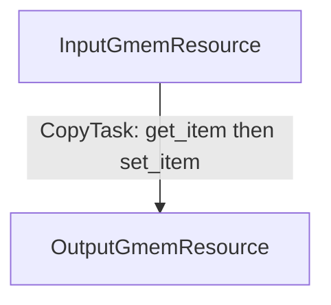

# Task Scheduling (TS) Tutorials

TS is the programming model for writing warp-specialized asynchronous NVIDIA GPU kernels.
Instead of writing the kernel as a monolithic body in which warp roles, barrier calls, and data passing are intermixed, the user expresses the kernel as a set of explicit warp-specialized tasks with an explicit schedule for each task.
If you already know CUDA, CuTe DSL or CUTLASS Primitives kernels and know how to write warp-specialized kernels, the core shift is this:

Instead of manual warp branches
```python
if warp_idx == 0:
    ...
elif warp_idx == 1:
```
and hand-written barrier setup, arrivals and waits, kernel is restructured to
express producer and consumer roles, and their asynchronous communication schedule explicitly.

## Why TS Exists

Modern NVIDIA GPUs expose asynchronous operations such as TMA, tcgen05 MMA,
CLC fetch, copy to Tensor Memory, etc. Programming them efficiently requires
writing asynchronous warp-specialized programs, where each warp or group of
warps owns a task such as data loading or math computation. These tasks
communicate through GPU memory resources such as shared memory or tensor memory,
so synchronization is needed to prevent concurrent data hazards. In TS
tutorials, "barriers" usually means TS-managed pipeline mbarriers, named
barriers, and CTA/cluster synchronization where the kernel needs them.
Barrier behavior depends on the kernel configuration (single-CTA or cluster-wide kernel),
the producer/consumer pattern (how many warps are writing and reading data)
between specialized warps, the operation type (TMA, tensor-core MMA,
global memory load, etc.),
which threads signal each barrier, and which memory regions overlap in time.
A wrong arrival count, a missed barrier advance, a release before the producer finished writing,
cause wrong result or a runtime hang.
In bare-metal code, the schedule is implicit. Warp specialization, barrier
arrivals, and phase advancement are scattered across warp branches and mixed
into the kernel body. There is no separate schedule object to inspect, so there
is no deadlock or race checker either.

TS makes the schedule explicit. The developer still writes low-level work methods for
TMA, MMA, and memory operations. But they also explicitly declare:

- which resources are used in the program for asynchronous communication,
- which warp range runs each asynchronous task and which resources participate in those tasks,
- the explicit schedule -- an order of acquire/work/commit and wait/work/release calls in the task that defines the communication pattern between the asynchronous workers,
- the dependency graph between resources, e.g. for a given resource, which resources are required to be produced before.

TS statically checks the schedule for deadlocks and race conditions and barrier
initialization before lowering kernel to GPU code. Many synchronization ordering mistakes fail
early instead of becoming runtime hangs or race conditions.
The warp-role structure is written in one concise place, making the kernel
easier to inspect and review.
Schedule edits and optimizations are easier to audit because TS re-checks the schedule ordering before
lowering to GPU code.

The tutorials go from a one-task copy to specialized GEMM variants.

## Four Terms

These are the only terms you need before opening tutorial 01. They will be explained in tutorial 01 in details:

| Term | Meaning |
|---|---|
| Resource | Abstractions over physical resources on the GPU such as on-chip memory regions or barriers. A resource optionally carries a pipeline that guards its physical location against concurrent reads and writes. |
| Task | Assignments of a contiguous range of warps to a list of resources, which execute the schedule's operations on those resources. |
| Explicit schedule | Explicitly specified order of operations on the resources (including asynchronous operations) per task. Calling it records an ordered sequence of resource calls; it does not run the work immediately. |
| Dependency graph | A map specifying for each resource the list of resources it depends on. TS uses this graph to validate schedule ordering. |

A minimal copy example has the same four pieces:



The first tutorials are meant to teach that shift gradually. Do not start by
reading all the reference material. Run a [small copy example](01_copy_basics_ts/01_copy_grid_stride.py), read how TS expresses it,
then move to [TMA](01_copy_basics_ts/02_copy_tma.py), [GEMM](02_gemm_simple_ts/01_fp16_bf16_gemm_3.py), and [persistent scheduling](03_persistent_scheduling_dynamic_domain_ts/01_copy_persistent_skip_tile.py).

## First Path

Run these examples first:

```bash
python 01_copy_basics_ts/01_copy_grid_stride.py
python 01_copy_basics_ts/02_copy_tma.py --rows_cols 256,512
python 02_gemm_simple_ts/01_fp16_bf16_gemm_3.py --mnk 128,256,64 --dtype fp16 --tolerance 1e-4
python 03_persistent_scheduling_dynamic_domain_ts/01_copy_persistent_skip_tile.py --rows_cols 256,512 --overlaunch-tiles 4
```

Then read, in order:

1. [Tutorial 01: copy basics](01_copy_basics_ts/README.md)
2. [Tutorial 02: simple GEMM](02_gemm_simple_ts/README.md)
3. [Tutorial 03: persistent scheduling and dynamic domains](03_persistent_scheduling_dynamic_domain_ts/README.md)

Tutorial 01 is the main onboarding document. It explains the TS vocabulary
while walking through the copy kernels. Tutorial 02 shows the same model on a
real warp-specialized GEMM. Tutorial 03 adds persistent tile scheduling and
runtime loop bounds.

## Tutorial Map

| Step | Tutorial | What it teaches |
|---:|---|---|
| 01 | [Copy basics](01_copy_basics_ts/) | The TS mental model. Starts with one GMEM copy task, then adds TMA, SMEM allocation, pipeline brackets, and warp specialization. |
| 02 | [Simple FP16/BF16 GEMM](02_gemm_simple_ts/) | A real resource chain: GMEM coordinates -> SMEM A/B tiles -> TMEM accumulator -> GMEM output. Introduces TMEM ownership and a deeper dependency graph. |
| 03 | [Persistent scheduling and dynamic domains](03_persistent_scheduling_dynamic_domain_ts/) | Persistent scheduling and dynamically specified domain loops. |
| 04 | [Advanced FP16/BF16 GEMM](04_gemm_bf16_advanced_ts/) | Persistent GEMM, CLC scheduler, PDL, bias, clusters, multicast, split A/B resources, and benchmark sweeps. |
| 05 | [NVFP4 GEMM](05_gemm_nvfp4_ts/) | NVFP4 block scaling and scale-factor resource chains. |
| 06 | [Split-K GEMM](06_gemm_split_k_fp16_ts/) | Split-K GEMM, DSMEM reduce-scatter. |
| 07 | [PipelineGroup](07_group_pipeline_ts/) | Merge/Fork barrier sharing patterns for optimized pipelines. |

Tutorials 01, 02, and 03 are teaching examples and do not include benchmark
scripts. Tutorials 04, 05, and 06 include benchmark drivers.
These kernels are intended only for TS educational purposes. State-of-the-art
performance is not guaranteed.

## After Tutorials 01-03

Use tutorials 04-07 when you want more hardware features. Use the production
examples when you want to see larger TS codebases:

| Area | Path |
|---|---|
| Batched GEMM port | [blackwell/kernel/dense_gemm_ts/batched_gemm/](../../../blackwell/kernel/dense_gemm_ts/batched_gemm/) |
| FMHA context and decode kernels | [blackwell/kernel/attention_ts/fmha/](../../../blackwell/kernel/attention_ts/fmha/) |
| Blackwell GeForce FMHA variants | [blackwell_geforce/](blackwell_geforce/) |

Those examples assume you already understand the first three tutorials. They are
better references for complete kernels than for first-time TS onboarding.
