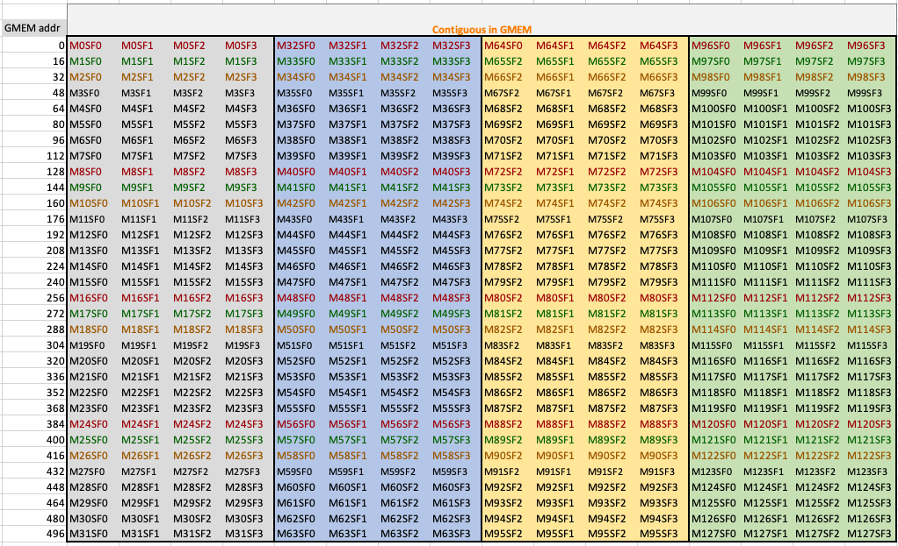
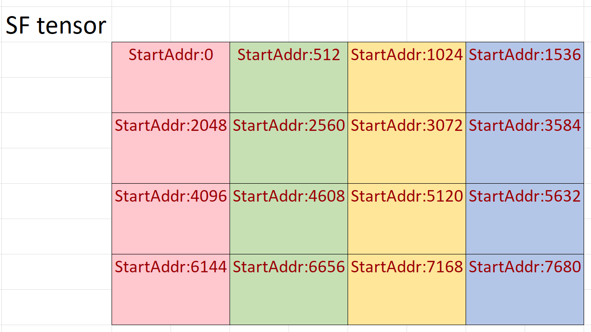

# Blackwell SM100 GEMMs

[**TLDR; jump to block scaled GEMM example**](#detailed_blockscale_example)

Blackwell SM100 introduces `tcgen05.mma` instructions. `tcgen05.mma` instructions support all legacy types (`tfloat32_t`, `half_t`, `bfloat16_t`, `int8_t`, `uint8_t`) and
the new 4, 6, and 8-bits floating point datatypes with and without scale factors. 
This document explains the new `tcgen05.mma` instructions supported by CUTLASS and how one can leverage CUTLASS to create
efficient SM100 GEMM kernels targeting these new mma instructions.

Blackwell SM100 has 7 new `tcgen05.mma` instructions. These instructions are 2x to 4x faster then Hopper Architecture's WGMMA instructions.

| Ptx Instruction                                                                  | Throughput                 | Notes |
|----------------------------------------------------------------------------------|----------------------------|-------|
|tcgen05.mma.cta_group::[1\|2].kind::tf32                                          | 2x Hopper Tf32 Tensor Core | MMA with A={tf32} x B={tf32} TN, NT, TT, NN layouts                                                       |
|tcgen05.mma.cta_group::[1\|2].kind::f16                                           | 2x Hopper Fp16 Tensor Core | MMA with A={f16} x B={f16} or A={bf16} x B={bf16}  TN, NT, TT, NN layouts                                 |
|tcgen05.mma.cta_group::[1\|2].kind::i8                                            | 2x Hopper I8 Tensor Core   | MMA with A={i8} x B={i8} or A={u8} x B={u8}  TN, NT, TT, NN layouts                                       |
|tcgen05.mma.cta_group::[1\|2].kind::f8f6f4                                        | 2x Hopper Fp8 Tensor Core  | Mixed precision MMA with A={f4,f6,f8} x B={f4,f6,f8} TN, NT, TT, NN layouts                               |
|tcgen05.mma.cta_group::[1\|2].kind::mxf8f6f4.block_scale                          | 2x Hopper Fp8 Tensor Core  | Block scaled mixed precision MMA with A={mxf4,mxf6,mxf8} x B={mxf4,mxf6,mxf8} with TN, NT, TT, NN layouts |
|tcgen05.mma.cta_group::[1\|2].kind::mxf4.block_scale                              | 4x Hopper Fp8 Tensor Core  | Block scaled MMA with A={mxf4} x B={mxf4} with TN layouts                                                 |
|tcgen05.mma.cta_group::[1\|2].kind::mxf4nvf4.block_scale.scale_vec_size::[2X\|4X] | 4x Hopper Fp8 Tensor Core  | Block scaled MMA with A={mxf4} x B={mxf4} or A={nvf4} x B={nvf4} with TN layouts                          |

For more detailed information see [`tcgen05.mma` PTX documentation](https://docs.nvidia.com/cuda/parallel-thread-execution/index.html#tensorcore-5th-generation-family-instructions).

## New in Blackwell SM100

### Block Scaled GEMMs

Instructions with `kind` modifiers `mxf8f6f4`, `mxf4`, and `nvf4mxf4` perform matrix multiplication operations with scale
factors of the form $D = C +( A \times SFA) * (B \times SFB)$. Scale factors are applied to GEMM-K dimension such that
every 16 or 32 elements of $A$ and $B$ matrices in K dimension have an associated scale factor. For example, an $M\times K$,
$A$ matrix has an associated $M \times \lceil K/32 \rceil$ SFA matrix; and an $N\times K$ $B$, matrix has an associated
$N \times \lceil K/32 \rceil$ SFB matrix. For block scaled GEMMs, an entry of output D matrix is
$D_{ij} = C_{ij} + \sum_{k} (A_{i,k} \times SFA_{i,k/SV}) \times (B_{j,k}\times SFB_{j,k/SV})$, in index notation, we SV is the scale factor vector size (16 or 32).
Further details can be found in
[PTX documentation on block scaling](https://docs.nvidia.com/cuda/parallel-thread-execution/index.html#tcgen05-block-scaling).

### Blackwell Narrow Precision Data Types

Narrow-precision `tcgen05.mma` instructions can operate on several 4, 6, and 8-bit data types. Blackwell MMAs can operate
on five different 8-bit floating point values, of which only two (`float_ue8m0_t` and `float_ue4m3_t`) can be used as scale factor data types.
There are two 6-bit floating point types and one 4-bit floating point data type.
See [PTX documentation for narrow precision data types](https://docs.nvidia.com/cuda/parallel-thread-execution/index.html#alternate-floating-point-data-formats) for details.

**Blackwell Narrow Precision Data Types**
| Data Type         | Exponent Bits | Mantissa Bits | Signed | Bit Size |
|-------------------|---------------|---------------|--------|----------|
| float_e4m3_t      |4              |3              | Yes    | 8        |
| float_e5m2_t      |5              |2              | Yes    | 8        |
| float_e2m3_t      |2              |3              | Yes    | 6        |
| float_e3m2_t      |3              |2              | Yes    | 6        |
| float_e2m1_t      |2              |1              | Yes    | 4        |
| float_ue8m0_t[^1] |8              |0              | No     | 8        |
| float_ue4m3_t[^1] |4              |3              | No     | 8        |

[^1]: Only valid as scale factor data types.

Block scaled MMAs use `mx` and `nv` types which are a pair of float8_t, float6_t, float4_t with 2 of the scale factor data types with a predetermined scale factor vector size. `mx` types follow OCP specification (see [OCP Specification](https://www.opencompute.org/documents/ocp-microscaling-formats-mx-v1-0-spec-final-pdf)). The following types provided by CUTLASS can be used as inputs to collective builders to generate the block scaled kernels:

**Blackwell Block Scaled Narrow Precision Data Types**
| Mx/Nv Data Type            |Scale Factor Type | SF Vector Size | OCP Compliant |
|----------------------------|------------------|----------------|---------------|
| mx_float8_t\<Any F8type\>  |float_ue8m0_t     |32              | Yes           |
| mx_float6_t\<Any F6Type\>  |float_ue8m0_t     |32              | Yes           |
| mx_float4_t                |float_ue8m0_t     |32              | Yes           |
| nv_float4_t                |float_ue4m3_t     |16              | No            |

## Layouts, Tensor Alignment Requirements to Target `tcgen05.mma` Instructions

Tables below list valid data type, and AB layout combinations. Note that the alignment is reported as number of elements. A and B matrix layouts are
represented with T and N. T represents row-major layouts, and N represents column-major layouts. For instance, TN is
row-major A matrix with column-major B matrix.

For legacy types (`tf32`, `f16`, `bf16`, `i8` and `u8`) alignment requirements for A and B matrices are the same as in Hopper.
All four layouts (TT, NN, NT, TT) are supported for all legacy data types.

**Table 1: Valid Data Type, Alignment, and Layout Combinations For MMAs with Legacy Types** <a id="legacy_gemm_table" name="legacy_gemm_table"></a>
|                               | A Type     | B Type     | AB Layout      | A Alignment | B Alignment | Target tcgen05.mma.kind | Unit Test |
|-------------------------------|------------|------------|----------------|-------------|-------------|-------------------------|-----------|
|1                              | tfloat32_t | tfloat32_t | TN, NN, NT, TT | 4           | 4           | tf32                    | |
|2                              | half_t     | half_t     | TN, NN, NT, TT | 8           | 8           | f16                     | [Unit tests](../../test/unit/gemm/device/sm100_tensorop_gemm/f16_f16_void_f32.cu)|
|3                              | bfloat16_t | bfloat16_t | TN, NN, NT, TT | 8           | 8           | f16                     | [Similar to half_t unit tests](../../test/unit/gemm/device/sm100_tensorop_gemm/f16_f16_void_f32.cu)|
|4                              | int8_t     | int8_t     | TN, NN, NT, TT | 16          | 16          | i8                      | [Unit tests](../../test/unit/gemm/device/sm100_tensorop_gemm/s8_s8_void_s32.cu)|
|5                              | uint8_t    | uint8_t    | TN, NN, NT, TT | 16          | 16          | i8                      | [Similar to int8_t unit tests](../../test/unit/gemm/device/sm100_tensorop_gemm/s8_s8_void_s32.cu)|

For narrow precision Mmas, not all A/B type, and A/B layout combinations are supported by every `tcgen05.mma` instructions.
Furthermore, tensor copy instructions for subbyte types impose additional alignment requirements while loading narrow-precision
tensors from global memory to shared memory 
(see [PTX doc](https://docs.nvidia.com/cuda/parallel-thread-execution/index.html#data-movement-and-conversion-instructions-tensor-copy-restrictions) for details).

Below tables list valid layout, and alignment values for each A and B data type combination and their target `tcgen05.mma`
instructions supported by CUTLASS. 

**Table 2: Valid Data Type, Alignment, and Layout Combinations For Narrow Precision MMAs Without Block Scaling** <a id="non_bs_gemm_table" name="non_bs_gemm_table"></a>
|                               | A Type   | B Type   | AB Layout      | A Alignment | B Alignment | Target tcgen05.mma.kind | Unit Test |
|-------------------------------|----------|----------|----------------|-------------|-------------|-------------------------|-----------|
|[1](#nonbs_rows_1_2_3_6)       | float4_t | float4_t | TN, NN, NT, TT | 128         | 128         | f8f6f4                  | [TN unit tests](../../test/unit/gemm/device/sm100_tensorop_gemm/narrow_precision/f6f4_f6f4_void_f32_tn_layout.cu) <br> [NT unit tests](../../test/unit/gemm/device/sm100_tensorop_gemm/narrow_precision/f6f4_f6f4_void_f32_nt_layout.cu) <br> [NN unit tests](../../test/unit/gemm/device/sm100_tensorop_gemm/narrow_precision/f6f4_f6f4_void_f32_nn_layout.cu) <br> [TT unit tests](../../test/unit/gemm/device/sm100_tensorop_gemm/narrow_precision/f6f4_f6f4_void_f32_tt_layout.cu) |
|[2](#nonbs_rows_1_2_3_6)       | float4_t | float6_t | TN, NN, NT, TT | 128         | 128         | f8f6f4                  | [TN unit tests](../../test/unit/gemm/device/sm100_tensorop_gemm/narrow_precision/f6f4_f6f4_void_f32_tn_layout.cu) <br> [NT unit tests](../../test/unit/gemm/device/sm100_tensorop_gemm/narrow_precision/f6f4_f6f4_void_f32_nt_layout.cu) <br> [NN unit tests](../../test/unit/gemm/device/sm100_tensorop_gemm/narrow_precision/f6f4_f6f4_void_f32_nn_layout.cu) <br> [TT unit tests](../../test/unit/gemm/device/sm100_tensorop_gemm/narrow_precision/f6f4_f6f4_void_f32_tt_layout.cu) |
|[3](#nonbs_rows_1_2_3_6)       | float6_t | float4_t | TN, NN, NT, TT | 128         | 128         | f8f6f4                  | [TN unit tests](../../test/unit/gemm/device/sm100_tensorop_gemm/narrow_precision/f6f4_f6f4_void_f32_tn_layout.cu) <br> [NT unit tests](../../test/unit/gemm/device/sm100_tensorop_gemm/narrow_precision/f6f4_f6f4_void_f32_nt_layout.cu) <br> [NN unit tests](../../test/unit/gemm/device/sm100_tensorop_gemm/narrow_precision/f6f4_f6f4_void_f32_nn_layout.cu) <br> [TT unit tests](../../test/unit/gemm/device/sm100_tensorop_gemm/narrow_precision/f6f4_f6f4_void_f32_tt_layout.cu) |
|[4](#nonbs_rows_4_7)           | float4_t | float8_t | TN, NN, NT, TT | 128         | 16          | f8f6f4                  | [TN unit tests](../../test/unit/gemm/device/sm100_tensorop_gemm/narrow_precision/f6f4_f8_void_f32_tn_layout.cu) <br> [NT unit tests](../../test/unit/gemm/device/sm100_tensorop_gemm/narrow_precision/f6f4_f8_void_f32_nt_layout.cu) |
|[5](#nonbs_rows_5_8)           | float8_t | float4_t | TN, NN, NT, TT | 16          | 128         | f8f6f4                  | [TN unit tests](../../test/unit/gemm/device/sm100_tensorop_gemm/narrow_precision/f8_f6f4_void_f32_tn_layout.cu) <br> [NT unit tests](../../test/unit/gemm/device/sm100_tensorop_gemm/narrow_precision/f8_f6f4_void_f32_nt_layout.cu) |
|[6](#nonbs_rows_1_2_3_6)       | float6_t | float6_t | TN, NN, NT, TT | 128         | 128         | f8f6f4                  | [TN unit tests](../../test/unit/gemm/device/sm100_tensorop_gemm/narrow_precision/f6f4_f6f4_void_f32_tn_layout.cu) <br> [NT unit tests](../../test/unit/gemm/device/sm100_tensorop_gemm/narrow_precision/f6f4_f6f4_void_f32_nt_layout.cu) <br> [NN unit tests](../../test/unit/gemm/device/sm100_tensorop_gemm/narrow_precision/f6f4_f6f4_void_f32_nn_layout.cu) <br> [TT unit tests](../../test/unit/gemm/device/sm100_tensorop_gemm/narrow_precision/f6f4_f6f4_void_f32_tt_layout.cu) |
|[7](#nonbs_rows_4_7)           | float6_t | float8_t | TN, NN, NT, TT | 128         | 16          | f8f6f4                  | [TN unit tests](../../test/unit/gemm/device/sm100_tensorop_gemm/narrow_precision/f6f4_f8_void_f32_tn_layout.cu) <br> [NT unit tests](../../test/unit/gemm/device/sm100_tensorop_gemm/narrow_precision/f6f4_f8_void_f32_nt_layout.cu) |
|[8](#nonbs_rows_5_8)           | float8_t | float6_t | TN, NN, NT, TT | 16          | 128         | f8f6f4                  | [TN unit tests](../../test/unit/gemm/device/sm100_tensorop_gemm/narrow_precision/f8_f6f4_void_f32_tn_layout.cu) <br> [NT unit tests](../../test/unit/gemm/device/sm100_tensorop_gemm/narrow_precision/f8_f6f4_void_f32_nt_layout.cu) |
|[9](#nonbs_rows_9)             | float8_t | float8_t | TN, NN, NT, TT | 16          | 16          | f8f6f4                  | [Unit tests](../../test/unit/gemm/device/sm100_tensorop_gemm/f8_f8_void_f32.cu)|


**Table 3: Valid Data Type, Alignment, and Layout Combinations for Block Scaled Narrow Precision MMAs** <a id="bs_gemm_table" name="bs_gemm_table"></a>
|                         | A Type      | B Type      | AB Layout      | A Alignment | B Alignment | Target tcgen05.mma.kind |Unit Test|
|-------------------------|-------------|-------------|----------------|-------------|-------------|-------------------------|------|
|[1](#bs_rows_1)          | nv_float4_t | nv_float4_t | TN             | 32          | 32          | mxf4nvf4                |[TN unit tests](../../test/unit/gemm/device/sm100_blockscaled_tensorop_gemm/nvf4_nvf4_bf16_bf16.cu)|
|[2](#bs_rows_2)          | mx_float4_t | mx_float4_t | TN             | 32          | 32          | mxf4, mxf4nvf4          |[TN unit tests](../../test/unit/gemm/device/sm100_blockscaled_tensorop_gemm/mxf4_mxf4_void_f16_tn_layout.cu)|
|[3](#bs_rows_3)          | mx_float4_t | mx_float4_t | TN, NN, NT, TT | 128         | 128         | mxf8f6f4                |[NT unit tests](../../test/unit/gemm/device/sm100_blockscaled_tensorop_gemm/mxf4_mxf4_void_f16_nt_layout.cu)|
|[4](#bs_rows_4_5_7_8_10) | mx_float4_t | mx_float6_t | TN, NN, NT, TT | 128         | 128         | mxf8f6f4                |[TN unit tests](../../test/unit/gemm/device/sm100_blockscaled_tensorop_gemm/mxf4_mxf6_f32_f16_tn_layout.cu)<br>[NT unit tests](../../test/unit/gemm/device/sm100_blockscaled_tensorop_gemm/mxf4_mxf6_f32_f16_nt_layout.cu)|
|[5](#bs_rows_4_5_7_8_10) | mx_float6_t | mx_float4_t | TN, NN, NT, TT | 128         | 128         | mxf8f6f4                |[TN unit tests](../../test/unit/gemm/device/sm100_blockscaled_tensorop_gemm/mxf6_mxf4_f16_f16_tn_layout.cu)<br>[NT unit tests](../../test/unit/gemm/device/sm100_blockscaled_tensorop_gemm/mxf6_mxf4_f16_f16_nt_layout.cu)|
|[6](#bs_rows_6_9_11)     | mx_float4_t | mx_float8_t | TN, NN, NT, TT | 128         | 16          | mxf8f6f4                |[TN unit tests](../../test/unit/gemm/device/sm100_blockscaled_tensorop_gemm/mxf4_mxf8_bf16_bf16_tn_layout.cu)<br>[NT unit tests](../../test/unit/gemm/device/sm100_blockscaled_tensorop_gemm/mxf4_mxf8_bf16_bf16_nt_layout.cu)|
|[7](#bs_rows_4_5_7_8_10) | mx_float8_t | mx_float4_t | TN, NN, NT, TT | 16          | 128         | mxf8f6f4                |[TN unit tests](../../test/unit/gemm/device/sm100_blockscaled_tensorop_gemm/mxf8_mxf4_f16_bf16_tn_layout.cu)<br>[NT unit tests](../../test/unit/gemm/device/sm100_blockscaled_tensorop_gemm/mxf8_mxf4_f16_bf16_nt_layout.cu)|
|[8](#bs_rows_4_5_7_8_10) | mx_float6_t | mx_float6_t | TN, NN, NT, TT | 128         | 128         | mxf8f6f4                |[TN unit tests](../../test/unit/gemm/device/sm100_blockscaled_tensorop_gemm/mxf6_mxf6_void_bf16_tn_layout.cu)<br>[NT unit tests](../../test/unit/gemm/device/sm100_blockscaled_tensorop_gemm/mxf6_mxf6_void_bf16_nt_layout.cu)|
|[9](#bs_rows_6_9_11)     | mx_float6_t | mx_float8_t | TN, NN, NT, TT | 128         | 16          | mxf8f6f4                |[TN unit tests](../../test/unit/gemm/device/sm100_blockscaled_tensorop_gemm/mxf6_mxf8_void_f32_tn_layout.cu)<br>[NT unit tests](../../test/unit/gemm/device/sm100_blockscaled_tensorop_gemm/mxf6_mxf8_void_f32_nt_layout.cu)|
|[10](#bs_rows_4_5_7_8_10)| mx_float8_t | mx_float6_t | TN, NN, NT, TT | 16          | 128         | mxf8f6f4                |[TN unit tests](../../test/unit/gemm/device/sm100_blockscaled_tensorop_gemm/mxf8_mxf6_f16_f8_tn_layout.cu)<br>[NT unit tests](../../test/unit/gemm/device/sm100_blockscaled_tensorop_gemm/mxf8_mxf6_f16_f8_nt_layout.cu)|
|[11](#bs_rows_6_9_11)    | mx_float8_t | mx_float8_t | TN, NN, NT, TT | 16          | 16          | mxf8f6f4                |[TN unit tests](../../test/unit/gemm/device/sm100_blockscaled_tensorop_gemm/mxf8_mxf8_void_f8_tn_layout.cu.cu)<br>[NT unit tests](../../test/unit/gemm/device/sm100_blockscaled_tensorop_gemm/mxf8_mxf8_void_f8_nt_layout.cu)|

## MMA tile shapes supported

The alignment restrictions also limit the options for Mma Tile Shapes. Tables below list the supported/valid `MmaTileShape`,
Layout, and Dispatch Policy combinations for each row of [Table 1](#legacy_gemm_table), [Table 2](#non_bs_gemm_table), and [Table 3](#bs_gemm_table).

**Table 4: Valid Tile Shapes and Dispatch Policies for lagacy types (All rows of Table 1)** <a id="legacy_rows" name="legacy_rows"></a> 
| 1/2 SM | Mma Tile Shape   | TN | TT | NT | NN | Dispatch Policy                    |
|--------|------------------|----|----|----|----|------------------------------------|
| 1SM    | 64x64x(4*MMA-K)  | Y  | Y  | Y  | Y  | `KernelTmaWarpSpecialized1SmSm100` |
| 1SM    | 64x128x(4*MMA-K) | Y  | Y  | Y  | Y  | `KernelTmaWarpSpecialized1SmSm100` |
| 1SM    | 64x192x(4*MMA-K) | Y  | Y  | Y  | Y  | `KernelTmaWarpSpecialized1SmSm100` |
| 1SM    | 64x256x(4*MMA-K) | Y  | Y  | Y  | Y  | `KernelTmaWarpSpecialized1SmSm100` |
| 1SM    | 128x64x(4*MMA-K) | Y  | Y  | Y  | Y  | `KernelTmaWarpSpecialized1SmSm100` |
| 1SM    | 128x128x(4*MMA-K)| Y  | Y  | Y  | Y  | `KernelTmaWarpSpecialized1SmSm100` |
| 1SM    | 128x192x(4*MMA-K)| Y  | Y  | Y  | Y  | `KernelTmaWarpSpecialized1SmSm100` |
| 1SM    | 128x256x(4*MMA-K)| Y  | Y  | Y  | Y  | `KernelTmaWarpSpecialized1SmSm100` |
| 2SM    | 128x64x(4*MMA-K) | Y  | Y  | Y  | Y  | `KernelTmaWarpSpecialized2SmSm100` |
| 2SM    | 128x128x(4*MMA-K)| Y  | Y  | Y  | Y  | `KernelTmaWarpSpecialized2SmSm100` |
| 2SM    | 128x192x(4*MMA-K)| Y  | Y  | Y  | Y  | `KernelTmaWarpSpecialized2SmSm100` |
| 2SM    | 128x256x(4*MMA-K)| Y  | Y  | Y  | Y  | `KernelTmaWarpSpecialized2SmSm100` |
| 2SM    | 256x64x(4*MMA-K) | Y  | Y  | Y  | Y  | `KernelTmaWarpSpecialized2SmSm100` |
| 2SM    | 256x128x(4*MMA-K)| Y  | Y  | Y  | Y  | `KernelTmaWarpSpecialized2SmSm100` |
| 2SM    | 256x192x(4*MMA-K)| Y  | Y  | Y  | Y  | `KernelTmaWarpSpecialized2SmSm100` |
| 2SM    | 256x256x(4*MMA-K)| Y  | Y  | Y  | Y  | `KernelTmaWarpSpecialized2SmSm100` |

**Table 5: Valid Tile Shapes and Dispatch Policies for {float4_t, float6_t} x {float4_t, float6_t} (Rows 1,2,3,6 of Table 2)** <a id="nonbs_rows_1_2_3_6" name="nonbs_rows_1_2_3_6"></a> 

| 1/2 SM | Mma Tile Shape | TN | TT | NT | NN | Dispatch Policy                    |
|--------|----------------|----|----|----|----|------------------------------------|
| 1SM    | 64x64x128      | Y  | N  | N  | N  | `KernelTmaWarpSpecialized1SmSm100` |
| 1SM    | 64x128x128     | Y  | Y  | N  | N  | `KernelTmaWarpSpecialized1SmSm100` |
| 1SM    | 64x192x128     | Y  | N  | N  | N  | `KernelTmaWarpSpecialized1SmSm100` |
| 1SM    | 64x256x128     | Y  | Y  | N  | N  | `KernelTmaWarpSpecialized1SmSm100` |
| 1SM    | 128x64x128     | Y  | N  | N  | Y  | `KernelTmaWarpSpecialized1SmSm100` |
| 1SM    | 128x128x128    | Y  | Y  | Y  | Y  | `KernelTmaWarpSpecialized1SmSm100` |
| 1SM    | 128x192x128    | Y  | N  | N  | Y  | `KernelTmaWarpSpecialized1SmSm100` |
| 1SM    | 128x256x128    | Y  | Y  | Y  | Y  | `KernelTmaWarpSpecialized1SmSm100` |
| 2SM    | 128x64x128     | Y  | N  | N  | N  | `KernelTmaWarpSpecialized2SmSm100` |
| 2SM    | 128x128x128    | Y  | N  | N  | N  | `KernelTmaWarpSpecialized2SmSm100` |
| 2SM    | 128x192x128    | Y  | N  | N  | N  | `KernelTmaWarpSpecialized2SmSm100` |
| 2SM    | 128x256x128    | Y  | Y  | N  | N  | `KernelTmaWarpSpecialized2SmSm100` |
| 2SM    | 256x64x128     | Y  | N  | N  | Y  | `KernelTmaWarpSpecialized2SmSm100` |
| 2SM    | 256x128x128    | Y  | N  | N  | Y  | `KernelTmaWarpSpecialized2SmSm100` |
| 2SM    | 256x192x128    | Y  | N  | N  | Y  | `KernelTmaWarpSpecialized2SmSm100` |
| 2SM    | 256x256x128    | Y  | Y  | Y  | Y  | `KernelTmaWarpSpecialized2SmSm100` |

**Table 6: Valid Tile Shapes and Dispatch Policies for float8_t x {float4_t, float6_t} (Rows 5,8 of Table 2)** <a id="nonbs_rows_5_8" name="nonbs_rows_5_8"></a> 

| 1/2 SM | Mma Tile Shape | TN | TT | NT | NN | Dispatch Policy                    |
|--------|----------------|----|----|----|----|------------------------------------|
| 1SM    | 64x64x128      | Y  | N  | N  | Y  | `KernelTmaWarpSpecialized1SmSm100` |
| 1SM    | 64x128x128     | Y  | Y  | Y  | Y  | `KernelTmaWarpSpecialized1SmSm100` |
| 1SM    | 64x192x128     | Y  | N  | N  | Y  | `KernelTmaWarpSpecialized1SmSm100` |
| 1SM    | 64x256x128     | Y  | Y  | Y  | Y  | `KernelTmaWarpSpecialized1SmSm100` |
| 1SM    | 128x64x128     | Y  | N  | N  | Y  | `KernelTmaWarpSpecialized1SmSm100` |
| 1SM    | 128x128x128    | Y  | Y  | Y  | Y  | `KernelTmaWarpSpecialized1SmSm100` |
| 1SM    | 128x192x128    | Y  | N  | N  | Y  | `KernelTmaWarpSpecialized1SmSm100` |
| 1SM    | 128x256x128    | Y  | Y  | Y  | Y  | `KernelTmaWarpSpecialized1SmSm100` |
| 2SM    | 128x64x128     | Y  | N  | N  | Y  | `KernelTmaWarpSpecialized2SmSm100` |
| 2SM    | 128x128x128    | Y  | N  | N  | Y  | `KernelTmaWarpSpecialized2SmSm100` |
| 2SM    | 128x192x128    | Y  | N  | N  | Y  | `KernelTmaWarpSpecialized2SmSm100` |
| 2SM    | 128x256x128    | Y  | Y  | Y  | Y  | `KernelTmaWarpSpecialized2SmSm100` |
| 2SM    | 256x64x128     | Y  | N  | N  | Y  | `KernelTmaWarpSpecialized2SmSm100` |
| 2SM    | 256x128x128    | Y  | N  | N  | Y  | `KernelTmaWarpSpecialized2SmSm100` |
| 2SM    | 256x192x128    | Y  | N  | N  | Y  | `KernelTmaWarpSpecialized2SmSm100` |
| 2SM    | 256x256x128    | Y  | Y  | Y  | Y  | `KernelTmaWarpSpecialized2SmSm100` |

**Table 7: Valid Tile Shapes and Dispatch Policies for {float4_t, float6_t} x float8_t (Rows 4,7 of Table 2)** <a id="nonbs_rows_4_7" name="nonbs_rows_4_7"></a> 

| 1/2 SM | Mma Tile Shape | TN | TT | NT | NN | Dispatch Policy                    |
|--------|----------------|----|----|----|----|------------------------------------|
| 1SM    | 64x64x128      | Y  | Y  | N  | N  | `KernelTmaWarpSpecialized1SmSm100` |
| 1SM    | 64x128x128     | Y  | Y  | N  | N  | `KernelTmaWarpSpecialized1SmSm100` |
| 1SM    | 64x192x128     | Y  | Y  | N  | N  | `KernelTmaWarpSpecialized1SmSm100` |
| 1SM    | 64x256x128     | Y  | Y  | N  | N  | `KernelTmaWarpSpecialized1SmSm100` |
| 1SM    | 128x64x128     | Y  | Y  | Y  | Y  | `KernelTmaWarpSpecialized1SmSm100` |
| 1SM    | 128x128x128    | Y  | Y  | Y  | Y  | `KernelTmaWarpSpecialized1SmSm100` |
| 1SM    | 128x192x128    | Y  | Y  | Y  | Y  | `KernelTmaWarpSpecialized1SmSm100` |
| 1SM    | 128x256x128    | Y  | Y  | Y  | Y  | `KernelTmaWarpSpecialized1SmSm100` |
| 2SM    | 128x64x128     | Y  | Y  | Y  | Y  | `KernelTmaWarpSpecialized2SmSm100` |
| 2SM    | 128x128x128    | Y  | Y  | N  | N  | `KernelTmaWarpSpecialized2SmSm100` |
| 2SM    | 128x192x128    | Y  | Y  | N  | N  | `KernelTmaWarpSpecialized2SmSm100` |
| 2SM    | 128x256x128    | Y  | Y  | N  | N  | `KernelTmaWarpSpecialized2SmSm100` |
| 2SM    | 256x64x128     | Y  | Y  | Y  | Y  | `KernelTmaWarpSpecialized2SmSm100` |
| 2SM    | 256x128x128    | Y  | Y  | Y  | Y  | `KernelTmaWarpSpecialized2SmSm100` |
| 2SM    | 256x192x128    | Y  | Y  | Y  | Y  | `KernelTmaWarpSpecialized2SmSm100` |
| 2SM    | 256x256x128    | Y  | Y  | Y  | Y  | `KernelTmaWarpSpecialized2SmSm100` |

**Table 8: Valid Tile Shapes and Dispatch Policies for float8_t x float8_t (Row 9 of Table 2)** <a id="nonbs_rows_9" name="nonbs_rows_9"></a> 

| 1/2 SM | Mma Tile Shape | TN | TT | NT | NN | Dispatch Policy                    |
|--------|----------------|----|----|----|----|------------------------------------|
| 1SM    | 64x64x128      | Y  | Y  | Y  | Y  | `KernelTmaWarpSpecialized1SmSm100` |
| 1SM    | 64x128x128     | Y  | Y  | Y  | Y  | `KernelTmaWarpSpecialized1SmSm100` |
| 1SM    | 64x192x128     | Y  | Y  | Y  | Y  | `KernelTmaWarpSpecialized1SmSm100` |
| 1SM    | 64x256x128     | Y  | Y  | Y  | Y  | `KernelTmaWarpSpecialized1SmSm100` |
| 1SM    | 128x64x128     | Y  | Y  | Y  | Y  | `KernelTmaWarpSpecialized1SmSm100` |
| 1SM    | 128x128x128    | Y  | Y  | Y  | Y  | `KernelTmaWarpSpecialized1SmSm100` |
| 1SM    | 128x192x128    | Y  | Y  | Y  | Y  | `KernelTmaWarpSpecialized1SmSm100` |
| 1SM    | 128x256x128    | Y  | Y  | Y  | Y  | `KernelTmaWarpSpecialized1SmSm100` |
| 2SM    | 128x64x128     | Y  | Y  | Y  | Y  | `KernelTmaWarpSpecialized2SmSm100` |
| 2SM    | 128x128x128    | Y  | Y  | Y  | Y  | `KernelTmaWarpSpecialized2SmSm100` |
| 2SM    | 128x192x128    | Y  | Y  | Y  | Y  | `KernelTmaWarpSpecialized2SmSm100` |
| 2SM    | 128x256x128    | Y  | Y  | Y  | Y  | `KernelTmaWarpSpecialized2SmSm100` |
| 2SM    | 256x64x128     | Y  | Y  | Y  | Y  | `KernelTmaWarpSpecialized2SmSm100` |
| 2SM    | 256x128x128    | Y  | Y  | Y  | Y  | `KernelTmaWarpSpecialized2SmSm100` |
| 2SM    | 256x192x128    | Y  | Y  | Y  | Y  | `KernelTmaWarpSpecialized2SmSm100` |
| 2SM    | 256x256x128    | Y  | Y  | Y  | Y  | `KernelTmaWarpSpecialized2SmSm100` |


**Table 9: Valid Tile Shapes for nv_float4_t x nv_float4_t (Row 1 of Table 3)** <a id="bs_rows_1" name="bs_rows_1"></a>
| 1/2 SM | Mma Tile Shape | TN | TT | NT | NN | Dispatch Policy                       |
|--------|---------------|----|----|----|----|----------------------------------------|
| 1SM    | 128x128x256   | Y  | N  | N  | N  | `KernelTmaWarpSpecialized1SmNvf4Sm100` |
| 1SM    | 128x192x256   | Y  | N  | N  | N  | `KernelTmaWarpSpecialized1SmNvf4Sm100` |
| 1SM    | 128x256x256   | Y  | N  | N  | N  | `KernelTmaWarpSpecialized1SmNvf4Sm100` |
| 2SM    | 256x128x256   | Y  | N  | N  | N  | `KernelTmaWarpSpecialized2SmNvf4Sm100` |
| 2SM    | 256x192x256   | Y  | N  | N  | N  | `KernelTmaWarpSpecialized2SmNvf4Sm100` |
| 2SM    | 256x256x256   | Y  | N  | N  | N  | `KernelTmaWarpSpecialized2SmNvf4Sm100` |

**Table 10: Valid Tile Shapes and Dispatch Policies for mx_float4_t x mx_float4_t (Row 2 of Table 3)** <a id="bs_rows_2" name="bs_rows_2"></a>
| 1/2 SM | Mma Tile Shape | TN | TT | NT | NN | Dispatch Policy                       |
|--------|---------------|----|----|----|----|----------------------------------------|
| 1SM    | 128x128x256   | Y  | N  | N  | N  | `KernelTmaWarpSpecialized1SmMxf4Sm100` |
| 1SM    | 128x192x256   | Y  | N  | N  | N  | `KernelTmaWarpSpecialized1SmMxf4Sm100` |
| 1SM    | 128x256x256   | Y  | N  | N  | N  | `KernelTmaWarpSpecialized1SmMxf4Sm100` |
| 2SM    | 256x128x256   | Y  | N  | N  | N  | `KernelTmaWarpSpecialized2SmMxf4Sm100` |
| 2SM    | 256x192x256   | Y  | N  | N  | N  | `KernelTmaWarpSpecialized2SmMxf4Sm100` |
| 2SM    | 256x256x256   | Y  | N  | N  | N  | `KernelTmaWarpSpecialized2SmMxf4Sm100` |

**Table 11: Valid Tile Shapes and Dispatch Policies for mx_float4_t x mx_float4_t (Row 3 of Table 3)** <a id="bs_rows_3" name="bs_rows_3"></a>
| 1/2 SM | Mma Tile Shape | TN | TT | NT | NN | Dispatch Policy                            |
|--------|---------------|----|----|----|----|--------------------------------------------|
| 1SM    | 128x128x128   | Y  | Y  | Y  | Y  | `KernelTmaWarpSpecialized1SmMxf8f6f4Sm100` |
| 1SM    | 128x192x128   | Y  | N  | N  | Y  | `KernelTmaWarpSpecialized1SmMxf8f6f4Sm100` |
| 1SM    | 128x256x128   | Y  | Y  | Y  | Y  | `KernelTmaWarpSpecialized1SmMxf8f6f4Sm100` |
| 2SM    | 256x128x128   | Y  | N  | N  | Y  | `KernelTmaWarpSpecialized2SmMxf8f6f4Sm100` |
| 2SM    | 256x192x128   | Y  | N  | N  | Y  | `KernelTmaWarpSpecialized2SmMxf8f6f4Sm100` |
| 2SM    | 256x256x128   | Y  | Y  | Y  | Y  | `KernelTmaWarpSpecialized2SmMxf8f6f4Sm100` |

**Table 12: Valid Tile Shapes and Dispatch Policies for {mx_float4_t, mx_float6_t, mx_float8_t} x {mx_float4_t, mx_float6_t} (Rows 4, 5, 7, 8, 10 of Table 3)** <a id="bs_rows_4_5_7_8_10" name="bs_rows_4_5_7_8_10"></a> 
| 1/2 SM | Mma Tile Shape | TN | TT | NT | NN | Dispatch Policy                            |
|--------|---------------|----|----|----|----|--------------------------------------------|
| 1SM    | 128x128x128   | Y  | Y  | Y  | Y  | `KernelTmaWarpSpecialized1SmMxf8f6f4Sm100` |
| 1SM    | 128x192x128   | Y  | N  | N  | Y  | `KernelTmaWarpSpecialized1SmMxf8f6f4Sm100` |
| 1SM    | 128x256x128   | Y  | Y  | Y  | Y  | `KernelTmaWarpSpecialized1SmMxf8f6f4Sm100` |
| 2SM    | 256x128x128   | Y  | N  | N  | Y  | `KernelTmaWarpSpecialized2SmMxf8f6f4Sm100` |
| 2SM    | 256x192x128   | Y  | N  | N  | Y  | `KernelTmaWarpSpecialized2SmMxf8f6f4Sm100` |
| 2SM    | 256x256x128   | Y  | Y  | Y  | Y  | `KernelTmaWarpSpecialized2SmMxf8f6f4Sm100` |

**Table 13: Valid Tile Shapes and Dispatch Policies for {mx_float4_t, mx_float6_t, mx_float8_t} x mx_float8_t (Rows 6, 9, 11 of Table 3)** <a id="bs_rows_6_9_11" name="bs_rows_6_9_11"></a> 
| 1/2 SM | Mma Tile Shape | TN| TT | NT | NN | Dispatch Policy                            |
|--------|---------------|----|----|----|----|--------------------------------------------|
| 1SM    | 128x128x128   | Y  | Y  | Y  | Y  | `KernelTmaWarpSpecialized1SmMxf8f6f4Sm100` |
| 1SM    | 128x192x128   | Y  | Y  | Y  | Y  | `KernelTmaWarpSpecialized1SmMxf8f6f4Sm100` |
| 1SM    | 128x256x128   | Y  | Y  | Y  | Y  | `KernelTmaWarpSpecialized1SmMxf8f6f4Sm100` |
| 2SM    | 256x128x128   | Y  | Y  | Y  | Y  | `KernelTmaWarpSpecialized2SmMxf8f6f4Sm100` |
| 2SM    | 256x192x128   | Y  | Y  | Y  | Y  | `KernelTmaWarpSpecialized2SmMxf8f6f4Sm100` |
| 2SM    | 256x256x128   | Y  | Y  | Y  | Y  | `KernelTmaWarpSpecialized2SmMxf8f6f4Sm100` |

## Epilogue config supported

**Table 14: Epilogue Dispatch Policy** <a id="epi_dispatch" name="epi_dispatch"></a> 
| 1/2 SM | Epilogue Dispatch Policy                 |
|--------|------------------------------------------|
| 1SM    | cutlass::epilogue::TmaWarpSpecialized1Sm |
| 2SM    | cutlass::epilogue::TmaWarpSpecialized2Sm |

**Table 15: Epilogue PerSmTileShape_MNK** <a id="epi_persmtileshape" name="epi_persmtileshape"></a> 
| 1/2 SM | MMA tile Shape           | PerSmTileShape_MNK      |
|--------|--------------------------|-------------------------|
| 1SM    | 64x64xMMA_TileShape_K    | 64x64xMMA_TileShape_K   |
| 1SM    | 64x128xMMA_TileShape_K   | 64x128xMMA_TileShape_K  |
| 1SM    | 64x192xMMA_TileShape_K   | 64x192xMMA_TileShape_K  |
| 1SM    | 64x256xMMA_TileShape_K   | 64x256xMMA_TileShape_K  |
| 1SM    | 128x64xMMA_TileShape_K   | 128x64xMMA_TileShape_K  |
| 1SM    | 128x128xMMA_TileShape_K  | 128x128xMMA_TileShape_K |
| 1SM    | 128x192xMMA_TileShape_K  | 128x192xMMA_TileShape_K |
| 1SM    | 128x256xMMA_TileShape_K  | 128x256xMMA_TileShape_K |
| 2SM    | 128x64xMMA_TileShape_K   | 64x64xMMA_TileShape_K   |
| 2SM    | 128x128xMMA_TileShape_K  | 64x128xMMA_TileShape_K  |
| 2SM    | 128x192xMMA_TileShape_K  | 64x192xMMA_TileShape_K  |
| 2SM    | 128x256xMMA_TileShape_K  | 64x256xMMA_TileShape_K  |
| 2SM    | 256x64xMMA_TileShape_K   | 128x64xMMA_TileShape_K  |
| 2SM    | 256x128xMMA_TileShape_K  | 128x128xMMA_TileShape_K |
| 2SM    | 256x192xMMA_TileShape_K  | 128x192xMMA_TileShape_K |
| 2SM    | 256x256xMMA_TileShape_K  | 128x256xMMA_TileShape_K |

MMA_TileShape_K is is generally 4 * MMA-Instruction-K. It depends on the config we defined in MMA tile shapes supported section.

### Auto Kernel Dispatch Policies

In addition to direct dispatch policies listed above, the user can also use auto policies for both non-block scaled narrow-precision
GEMMs, and block scaled narrow-precision GEMMs.

CUTLASS will do its best to find the most efficient kernel for given parameters, however, the preferred method for building
these kernels is to use direct kernel dispatch policies shown in the above tables.

* `cutlass::gemm::collective::KernelScheduleAuto`: For a given Mma Tile Size, data type and layout combinations choose instr kind (mxf8f6f4, mxf4, nvf4mxf4) and 1/2 SM `tcgen05.mma`.
* `KernelTmaWarpSpecialized1SmBlockScaledSm100`: Use 1 SM `tcgen05.mma` instruction and choose instr kind (mxf8f6f4, mxf4, nvf4mxf4) automatically.
* `KernelTmaWarpSpecialized2SmBlockScaledSm100`: Use 2 SM `tcgen05.mma` instruction and choose instr kind (mxf8f6f4, mxf4, nvf4mxf4) automatically.

Similarly for epilogues, we can use `cutlass::epilogue::collective::EpilogueScheduleAuto`.

## Building a Block Scaled Kernel <a id="detailed_blockscale_example" name="detailed_blockscale_example"></a>

For non-blockscaled dense GEMM refer to [quick start page](quickstart.md#instantiating-a-blackwell-gemm-kernel). An example dense GEMM can be found:
1. [Blackwell FP16 GEMM example](../../examples/70_blackwell_gemm/).

Narrow precision and block scaled narrow precision kernels can be built using CUTLASS 3.x collective builder interface
(as described in [CUTLASS 3.0 GEMM API](gemm_api_3x.md#cutlass-30-gemm-api)). However, special attention needs to be given to 
A and B matrix layouts, alignment requirements, and dispatch policies to obtain a functionally correct and performant kernel
which are listed above.

Several examples of block scaled kernels can be found in [examples/72_blackwell_narrow_precision_gemm](../../examples/72_blackwell_narrow_precision_gemm/) directory:
1. [NVF4 Gemm with block scaling](../../examples/72_blackwell_narrow_precision_gemm/72a_blackwell_nvfp4_bf16_gemm.cu)
2. [NVF4 Gemm with block scaling and NVF4 output matrix](../../examples/72_blackwell_narrow_precision_gemm/72b_blackwell_nvfp4_nvfp4_gemm.cu)
3. [Mixed precision Nvf4 x Mxf8 GEMM with block scaling](../../examples/72_blackwell_narrow_precision_gemm/72c_blackwell_mixed_mxfp8_bf16_gemm.cu)

Collective builder interface expects the same arguments as any other CUTLASS 3.x kernels as described
[here](gemm_api_3x.md#collective-builder-for-collectivemmas) with a small difference for Collective MMA builder interface.
As in all Blackwell kernels, the `TileShape_MNK` argument expects the `MmaTileShape_MNK` which is the tile shape needed
by 1 or 2 SM `tcgen05.mma` instructions.

Let's consider building a block scaled GEMM where the A matrix is of type `mx_float4_t` and column-major (N), and the
B matrix is of type `mx_float4_t` and row-major (T). We first need to describe the A and B tensors, and find the
instruction that can support the selected A and B type and layout pair. Then, we will choose the performance parameters.

The skeleton C++ code is shown below:

```cpp
  ///////////////////////////////////////////////////////////
  //                Mainloop Builder Setup
  ///////////////////////////////////////////////////////////
  
  ///////////////////////////////////////////
  // 1. Describe A and B tensors
  ///////////////////////////////////////////
  using ElementA       = // TBD
  constexpr int AlignA = // TBD
  using GmemLayoutA    = // TBD
  using ElementB       = // TBD
  constexpr int AlignB = // TBD
  using GmemLayoutB    = // TBD

  // Mma's accumulator type
  using ElementAccumulator = float;           // Always float for block scaled tcgen05.mma instructions

  //////////////////////////////////////////
  // 2. Choose Performance Parameters
  //////////////////////////////////////////

  // Tile and cluster shapes
  // Collective MMA takes tile shape of the MMA operation as input
  using KernelMainloopPolicy     = // TBD
  using MmaTileShape_MNK         = // TBD
  using ClusterShape_MNK         = // TBD

  using CollectiveMainloop = typename cutlass::gemm::collective::CollectiveBuilder<
      cutlass::arch::Sm100, cutlass::arch::OpClassBlockScaledTensorOp,      // Arch and Tensorop spec
      ElementA, GmemLayoutA, AlignA,                                        // A tensor elem type, layout and alignment requirement
      ElementB, GmemLayoutB, AlignB,                                        // B tensor elem type, layout and alignment requirement
      ElementAccumulator,                                                   // Mma instruction accumulator type
      MmaTileShape_MNK, ClusterShape_MNK,                                   // Mma instruction tile shape, cluster shape
      // Epilogue's SMEM usage that needs to be subtracted from overall SMEM capacity 
      cutlass::gemm::collective::StageCountAutoCarveout<static_cast<int>(sizeof(typename CollectiveEpilogue::SharedStorage))>,
      KernelMainloopPolicy                                                  // Kernel schedule policy.
                                                                            // Auto or using targeted scheduling policy
    >::CollectiveOp;
```

From the valid type and layout combinations [Table 3](#bs_gemm_table), we see that only **row 3** can support `mx_float4_t`x`mx_float4_t`
combination with NT layout. As a result, we need to use the `tcgen05.mma.kind:mxf8f6f4` instruction. Additionally, in order
to use `tcgen05.mma.kind:mxf8f6f4`, we see that A and B tensors both should be 128-element aligned.
Thus, we can describe A and B tensors as follows:

```cpp
  ///////////////////////////////////////////////////////////
  //                Mainloop Builder Setup
  ///////////////////////////////////////////////////////////
  
  ///////////////////////////////////////////
  // 1. Describe A and B tensors
  ///////////////////////////////////////////
  using ElementA       = mx_float4_t;
  constexpr int AlignA = 128;
  using GmemLayoutA    = cutlass::layout::ColumnMajor;
  using ElementB       = mx_float4_t;
  constexpr int AlignB = 128;
  using GmemLayoutB    = cutlass::layout::RowMajor;
```
Next, we need to choose the performance parameters such as `MmaTileShape_MNK`, `KernelMainloopPolicy`,
and `ClusterShape_MNK`.

`MmaTileShape_MNK` supported for `mx_float4_t`x`mx_float4_t` with `mxf8f6f4` are listed in [Table 11](#bs_rows_3).
For NT layout, we see that 3 `MmaTileShape_MNK` are supported: `128x128x128`, and `128x256x128` with 1SM instruction;
and `256x256x128` with 2SM instruction. Let's say, we expect to get the best performance with `256x256x128` MMA tile shape
for our GEMM problem. Then, we need to set the `KernelMainloopPolicy` to `KernelTmaWarpSpecialized2SmMxf8f6f4Sm100`.
Now, we need to choose the `ClusterShape_MNK`. Since we have selected a 2SM mma instruction, `ClusterShape_MNK` should be
compatible and its first mode should be a multiple of 2. `ClusterShape_MNK = cute::Shape<_2, [_1|_2|_4], _1>` or
`ClusterShape_MNK = cute::Shape<_4, [_1|_2|_4], _1>` would be valid options. Let's choose `cute::Shape<_4,_4,_1>`.
Our performance parameters looks like below:

```cpp
  //////////////////////////////////////////
  // 2. Choose Performance Parameters
  //////////////////////////////////////////

  // Tile and cluster shapes
  // Collective MMA takes tile shape of the MMA operation as input
  using KernelMainloopPolicy     = cutlass::gemm::KernelTmaWarpSpecialized2SmMxf8f6f4Sm100;
  using MmaTileShape_MNK         = cute::Shape<_256,_256,_128>;
  using ClusterShape_MNK         = cute::Shape<_4,_4,_1>;
```

After we config the main-loop, let's setup the epilogue. 
A normal epilogue looks like below, we need to specify the output layout, datatype, alignment and PerSmTileShape_MNK, and let others to be default/auto.

PerSmTileShape_MNK should be deduced from the mainloop setup. For example, in above mainloop setup, the MmaTileShape_MNK is
256x256x128 and the KernelMainloopPolicy is 2sm policy. 
It means each CTA is doing (256 / 2sm) x 256 x 128 output, so the PerSmTileShape_MNK is 128x256x128. The possible PerSmTileShape_MNK
is listed in [Table 15](#epi_persmtileshape)

The epilogue scheduling policy is configurable, and it is common to set `cutlass::epilogue::TmaWarpSpecialized2Sm`
to allow the epilogue builder to automatically select the appropriate policy. However, it can also be explicitly defined to
use other policies based on the 1sm or 2sm MMA instruction. The available policies are listed in [Table 14](#epi_dispatch).

```cpp
  // Describe C and D tensors
  using ElementC = cutlass::half_t;
  constexpr int AlignC = 8;
  using GmemLayoutC = cutlass::layout::RowMajor;
  using ElementD = cutlass::float_e2m1_t;
  constexpr int AlignD = 32;
  using GmemLayoutD = cutlass::layout::RowMajor;
  // Mma's accumulator type
  using ElementAccumulator = float;
  // Epilogue computation's precision type
  using ElementCompute = float;
  // Cluster size for multicast
  using ClusterShape_MNK = Shape<_4,_4,_1>;
  // Collective Epilogue takes the output tile shape for 1 CTA
  using PerSmTileShape_MNK = Shape<_128,_256,_128>;
  
  //
  // Construct CollectiveEpilogue
  //

  using CollectiveEpilogue = typename cutlass::epilogue::collective::CollectiveBuilder<
      cutlass::arch::Sm100, cutlass::arch::OpClassBlockScaledTensorOp,      // Arch and Tensorop spec
      PerSmTileShape_MNK, ClusterShape_MNK,                                 // Epilogue tile shape, and cluster shape
      cutlass::epilogue::collective::EpilogueTileAuto,                      // Epilogue subtile shape. Auto will find a suitable tile shape
      ElementAccumulator, ElementCompute,                                   // Mma instr's accumulator type and compute precision for epilogue
      ElementC, GmemLayoutC, AlignC,                                        // C tensor description
      ElementD, GmemLayoutD, AlignD,                                        // D tensor description
      cutlass::epilogue::TmaWarpSpecialized2Sm                              // Epilogue schedule policy
    >::CollectiveOp;

```

If we want to let the epilogue generate mxf4/nvf4/mxf6/mxf8 (i.e. elements + block-scalefactor), we need to setup the epilogue fusion into the builder. 
First, we need to choose a SFDVectorSize indicates how many elements sharing the same block-scalefactor. 
Then, we need to choose ElementSFD and GmemLayoutSFD which indicates the output datatype and which output-dim is used to generate the block-scalefactor. 
Typically, GmemLayoutSFD would be same as the GmemLayoutD.

```cpp
  //
  // Construct FusionOperation
  //
  constexpr int SFDVectorSize = 16;
  // Define the fusion operation applied during epilogue
  using FusionOperation = cutlass::epilogue::fusion::LinCombBlockScaleFactor<
      SFDVectorSize,
      ElementD, ElementCompute, 
      ElementSFD, GmemLayoutSFD,
      ElementC
    >;

  using CollectiveEpilogue = typename cutlass::epilogue::collective::CollectiveBuilder<
      cutlass::arch::Sm100, cutlass::arch::OpClassBlockScaledTensorOp,      // Arch and Tensorop spec
      PerSmTileShape_MNK, ClusterShape_MNK,                                 // Epilogue tile shape, and cluster shape
      cutlass::epilogue::collective::EpilogueTileAuto,                      // Epilogue subtile shape. Auto will find a suitable tile shape
      ElementAccumulator, ElementCompute,                                   // Mma instr's accumulator type and compute precision for epilogue
      ElementC, GmemLayoutC, AlignC,                                        // C tensor description
      ElementD, GmemLayoutD, AlignD,                                        // D tensor description
      cutlass::epilogue::collective::EpilogueScheduleAuto                   // Epilogue schedule policy
      FusionOperation                                                       // <================================== Pass the fusion config into epilogue builder.
    >::CollectiveOp;
```

Above example made a gentle introduction to using the fusion operations in the epilogue. For more detailed example, see
[Blackwell GEMM with collective builder](../../examples/71_blackwell_gemm_with_collective_builder/71_blackwell_gemm_with_collective_builder.cu)

Note that we have first discussed the CollectiveMainloop, then the CollectiveEpilogue for clarity. 
However, the CollectiveMainloop needs to know the SMEM utilization of the epilogue. Therefore, it needs to be setup before the CollectiveMainloop. See  [examples/72_blackwell_narrow_precision_gemm](../../examples/72_blackwell_narrow_precision_gemm/) directory for full kernel and run setup.

### Scale Factor Layouts

The scale factor layout consists of a 512B basic-block structure, as illustrated in the diagram below. Each block contains 128 M/N dimension and 4 scale factors (SF) along the K dimension.
The byte order of the basic storage chunk is row-major, meaning that M0SF0 to M0SF3, M32SF0 to M32SF3, M64SF0 to M64SF3, and M96SF0 to M96SF3 are stored consecutively in GMEM.

[](../images/M128xK4_scalefactor_gmem.png)
<p align="center">
  
</p>

If the scale factor tensor exceeds M128xSF4, it indicates that there are multiple basic blocks along both the M and SFK dimensions. The arrangement of these basic blocks follows a K-major order. Here is a diagram illustrating the scenario where M equals 512 and the SFK is 16.

[](../images/narrow_precison_multiple_block_sf_layout.png)
<p align="center">
  
</p>

The creation of scale factor tensors' layouts are tedious. CUTLASS provides `Sm100BlockScaledConfig` to create these layouts easily
(See [sm100_blockscaled_layout.hpp](cutlass/include/cutlass/detail/sm100_blockscaled_layout.hpp)).
The interface to create SFA and SFB tensor layouts is as follows:

```cpp
auto problem_shape = make_shape(M, N, K, L);
using SfConfig = Sm100BlockScaledConfig<SFVecSize>;

// SFA shape: ((32,4), ceil(M/128)), ((SFVecSize,4), ceil(K/4), L)
auto layout_sfa = SfConfig::tile_atom_to_shape_SFA(problem_shape);
// SFB shape: ((32,4), ceil(N/128)), ((SFVecSize,4), ceil(K/4), L)
auto layout_sfb = SfConfig::tile_atom_to_shape_SFB(problem_shape);

auto tensor_sfa = make_tensor(aptr, layout_sfa);
auto tensor_sfb = make_tensor(bptr, layout_sfb);
// Access SF for for element m,k of A tensor
auto val_a_mk = tensor_sfa(make_coord(m,k,0));
```

# Copyright

Copyright (c) 2025 - 2025 NVIDIA CORPORATION & AFFILIATES. All rights reserved.
SPDX-License-Identifier: BSD-3-Clause

```
  Redistribution and use in source and binary forms, with or without
  modification, are permitted provided that the following conditions are met:

  1. Redistributions of source code must retain the above copyright notice, this
  list of conditions and the following disclaimer.

  2. Redistributions in binary form must reproduce the above copyright notice,
  this list of conditions and the following disclaimer in the documentation
  and/or other materials provided with the distribution.

  3. Neither the name of the copyright holder nor the names of its
  contributors may be used to endorse or promote products derived from
  this software without specific prior written permission.

  THIS SOFTWARE IS PROVIDED BY THE COPYRIGHT HOLDERS AND CONTRIBUTORS "AS IS"
  AND ANY EXPRESS OR IMPLIED WARRANTIES, INCLUDING, BUT NOT LIMITED TO, THE
  IMPLIED WARRANTIES OF MERCHANTABILITY AND FITNESS FOR A PARTICULAR PURPOSE ARE
  DISCLAIMED. IN NO EVENT SHALL THE COPYRIGHT HOLDER OR CONTRIBUTORS BE LIABLE
  FOR ANY DIRECT, INDIRECT, INCIDENTAL, SPECIAL, EXEMPLARY, OR CONSEQUENTIAL
  DAMAGES (INCLUDING, BUT NOT LIMITED TO, PROCUREMENT OF SUBSTITUTE GOODS OR
  SERVICES; LOSS OF USE, DATA, OR PROFITS; OR BUSINESS INTERRUPTION) HOWEVER
  CAUSED AND ON ANY THEORY OF LIABILITY, WHETHER IN CONTRACT, STRICT LIABILITY,
  OR TORT (INCLUDING NEGLIGENCE OR OTHERWISE) ARISING IN ANY WAY OUT OF THE USE
  OF THIS SOFTWARE, EVEN IF ADVISED OF THE POSSIBILITY OF SUCH DAMAGE.
```
