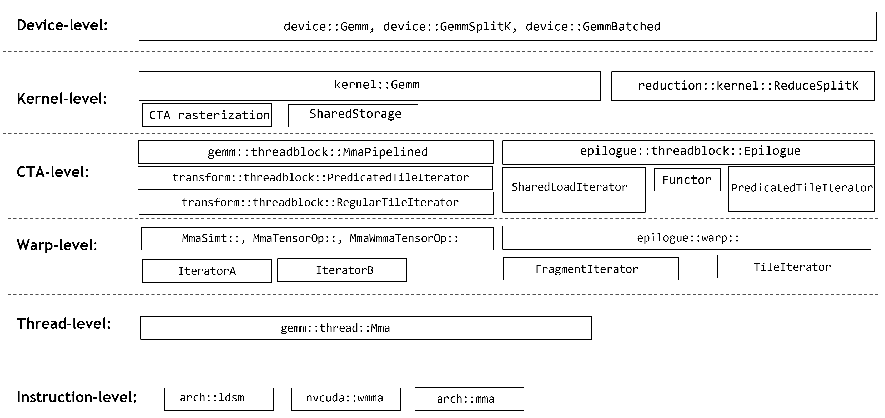
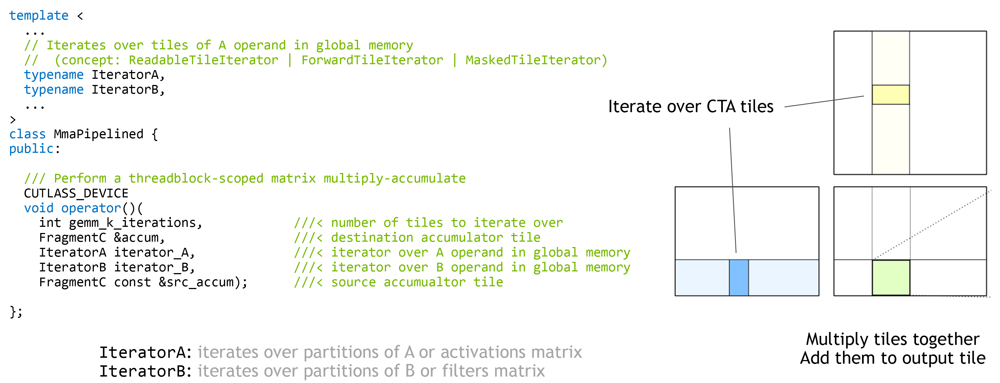
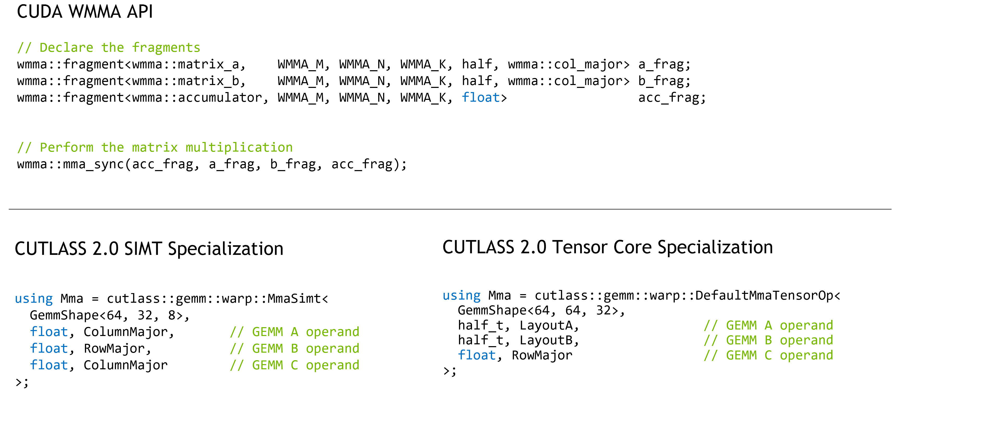
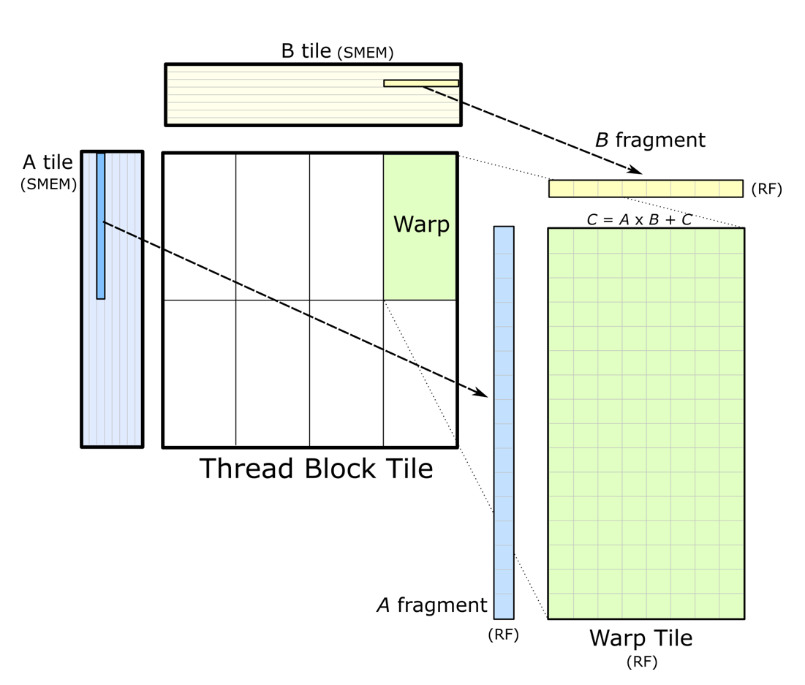

# CUTLASS GEMM API

CUTLASS presents a uniform programming model for matrix multiply-accumulate operations at each level of the hierarchy. This document
focuses on device-level, threadblock-level GEMMs, warp-level GEMMs, thread-level GEMMs, and instruction-level GEMMs.

# CUTLASS GEMM Model

CUTLASS implements the basic GEMM triple loop nest with a tiled structure mirroring the execution model hierarchy.

The following pseudocode describes the model for a GEMM kernel targeting a warp-synchronous matrix multiply instruction like
mma.sync. The entire operation is referred to as "Gemm," as it is assumed that an epilogue operation performs the general matrix
update similar to BLAS.

```c++
                                                                            // cutlass::gemm::device::Gemm
                                                                            //
for (int cta_n = 0; cta_n < GemmN; cta_n += CtaTileN) {                     // for each CTA       } CTA-level concurrency
  for (int cta_m = 0; cta_m < GemmM; cta_m += CtaTileM) {                   //    for each CTA    }
                                                                            //    
                                                                            // cutlass::gemm::threadblock::Mma
                                                                            //
    for (int cta_k = 0; cta_k < GemmK; cta_k += CtaTileK) {                 //       "GEMM mainloop" - no unrolling - one iteration of this loop is one "stage"
                                                                            //
      for (int warp_n = 0; warp_n < CtaTileN; warp_n += WarpTileN) {        // for each warp      } warp-level concurrency
        for (int warp_m = 0; warp_m < CtaTileM; warp_m += WarpTileM) {      //    for each warp   }
                                                                            //
          for (int warp_k = 0; warp_k < CtaTileK; warp_k += WarpTileK) {    //       fully unroll across CtaTileK - one iteration of this loop is one "k Group"
                                                                            //
            for (int mma_k = 0; mma_k < WarpTileK; mma_k += MmaK) {         // cutlass::gemm::warp::Mma
              for (int mma_n = 0; mma_n < WarpTileN; mma_n += MmaN) {       //
                for (int mma_m = 0; mma_m < WarpTileM; mma_m += MmaM) {     //
                                                                            //
                  mma_instruction(d, a, b, c);                              // cutlass::arch::mma - warp-wide matrix multiply instruction

                }   // for mma_m
              }   // for mma_n
            }   // for mma_k

          }   // for warp_k
        }   // for warp_m
      }   // for warp_n

    }   // for cta_k
  }   // for cta_m
}   // for cta_n

```

The outer-most loops correspond to CTA-level hardware concurrency and are not explicitly written as loops in the code. These
are implied by CUDA grid launch semantics.

The comment `cutlass::gemm::threadblock::Mma` refers to the threadblock-scoped matrix multiply-accumulate concept. This is
the computation performed by one threadblock to compute a matrix product in registers. The "GEMM main loop" is listed.

The comment `cutlass::gemm::warp::Mma` refers to the computation performed by each warp. This is a nested loop executing a
sequence of accumulated outer products. 

The inner-most operation corresponds directly to hardware support. In this example, the nested structure terminates with
warp-synchronous matrix multiply instructions targeting Tensor Cores. 
Alternatively, GEMMs targeting single-thread instructions may have an additional series of nested loops corresponding to 
thread-level concurrency.

# CUTLASS GEMM Components

This loop nest is expressed in CUTLASS via the following components which are specialized for data type, layout, and
math instruction.



These components are described in the following sections.

## Device-wide GEMM API

The device-level GEMM API is intended to streamline instantiation and execution of the standard
GEMM computation across the GPU. This operator is intended to be used in host-side .cu code and
has semantics similar to cuBLAS.

The device-wide GEMM API is embodied by the following operators:
- [cutlass::gemm::device::Gemm](https://github.com/NVIDIA/cutlass/tree/main/include/cutlass/gemm/device/gemm.h) - basic GEMM operation
- [cutlass::gemm::device::GemmArray](https://github.com/NVIDIA/cutlass/tree/main/include/cutlass/gemm/device/gemm_array.h) - batched GEMM operation in which input matrices are read from arrays of pointers
- [cutlass::gemm::device::GemmBatched](https://github.com/NVIDIA/cutlass/tree/main/include/cutlass/gemm/device/gemm_batched.h) - batched GEMM operation in which input matrices are separated by a constant stride
- [cutlass::gemm::device::GemmSplitKParallel](https://github.com/NVIDIA/cutlass/tree/main/include/cutlass/gemm/device/gemm_splitk_parallel.h) - GEMM operation that partitions the GEMM K dimension then launches a separate reduction kernel

**Example:** launch a mixed-precision GEMM targeting Volta Tensor Cores.
```c++
  using Gemm = cutlass::gemm::device::Gemm<
    cutlass::half_t,                           // ElementA
    cutlass::layout::ColumnMajor,              // LayoutA
    cutlass::half_t,                           // ElementB
    cutlass::layout::ColumnMajor,              // LayoutB
    cutlass::half_t,                           // ElementOutput
    cutlass::layout::ColumnMajor,              // LayoutOutput
    float,                                     // ElementAccumulator
    cutlass::arch::OpClassTensorOp,            // tag indicating Tensor Cores
    cutlass::arch::Sm70                        // tag indicating target GPU compute architecture
  >;

  Gemm gemm_op;
  cutlass::Status status;
 
  //
  // Launch GEMM on the device
  //
 
  status = gemm_op({
    {m, n, k},
    {ptrA, lda},
    {ptrB, ldb},
    {ptrC, ldc},
    {ptrD, ldd},
    {alpha, beta}
  });

  if (status != cutlass::Status::kSuccess) {
    return -1;
  }
```


## Threadblock-level GEMM API

GEMMs at this scope are expected to efficiently load tiles of data from global memory into internal storage and then compute matrix
products with warp-level GEMM operators.

The threadblock-scoped matrix multiply operation is embodied by 
[cutlass::gemm::threadblock::MmaPipelined](https://github.com/NVIDIA/cutlass/tree/main/include/cutlass/gemm/threadblock/mma_pipelined.h).
This is a class inspired by [std::transform_reduce()](https://en.cppreference.com/w/cpp/algorithm/transform_reduce) 
which computes the accumulated matrix product of a range of tiles defined by tile iterators.



In the case of GEMM, the tile iterators are 
[cutlass::transform::threadblock::PredicatedTileIterator](https://github.com/NVIDIA/cutlass/tree/main/include/cutlass/transform/threadblock/predicated_tile_iterator.h)
to traverse a sequence of tiles in global memory with appropriate predication to avoid out-of-bounds
memory accesses.

*Concept.* Threadblock-level matrix multiply accumulate operators are function objects satisfying the following concept.
```c++
struct Mma {
  /// Shape of warp-level matrix operation (concept: GemmShape)
  struct Shape;

  /// Data type of multiplicand A (concept: numeric type)
  struct ElementA;

  /// Layout of multiplicand A (concept: Layout)
  struct LayoutA;

  /// Data type of multiplicand B (concept: numeric type)
  struct ElementB;

  /// Layout of multiplicand B (concept: Layout)
  struct LayoutB;

  /// Data type of accumulator matrix C (concept: numeric type)
  struct ElementC;

  /// Layout of accumulator matrix C (concept: Layout)
  struct LayoutC;

  /// Iterator of A operand in shared memory - satisfies: ReadableRandomAccessTileIteratorConcept
  struct IteratorA;

  /// Fragment object loaded from IteratorA (concept: Array<ElementA, ..>)
  struct FragmentA;

  /// Iterator of B operand in shared memory - satisfies: ReadableRandomAccessTileIteratorConcept
  struct IteratorB;

  /// Fragment object loaded from IteratorB (concept: Array<ElementB, ..>)
  struct FragmentB;

  /// Iterator of C operand in shared memory - 
  ///    satisfies: ReadableRandomAccessTileIteratorConcept | WriteableRandomAccessTileIteratorConcept
  struct IteratorC;

  /// Fragment object loaded from IteratorC (concept: Array<ElementC, ..>)
  struct FragmentC;

  /// Warp-level matrix multiply operator (concept: satisfies gemm::warp::Mma)
  struct Operator;

  //
  // Method
  //

  /// Computes a matrix product accumulated in D
  CUTLASS_DEVICE
  void operator()(
    FragmentC &D, 
    IteratorA iter_A, 
    IteratorB iter_B, 
    FragmentC const &C);
};
```

## Warp-level Matrix Multiply API

Warp-level GEMM operators load tiles from shared memory into registers and then compute matrix multiplies using either 
Tensor Cores or CUDA Cores. The result is accumulated in a register tile. Iterators are defined for each
operand `A`, `B`, and `C`.

The warp-level GEMM API is a generalization of CUDA's WMMA API to achieve the following objectives:

- native matrix multiply sizes of Tensor Cores
- permuted shared memory layouts to ensure conflict-free accesses
- pointer initilization outside of the mainloop
- efficient traversal

Defining a warp-level matrix multiply in CUTLASS is similar to WMMA as shown below.



The usage model is also similar. The following example computes a warp-level GEMM operation,
accumulating a series of matrix products in a register-backed array. The input to a warp-level
GEMM operation in CUTLASS _must_ be data in shared memory loaded by iterators or on 
register-backed fragments.



```c++
#include "cutlass/gemm/warp/default_mma_tensor_op.h"

using LayoutA = cutlass::layout::ColumnMajorTensorOpMultiplicandCongruous<
    cutlass::sizeof_bits<Element>::value, 64>;

using LayoutB = cutlass::layout::RowMajorTensorOpMultiplicandCongruous<
    cutlass::sizeof_bits<Element>::value, 64>;

using WarpMma = typename cutlass::gemm::warp::DefaultMmaTensorOp<
    cutlass::gemm::GemmShape<64, 64, 8>,                            // Overall warp-level GEMM operation
    cutlass::gemm::GemmShape<16, 8, 8>,                             // Target instruction
    cutlass::half_t, LayoutA,                                       // operand A type and layout
    cutlass::half_t, LayoutB,                                       // operand B type and layout
    float,                                                          // accumulator type
    cutlass::layout::RowMajor>::Type;                               // accumulator layout

//
// Define a GEMM operation loading data from shared memory
//
int const kGemmK = 32;

__shared__ ElementA smem_buffer_A[WarpMma::Shape::kM * kGemmK];
__shared__ ElementB smem_buffer_B[WarpMma::Shape::kN * kGemmK];

//
// Construct iterators into SMEM tiles
//

// leading dimensions inferred from matrix problem size
int lda = WarpMma::Shape::kM;
int ldb = WarpMma::Shape::kN;

// iterators into shared memory
WarpMma::IteratorA warp_iterator_A({smem_buffer_A, lda});
WarpMma::IteratorB warp_iterator_B({smem_buffer_B, ldb});

// Fragments in registers storing the operands
FragmentA frag_A;
FragmentB frag_B;
FragmentC accum;

WarpMma mma;

accum.clear();

//
// Accumulated outer product
//

#pragma unroll 1
for (int k = 0; k < kGemmK; k += WarpMma::Shape::kK) {

  
  iter_A.load(frag_A);  // Load fragments from A and B matrices
  iter_B.load(frag_B);

  ++iter_A; ++iter_B;   // Advance along GEMM K to next tile in A
                        //   and B matrices

                        // Compute matrix product
  mma(accum, frag_A, frag_B, accum);
}
```

*Concept.* Warp-level Mma operations are function objects satisfying the following concept.

```c++
struct Mma {
  /// Shape of warp-level matrix operation (concept: GemmShape)
  struct Shape;

  /// Data type of multiplicand A (concept: numeric type)
  struct ElementA;

  /// Layout of multiplicand A (concept: Layout)
  struct LayoutA;

  /// Data type of multiplicand B (concept: numeric type)
  struct ElementB;

  /// Layout of multiplicand B (concept: Layout)
  struct LayoutB;

  /// Data type of accumulator matrix C (concept: numeric type)
  struct ElementC;

  /// Layout of accumulator matrix C (concept: Layout)
  struct LayoutC;

  /// Iterator of A operand in shared memory - satisfies: ReadableRandomAccessTileIteratorConcept
  struct IteratorA;

  /// Fragment object loaded from IteratorA (concept: Array<ElementA, ..>)
  struct FragmentA;

  /// Iterator of B operand in shared memory - satisfies: ReadableRandomAccessTileIteratorConcept
  struct IteratorB;

  /// Fragment object loaded from IteratorB (concept: Array<ElementB, ..>)
  struct FragmentB;

  /// Iterator of C operand in shared memory - 
  ///     satisfies: ReadableRandomAccessTileIteratorConcept | WriteableRandomAccessTileIteratorConcept
  struct IteratorC;

  /// Fragment object loaded from IteratorC (concept: Array<ElementC, ..>)
  struct FragmentC;

  /// Indicates class of matrix operator (arch::OpClassSimt or arch::OpClassTensorOp)
  struct OperatorClass;

  //
  // Methods
  //

  /// Computes a matrix multiply-accumulate
  CUTLASS_DEVICE
  void operator()(
    FragmentC &D, 
    IteratorA A, 
    IteratorB B, 
    FragmentC const &C);
};
```


*Tensor Core Operators.* Warp-level matrix multiply operators targeting Tensor Cores
may be defined with the following template arguments. The `Policy` type specifies implementation-level details which may 
be used to affect performance or internal implementation of the warp-level operator.

```c++
namespace cutlass {
namespace gemm {
namespace warp {

/// Structure to compute the matrix product targeting CUDA cores and SIMT math instructions.
template <
  /// Size of the Gemm problem - concept: gemm::GemmShape<>
  typename Shape_,
  /// Data type of A elements
  typename ElementA_,
  /// Layout of A matrix (concept: MatrixLayout)
  typename LayoutA_,
  /// Data type of B elements
  typename ElementB_,
  /// Layout of B matrix (concept: MatrixLayout)
  typename LayoutB_,
  /// Element type of C matrix
  typename ElementC_,
  /// Layout of C matrix (concept: MatrixLayout)
  typename LayoutC_,
  /// Shape of the warp in units of thread (concept: MmaSimtPolicy)
  typename Policy_,
  /// Used for partial specialization
  typename Enable = bool
>
class MmaTensorOp {}

} // namespace warp
} // namespace gemm
} // namespace cutlass

```

*SIMT Math Instructions.*  Warp-level matrix multiply operators targeting CUDA Cores
may be defined with the following template arguments. The `Policy` type specifies implementation-level details which may 
be used to affect performance or internal implementation of the warp-level operator.

```c++
/// Structure to compute the matrix product targeting CUDA cores and SIMT math instructions.
template <
  /// Size of the Gemm problem - concept: gemm::GemmShape<>
  typename Shape_,
  /// Data type of A elements
  typename ElementA_,
  /// Layout of A matrix (concept: MatrixLayout)
  typename LayoutA_,
  /// Data type of B elements
  typename ElementB_,
  /// Layout of B matrix (concept: MatrixLayout)
  typename LayoutB_,
  /// Element type of C matrix
  typename ElementC_,
  /// Layout of C matrix (concept: MatrixLayout)
  typename LayoutC_,
  /// Shape of the warp in units of thread (concept: MmaSimtPolicy)
  typename Policy_,
  /// Used for partial specialization
  typename Enable = bool
>
class MmaSimt;
```


## Thread-level GEMM API

Thread-level GEMM operations perform matrix multiply-accumulate on data held in registers. These target CUDA Cores exclusively.

*Concept.* Thread-level matrix multiply operations are function objects satisfying the following concept.
```c++
struct Mma {

  /// Shape of warp-level matrix operation (concept: GemmShape)
  struct Shape;

  /// Data type of multiplicand A (concept: numeric type)
  struct ElementA;

  /// Layout of multiplicand A (concept: Layout)
  struct LayoutA;

  /// Fragment object loaded from IteratorA (concept: Array<ElementA, ..>)
  struct FragmentA;

  /// Data type of multiplicand B (concept: numeric type)
  struct ElementB;

  /// Layout of multiplicand B (concept: Layout)
  struct LayoutB;

  /// Fragment object loaded from IteratorA (concept: Array<ElementB, ..>)
  struct FragmentB;

  /// Data type of accumulator matrix C (concept: numeric type)
  struct ElementC;

  /// Layout of accumulator matrix C (concept: Layout)
  struct LayoutC;

  /// Fragment object loaded from IteratorA (concept: Array<ElementC, ..>)
  struct FragmentC;

  //
  // Methods
  //

  /// Computes a matrix multiply-accumulate
  CUTLASS_DEVICE
  void operator()(
    FragmentC &D, 
    FragmentA const &A, 
    FragmentB const &B, 
    FragmentC const &C);
};
```

The CUTLASS thread-level GEMM template accepts the following template arguments.
```c++
namespace cutlass {
namespace gemm {
namespace thread {

/// Structure to compute the matrix product
template <
  /// Size of the Gemm problem - concept: gemm::GemmShape<>
  typename Shape,
  /// Data type of A elements
  typename ElementA,
  /// Layout of A matrix (concept: MatrixLayout)
  typename LayoutA,
  /// Data type of B elements
  typename ElementB,
  /// Layout of B matrix (concept: MatrixLayout)
  typename LayoutB,
  /// Element type of C matrix
  typename ElementC,
  /// Layout of C matrix (concept: MatrixLayout)
  typename LayoutC,
  /// Concept: arch::OpMultiplyAdd or arch::Mma<>
  typename Operator = arch::OpMultiplyAdd,
  /// Used for partial specialization
  typename Enable = bool
>
struct Mma;

} // namespace thread
} // namespace gemm
} // namespace cutlass
```

## Efficient Epilogue 

CUTLASS GEMM operators perform mma followed by epilogue operation similar 
to cuBLAS. CUTLASS implements an efficient row-major epilogue. Thus, to achieve 
column-major GEMM, operands A & B are transposed and swapped.

To enable efficient row-major epilogue for both row-major and column-major output layout, 
CUTLASS' device-level GEMM operators `cutlass::device::Gemm` and `cutlass::device::GemmUniversal` 
provide two template definitions:
- (a) [General definition](https://github.com/NVIDIA/cutlass/tree/main/include/cutlass/gemm/device/gemm.h#L217)
- (b) [Specialized definition for column-major source/output](https://github.com/NVIDIA/cutlass/tree/main/include/cutlass/gemm/device/gemm.h#L545)

Efficient row-major epilogue for:
- (i)  GEMM operator on row-major source/output uses template (a). It runs row-major GEMM and 
an efficient row-major epilogue.
- (ii)  GEMM operator on column-major source/output uses template (b). It transposes and swaps 
operands A and B to enable efficient epilogue. `A x B = C => Transpose(B) x Transpose(A) = Transpose(C)`.
For column-major source (C) matrix, Transpose(C) is row-major, and efficient epilogue works on 
row-major.

Note that cuBLAS typically expects a column-major source (C) and output matrix (D). Thus,
CUTLASS library only instantiates and generates GEMM operatos with column-major layout. However, 
CUTLASS by itself can run both row-major and column-major output layouts for all combinations 
of input layouts. Thus, CUTLASS supports the following layout combinations for input and output layouts: 

- `{N,T} x {N,T} => {N,T}` - NN, TN, TN, TT GEMM for both row-major and column-major output

## Instruction-level operations

CUTLASS defines a template-based interface to Tensor Core operations to avoid resorting
to inline PTX.

- [mma_sm70.h](https://github.com/NVIDIA/cutlass/tree/main/include/cutlass/arch/mma_sm70.h) - Volta TensorCore operations
- [mma_sm75.h](https://github.com/NVIDIA/cutlass/tree/main/include/cutlass/arch/mma_sm75.h) - Turing TensorCore operations


# Copyright

Copyright (c) 2017 - 2025 NVIDIA CORPORATION & AFFILIATES. All rights reserved.
SPDX-License-Identifier: BSD-3-Clause

```
  Redistribution and use in source and binary forms, with or without
  modification, are permitted provided that the following conditions are met:

  1. Redistributions of source code must retain the above copyright notice, this
  list of conditions and the following disclaimer.

  2. Redistributions in binary form must reproduce the above copyright notice,
  this list of conditions and the following disclaimer in the documentation
  and/or other materials provided with the distribution.

  3. Neither the name of the copyright holder nor the names of its
  contributors may be used to endorse or promote products derived from
  this software without specific prior written permission.

  THIS SOFTWARE IS PROVIDED BY THE COPYRIGHT HOLDERS AND CONTRIBUTORS "AS IS"
  AND ANY EXPRESS OR IMPLIED WARRANTIES, INCLUDING, BUT NOT LIMITED TO, THE
  IMPLIED WARRANTIES OF MERCHANTABILITY AND FITNESS FOR A PARTICULAR PURPOSE ARE
  DISCLAIMED. IN NO EVENT SHALL THE COPYRIGHT HOLDER OR CONTRIBUTORS BE LIABLE
  FOR ANY DIRECT, INDIRECT, INCIDENTAL, SPECIAL, EXEMPLARY, OR CONSEQUENTIAL
  DAMAGES (INCLUDING, BUT NOT LIMITED TO, PROCUREMENT OF SUBSTITUTE GOODS OR
  SERVICES; LOSS OF USE, DATA, OR PROFITS; OR BUSINESS INTERRUPTION) HOWEVER
  CAUSED AND ON ANY THEORY OF LIABILITY, WHETHER IN CONTRACT, STRICT LIABILITY,
  OR TORT (INCLUDING NEGLIGENCE OR OTHERWISE) ARISING IN ANY WAY OUT OF THE USE
  OF THIS SOFTWARE, EVEN IF ADVISED OF THE POSSIBILITY OF SUCH DAMAGE.
```
