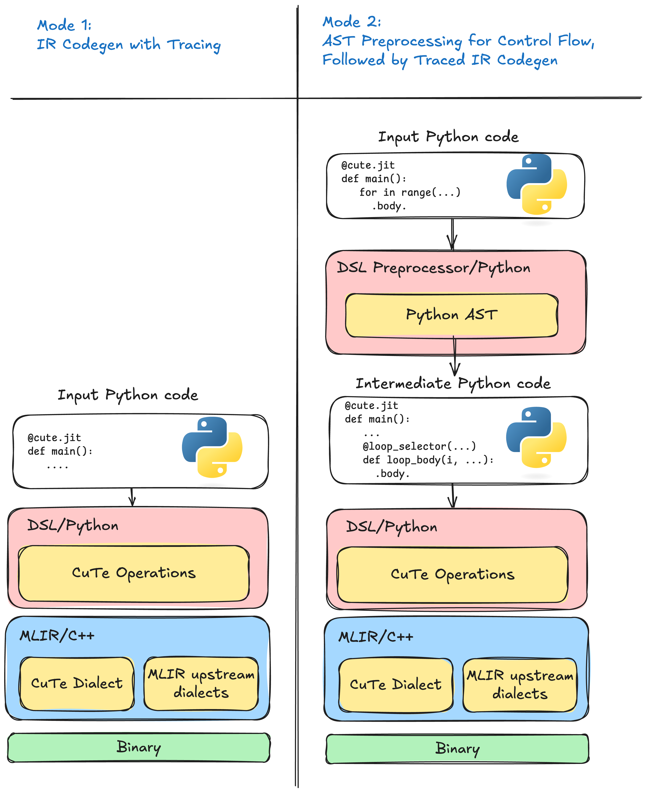

.. _dsl_code_generation:
.. |DC|  replace:: dynamic compilation
.. |DSL| replace:: CuTe DSL
.. |IR|  replace:: intermediate representation (IR)

End-to-End Code Generation
==========================

1. Hybrid DSL: Python Metaprogramming, Structured GPU Code
----------------------------------------------------------

|DSL| is a **hybrid DSL** that combines two compilation techniques: *AST rewrite*
and *tracing*.  This combination gives you the best of both worlds:

*  **Program structure is preserved** — control flow (loops, branches) is
   captured via AST rewrite, compiling to proper structured code instead of
   flattened traces.
*  **Python stays Python** — arithmetic and tensor operations are captured via
   tracing, so dynamic shapes, metaprogramming, and Python's rich expression
   language work naturally.

To understand why this matters, let's look at each technique.

1.1 AST Rewrite
^^^^^^^^^^^^^^^
The function’s abstract-syntax tree is analysed **before** execution.
Python control-flow (``for``/``while``, ``if``/``else``) and built-ins are converted to structured |IR|
constructs.  Computation inside each region is left untouched at this stage.

*Advantages*

*  Sees the entire program, so every branch and loop is preserved.
*  Keeps loop structure intact for optimization such as tiling, vectorisation
   or GPU thread mapping.

*Disadvantages*

*  Requires a well-defined Python subset that the rewriter understands.

1.2 Tracing
^^^^^^^^^^^
The decorated function is executed once with *proxy* arguments; overloaded
operators record every tensor operation that actually runs and produce a flat
trace that is lowered to |IR|.

*Advantages*

*  Near-zero compile latency, ideal for straight-line arithmetic.
*  No need to parse Python source, so it supports many dynamic Python
   features, and Python has many features.

*Disadvantages*

*  Untaken branches vanish, so the generated kernel may be wrong for other
   inputs.
*  Loops are flattened to the iteration count observed during tracing.
*  Data-dependent control-flow freezes to a single execution path.

1.3 The Hybrid Solution
^^^^^^^^^^^^^^^^^^^^^^^

As shown above, neither technique alone is sufficient—but together they
complement each other perfectly.

**Why this works: GPU kernels are simple at runtime**

High-performance GPU kernels are structurally simple at runtime: they avoid
deep call hierarchies, complex branching, and dynamic dispatch.  However,
*authoring* such kernels benefits greatly from Python's abstractions—classes,
metaprogramming, and polymorphic patterns improve readability and
maintainability.

The hybrid approach resolves this tension by evaluating Python abstractions at
compile time while emitting simple, optimized code for runtime execution.

**How |DSL| divides the work:**

1. **AST rewrite handles structure** — loops (``for``, ``while``) and branches
   (``if``/``else``) are converted to structured |IR| *before* execution.
   This solves tracing's control-flow problem.

2. **Tracing handles arithmetic** — inside each structured region, the tracer
   records tensor operations exactly as they execute.  No need to model Python's
   complex semantics—just run Python and record what happens.  This solves AST
   rewriting's complexity problem.

The result:

*  Loops compile to real loops, not unrolled traces.
*  All branches are preserved, even if not taken during tracing.
*  Dynamic shapes, metaprogramming, and Python idioms work naturally.
*  The rewriter only needs to understand control flow, not all of Python.

2. |DSL| Compilation Flow: Meta-Stage to Object-Stage
------------------------------------------------------

|DSL| bridges Python and GPU hardware through a three-stage pipeline.

.. _fig-dsl-modes:

   *Left*: tracing mode records only the path that executed.
   *Right*: preprocessor mode emits structured |IR| for every branch and loop
   before tracing the arithmetic.

   The default |DSL| compilation pipeline (mode 2): Python source flows through AST preprocessing
   and interpreter-driven tracing to produce |IR|, which is then lowered and
   compiled to device code.

**Stage 1: Pre-Staging (Python AST)**

Before any code executes, the AST preprocessor rewrites the decorated function.
It inserts *callbacks* around control-flow constructs—loops, branches, and
function boundaries—so that program structure is captured explicitly rather than
lost during execution.

**Stage 2: Meta-Stage (Python Interpreter)**

The rewritten function runs in the Python interpreter with proxy tensor
arguments.  As execution proceeds:

*  Callbacks fire at control-flow boundaries, emitting structured |IR| (loops,
   branches, etc.).
*  Tensor operations are traced: each operator invocation records the
   corresponding operation.
*  Compile-time constants are *partially evaluated*—values known at JIT time
   fold directly into the |IR|, enabling aggressive specialization.

The result is a complete representation of the kernel, with both high-level
structure and low-level arithmetic intact.

**Stage 3: Object-Stage (Compiler Backend)**

The internal representation passes through a lowering pipeline:

1. High-level operations are progressively lowered toward hardware-specific
   representations.
2. Optimization passes (tiling, vectorization, memory promotion) reshape the
   code for the target architecture.
3. The final code is translated to PTX/SASS (for NVIDIA GPUs) and assembled
   into a device binary.

At runtime, the compiled kernel is loaded and launched on the accelerator.

3. Meta-Programming vs Runtime: Two Worlds in One Function
----------------------------------------------------------

A key insight for understanding |DSL| is that **your Python code runs twice**,
in two very different contexts:

1. **Meta-programming time (compilation)** — Python executes to *build* the
   kernel.  This happens on the host CPU when you call a ``@jit`` function.
2. **Runtime (execution)** — The compiled kernel runs on the GPU with actual
   tensor data.

This distinction determines what you can observe and when.

``print()`` vs ``cute.printf()``: Meta-Stage vs Object-Stage Output
^^^^^^^^^^^^^^^^^^^^^^^^^^^^^^^^^^^^^^^^^^^^^^^^^^^^^^^^^^^^^^^^^^^^

|DSL| provides two ways to print values, each operating at a different stage:

*  **Python's** ``print()`` — executes during the **meta-stage** (compilation).
   Use it to inspect what the compiler sees.
*  ``cute.printf()`` — compiles into the kernel and executes at **runtime** on
   the GPU.  Use it to observe actual tensor values during execution.

The following examples demonstrate how the same ``result`` variable appears
differently depending on when and how you print it.

**Example 1: Dynamic variables (both** ``a`` **and** ``b`` **are runtime values)**

.. code-block:: python

   @cute.jit
   def add_dynamicexpr(b: cutlass.Float32):
       a = cutlass.Float32(2.0)
       result = a + b
       print("[meta-stage] result =", result)          # runs at compile time
       cute.printf("[object-stage] result = %f\n", result)  # runs on GPU

   add_dynamicexpr(5.0)

.. code-block:: text

   $> python myprogram.py
   [meta-stage] result = <Float32 proxy>
   [object-stage] result = 7.000000

At meta-stage, ``result`` is a proxy—its value is unknown until the kernel runs.
At runtime, ``cute.printf()`` prints the actual GPU-computed value.

**Example 2: Compile-time constants (both** ``a`` **and** ``b`` **are Constexpr)**

.. code-block:: python

   @cute.jit
   def add_constexpr(b: cutlass.Constexpr):
       a = 2.0
       result = a + b
       print("[meta-stage] result =", result)          # runs at compile time
       cute.printf("[object-stage] result = %f\n", result)  # runs on GPU

   add_constexpr(5.0)

.. code-block:: text

   $> python myprogram.py
   [meta-stage] result = 7.0
   [object-stage] result = 7.000000

Both values are known at compile time, so Python evaluates ``2.0 + 5.0 = 7.0``
during tracing.  The constant is baked into the compiled kernel.

**Example 3: Hybrid (** ``a`` **is dynamic,** ``b`` **is Constexpr)**

.. code-block:: python

   @cute.jit
   def add_hybrid(b: cutlass.Constexpr):
       a = cutlass.Float32(2.0)
       result = a + b
       print("[meta-stage] result =", result)          # runs at compile time
       cute.printf("[object-stage] result = %f\n", result)  # runs on GPU

   add_hybrid(5.0)

.. code-block:: text

   $> python myprogram.py
   [meta-stage] result = <Float32 proxy>
   [object-stage] result = 7.000000

The constant ``b = 5.0`` is folded in, but since ``a`` is dynamic, the result
remains a proxy at meta-stage.  The GPU computes the final answer at runtime.

Practical Implications
^^^^^^^^^^^^^^^^^^^^^^

*  **Use** ``print()`` **to debug your meta-program** — inspect shapes, strides,
   tile sizes, and compile-time decisions.
*  **Constexpr parameters enable specialization** — the compiler can generate
   tighter code when values are known at JIT time.
*  **Dynamic parameters preserve generality** — a single compiled kernel can
   handle varying input sizes without recompilation.

4. |DSL| Code-Generation Modes
------------------------------

CuTe's Python front-end combines the techniques above into **two mutually
exclusive modes** (see :ref:`fig-dsl-modes`), selectable with the ``preprocessor`` flag of the
``@jit`` decorator:

1. Tracing mode ``@jit(preprocess=False)`` – tracing only.
This results in the fastest compilation path and is recommended only for kernels that are guaranteed to be
straight-line arithmetic. It suffers from all tracing limitations listed in the previous section.

2.  Preprocessor mode (**default**) ``@jit(preprocess=True)`` – **AST rewrite + tracing**.
The AST pass captures every loop and branch, eliminating the correctness and
optimisation problems of pure tracing; tracing then fills in the arithmetic.
This hybrid “preprocessor” pipeline is unique to |DSL| and was designed
specifically to overcome the disadvantages identified above.

