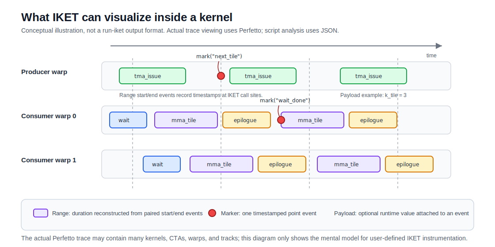
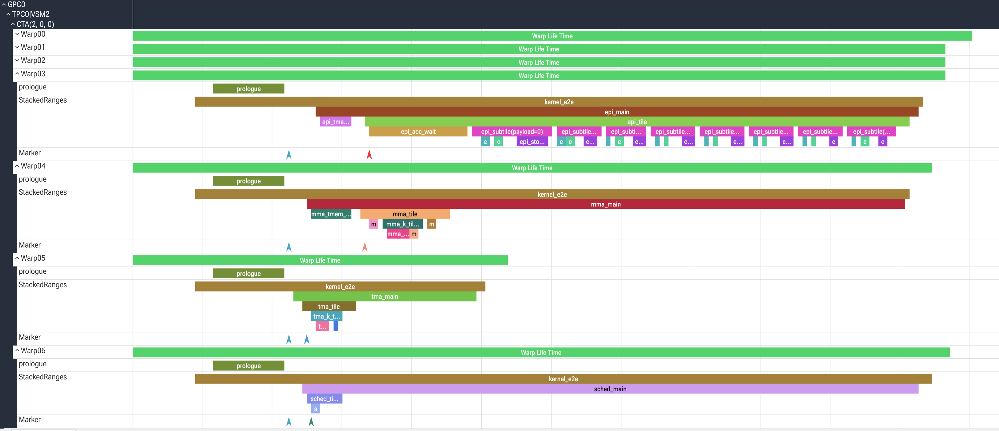
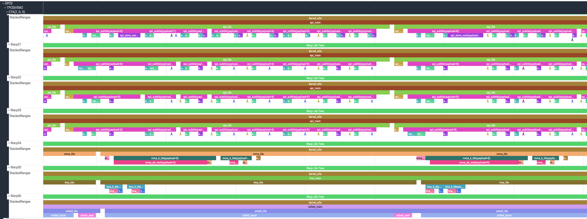

.. _iket_profiling:

IKET Profiling
==============

.. warning::

   IKET is an experimental profiling feature for CuTe DSL kernels. The API,
   output format, profiler workflow, and overhead characteristics may change
   in future releases. Users should understand the intended use cases and
   limitations before interpreting profiling results. IKET dialect tool support
   may also move to official NVIDIA Nsight tools in the future.

IKET, short for In-Kernel Event Tracing, lets CuTe DSL kernels emit named
markers and ranges from inside the kernel. The ``run-iket`` profiler collects
those events and generates timeline output that can be inspected in the
Perfetto UI at https://ui.perfetto.dev/, along with machine-readable JSON
output. ``run-iket`` is a purpose-built standalone profiler for collecting IKET
traces in this experimental workflow. Conceptually, IKET is similar to CPU-side
NVTX ranges and markers, but the events are emitted from device code inside the
kernel. IKET supports Hopper and newer GPU architectures, including SM90,
SM100, SM103, SM110, and SM120. The ``run-iket`` profiler is released with the
``nvidia-cutlass-dsl`` package.

IKET records device-side events at instrumentation points. The figure below is
a conceptual illustration, not a ``run-iket`` output format. It shows the kind
of producer/consumer activity that user-defined IKET ranges and markers can
make visible inside a kernel. Actual timeline viewing uses the Perfetto trace
described later in this guide.

   Conceptual view of IKET ranges and markers inside a kernel. ``run-iket``
   emits Perfetto and JSON traces; it does not emit this simplified diagram.

Requirements
------------

Use a ``nvidia-cutlass-dsl`` installation that includes ``run-iket``. A quick
first check is:

.. code-block:: bash

   run-iket --help

The profiled workload must run on a supported GPU architecture and must
JIT-compile the instrumented CuTe DSL kernel during the ``run-iket`` profiling
process. Kernels that are already compiled and reused without recompilation do
not gain IKET instrumentation during that run.

End-to-End Quick Start
----------------------

This section shows the minimal end-to-end flow: add IKET calls in kernel code,
run the workload under ``run-iket``, and open the generated trace.

**Step 1: Add IKET instrumentation.** Place IKET calls inside a
``@cute.kernel`` function. IKET calls in host-side Python wrappers do not emit
in-kernel events.

The following example shows a small kernel fragment with a marker, a
token-based range, and a stack-based range.

.. code-block:: python

   import cutlass
   import cutlass.cute as cute

   @cute.kernel
   def kernel(gA: cute.Tensor, gB: cute.Tensor, gC: cute.Tensor):
       bidx, _, _ = cute.arch.block_idx()

       cute.experimental.iket.mark("kernel_start", bidx)

       load_token = cute.experimental.iket.range_start("load")
       # Load data from gA and gB.
       cute.experimental.iket.range_end(load_token)

       cute.experimental.iket.range_push("compute")
       # Compute and store results.
       cute.experimental.iket.range_pop()

A complete CuTe DSL GEMM example with IKET instrumentation is available at
``examples/python/CuTeDSL/dsl_tutorials/fp16_gemm_4_iket.py``.

**Step 2: Run the application under** ``run-iket``. The profiler automatically
requests IKET lowering for kernels that are JIT-compiled during the profiled
run.

.. code-block:: bash

   run-iket profile --postprocess perfetto -- \
     python fp16_gemm_4_iket.py \
     --mnk 512,1024,64

**Step 3: Open the trace.** Open the generated ``*.pftrace`` file in the
Perfetto UI at https://ui.perfetto.dev/ and inspect the in-kernel markers and
ranges.

   Cropped Perfetto view from the GEMM tutorial, showing nested IKET ranges
   across several warp roles.

The rest of this guide explains the API, instrumentation patterns, trace output,
limitations, and overhead guidance in more detail.

IKET API calls are stripped by default. If neither ``run-iket`` is used to
profile the target kernel nor an explicit compile option enables IKET lowering,
the ``iket.*`` operations do not add instrumentation code to the final kernel.

To build IKET instrumentation outside a ``run-iket`` profiling run, enable IKET
for all JIT compilations in the process:

.. code-block:: bash

   export CUTE_DSL_COMPILER_OPT=iket
   python my_kernel.py

Alternatively, enable IKET for one explicit compilation:

.. code-block:: python

   compiled = cute.compile(host_function, *args, options="iket")

API Reference
-------------

IKET APIs are available under ``cutlass.cute.experimental.iket``. The table
below uses ``iket`` as shorthand for that module. IKET API calls should be
placed inside ``@cute.kernel`` code. Instrumentation in host-side Python code
does not create in-kernel events.

IKET has three basic concepts:

* An event is one warp-level runtime record emitted by a kernel. Each event
  records a timestamp and the metadata needed to identify it in the trace.
* A marker is a point annotation and emits one event.
* A range represents a duration and is usually built from two events: one at
  the start and one at the end. Each event can optionally carry one payload
  value to record a runtime variable.

.. list-table::
   :header-rows: 1
   :widths: 25 45 30

   * - API
     - Purpose
     - Notes
   * - ``iket.mark(name)``
     - Emit a single timestamped marker.
     - Use for point events.
   * - ``iket.mark(name, payload)``
     - Emit a marker with a numeric payload.
     - The payload is stored with the event.
   * - ``iket.range_push(name)``
     - Start a stack-based range.
     - Closed by the next matching ``iket.range_pop()`` in LIFO order.
   * - ``iket.range_push(name, payload)``
     - Start a stack-based range with a numeric payload.
     - The payload is attached to the push event.
   * - ``iket.range_pop()``
     - End the most recent stack-based range.
     - Does not take a range name.
   * - ``iket.range_start(name)``
     - Start a token-based range and return a token.
     - Closed by ``iket.range_end(token)``.
   * - ``iket.range_start(name, payload)``
     - Start a token-based range with a numeric payload.
     - Closed by ``iket.range_end(token, payload)`` with matching payload type.
   * - ``iket.range_end(token)``
     - End a token-based range.
     - The token must come from ``iket.range_start`` or ``iket.sentinel_token``.
   * - ``iket.range_end(token, payload)``
     - End a token-based range with a numeric payload.
     - The corresponding ``iket.range_start`` call must also have a payload,
       and the payload types must match.
   * - ``iket.sentinel_token(name)``
     - Create a token without a real runtime event for cross-iteration ranges.
     - Use it when ``range_end`` appears before the later ``range_start`` in
       source order.

Choosing a Range API
~~~~~~~~~~~~~~~~~~~~

CuTe DSL IKET provides two valid range-pairing models. Choose the one that makes
the pairing easiest to see in the kernel source.

Use ``range_push`` / ``range_pop`` when the range is naturally nested and the
push and pop calls can stay in the same structured scope. This is often the
clearest shape for phase-style instrumentation such as setup, mainloop, wait,
issue, and epilogue ranges.

Use ``range_start`` / ``range_end`` when an explicit handle makes the pairing
clearer. This can be useful when a range ends at a later synchronization point,
crosses an iteration boundary, or has multiple mutually exclusive close sites.

Payloads
~~~~~~~~

Payloads attach a runtime value to an event. They are useful for recording
values such as loop indices, block coordinates, or small computed metrics.
Supported payloads include Python boolean, integer, and floating-point literals,
plus CuTe DSL numeric and index scalar values. Do not use tensors, tuples, or
other aggregate values as payloads. Prefer warp-uniform payload values, such as
loop indices or block coordinates, when they describe the event clearly. For
example:

.. code-block:: python

   for k_tile in cutlass.range(k_tile_count):
       cute.experimental.iket.range_push("k_tile", k_tile)
       # Work for this K tile.
       cute.experimental.iket.range_pop()

IKET events are warp-level events. If active threads in the participating warp
evaluate a payload expression to different values, the dumped payload value is
from the first active thread. To record the payload value from a specific
thread, guard the IKET call with a predicate such as ``if tidx == 0:``. For
range endpoints, guard paired endpoints consistently.

Plain Python integer literals are emitted as 32-bit integer payloads, and plain
Python floating-point literals are emitted as 32-bit floating-point payloads.
Use explicit CuTe DSL scalar types for 64-bit literal payloads:

.. code-block:: python

   cute.experimental.iket.mark("large_count", cutlass.Int64(0x100000000))
   cute.experimental.iket.mark("scale", cutlass.Float64(3.141592653589793))

For token-based ranges, the start and end payload forms must match. It is not
allowed to start a range with a payload and end it without one, or to use
different payload types between ``range_start`` and ``range_end``.

Example Instrumentation Patterns
--------------------------------

The examples below use ``cute.experimental.iket`` inside ``@cute.kernel`` code.
IKET calls in host-side Python wrappers do not emit in-kernel events.

Before Adding Events
~~~~~~~~~~~~~~~~~~~~

Start by identifying the kernel body and the work you want to measure.

1. Find the ``@cute.kernel`` function. Host-side ``@cute.jit`` functions and
   launch wrappers are useful context, but IKET instrumentation should be placed
   in device kernel code.
2. Split the kernel into natural phases. For a GEMM-shaped kernel this may be
   setup, TMA or copy issue, mainloop, MMA, waits, and epilogue. Other kernels
   should use names that match their own algorithmic phases.
3. Note warp-specialized regions such as ``if warp_idx == 0:`` or
   ``if is_leader_cta:``. Put both ends of a range inside the same role or
   guard when the work is role-specific.
4. Identify asynchronous work. For example, TMA copies, ``cp.async``-style
   copies, WGMMA or MMA issue, and pipeline or mbarrier operations may have
   separate issue and completion points.

Coarse Phase Timing
~~~~~~~~~~~~~~~~~~~

Begin with a small number of coarse ranges. This provides orientation in the
trace and keeps overhead manageable while you decide where more detail is
needed.

.. code-block:: python

   @cute.kernel
   def kernel(...):
       user_warp_lifetime = cute.experimental.iket.range_start(
           "user_warp_lifetime"
       )

       cute.experimental.iket.range_push("setup")
       # Allocate/register fragments, partition tensors, initialize pipelines.
       cute.experimental.iket.range_pop()  # setup

       cute.experimental.iket.range_push("mainloop")
       for k_tile in cutlass.range(k_tile_count):
           # Main loop body.
       cute.experimental.iket.range_pop()  # mainloop

       cute.experimental.iket.range_push("epilogue")
       # Convert accumulators and store results.
       cute.experimental.iket.range_pop()  # epilogue

       cute.experimental.iket.range_end(user_warp_lifetime)

For warp-specialized code, place the range inside the guard for the warp that
does the work:

.. code-block:: python

   if warp_idx == tma_warp_id:
       cute.experimental.iket.range_push("tma_main")
       # TMA producer work.
       cute.experimental.iket.range_pop()  # tma_main

   if warp_idx == mma_warp_id:
       cute.experimental.iket.range_push("mma_main")
       # MMA consumer work.
       cute.experimental.iket.range_pop()  # mma_main

Timing Waits and Async Work
~~~~~~~~~~~~~~~~~~~~~~~~~~~

For asynchronous operations, decide whether the range measures issue time or
completion/wait time. An event immediately after an async issue point measures
issue-side timing. Completion is usually observed at a pipeline or mbarrier wait.

To measure issue time:

.. code-block:: python

   issue_token = cute.experimental.iket.range_start("tma_issue", k_tile)
   cute.copy(tma_atom, src_tensor, dst_tensor, tma_bar_ptr=barrier)
   cute.experimental.iket.range_end(issue_token, k_tile)

To measure wait time:

.. code-block:: python

   cute.experimental.iket.range_push("ab_wait")
   ab_full = ab_consumer.wait_and_advance()
   cute.experimental.iket.range_pop()

The same wait pattern can be used around pipeline acquire calls, mbarrier waits,
allocator waits, or other synchronization points whose return marks completion
of the waited-for work.

Cross-Iteration Wait-Boundary Timing
~~~~~~~~~~~~~~~~~~~~~~~~~~~~~~~~~~~~

Some pipelined loops start work for iteration ``N`` and observe the next useful
boundary for that work in iteration ``N + 1``. For example, the next iteration
may reach a pipeline wait, mbarrier wait, or other ``wait_and_advance``-style
call before the previous tile's range should close. Use ``sentinel_token`` to
initialize the token before the loop. Creating the sentinel token emits no
runtime event. Calling ``range_end`` on the initial sentinel token is valid and
emits no runtime event; after the variable is replaced by a token from
``range_start``, ``range_end`` emits the runtime end event for that real range.

.. code-block:: python

   iter_token = cute.experimental.iket.sentinel_token("mma_k_tile")

   for k_tile in cutlass.range(k_tile_count):
       ...  # some setup codes for k_tile
       ab_full = ab_consumer.wait_and_advance()

       # Close the previous tile only after this wait boundary is reached.
       if k_tile > 0:
           cute.experimental.iket.range_end(iter_token)

       iter_token = cute.experimental.iket.range_start("mma_k_tile")
       # Work for this tile.
       cute.gemm(tiled_mma, tCtAcc, tCrA, tCrB, tCtAcc)
       ab_full.release()

   if k_tile_count > 0:
       ...  # final drain or synchronization boundary for the last tile
       cute.experimental.iket.range_end(iter_token)

Use this pattern only when the cross-iteration boundary is meaningful. For a
simple per-iteration range whose start and end are both inside the same loop
iteration, a push/pop pair inside the loop is simpler:

.. code-block:: python

   for k_tile in cutlass.range(k_tile_count):
       cute.experimental.iket.range_push("k_tile", k_tile)
       # Work for this tile.
       cute.experimental.iket.range_pop()

Warp-Specialized Mainloop Example
~~~~~~~~~~~~~~~~~~~~~~~~~~~~~~~~~

The following skeleton shows how to layer ranges by role and by loop level in a
warp-specialized kernel. Adapt the role names and phase names to the actual
kernel.

.. code-block:: python

   @cute.kernel
   def kernel(...):
       user_warp_lifetime = cute.experimental.iket.range_start(
           "user_warp_lifetime"
       )

       # Work shared by all participating warps.
       cute.experimental.iket.range_push("prologue")
       # Tensor partitioning, pipeline setup, scheduler setup.
       cute.experimental.iket.range_pop()  # prologue

       if warp_idx == tma_warp_id:
           cute.experimental.iket.range_push("tma_main")
           while work_tile.is_valid_tile:
               cute.experimental.iket.range_push("tma_tile")

               for k_tile in cutlass.range(k_tile_count):
                   cute.experimental.iket.range_push("tma_k_tile", k_tile)
                   ...  # some setup codes for k_tile

                   cute.experimental.iket.range_push("tma_acquire")
                   ab_empty = ab_producer.acquire_and_advance()
                   cute.experimental.iket.range_pop()  # tma_acquire

                   issue_token = cute.experimental.iket.range_start(
                       "tma_issue", k_tile
                   )
                   cute.copy(tma_a_atom, tAgA, tAsA, tma_bar_ptr=ab_empty.barrier)
                   cute.copy(tma_b_atom, tBgB, tBsB, tma_bar_ptr=ab_empty.barrier)
                   cute.experimental.iket.range_end(issue_token, k_tile)

                   cute.experimental.iket.range_pop()  # tma_k_tile

               tile_sched.advance_to_next_work()
               work_tile = tile_sched.get_current_work()
               cute.experimental.iket.range_pop()  # tma_tile

           ab_producer.tail()
           cute.experimental.iket.range_pop()  # tma_main

       if warp_idx == mma_warp_id:
           cute.experimental.iket.range_push("mma_main")
           while work_tile.is_valid_tile:
               cute.experimental.iket.range_push("mma_tile")

               for k_tile in cutlass.range(k_tile_count):
                   cute.experimental.iket.range_push("mma_k_tile", k_tile)

                   cute.experimental.iket.range_push("ab_wait")
                   ab_full = ab_consumer.wait_and_advance()
                   cute.experimental.iket.range_pop()  # ab_wait

                   cute.experimental.iket.range_push("mma_issue")
                   cute.gemm(tiled_mma, tCtAcc, tCrA, tCrB, tCtAcc)
                   cute.experimental.iket.range_pop()  # mma_issue

                   ab_full.release()
                   cute.experimental.iket.range_pop()  # mma_k_tile

               tile_sched.advance_to_next_work()
               work_tile = tile_sched.get_current_work()
               cute.experimental.iket.range_pop()  # mma_tile

           cute.experimental.iket.range_pop()  # mma_main

       cute.experimental.iket.range_end(user_warp_lifetime)

This style makes each role visible in the trace. Prefixing names with the role
such as ``tma_`` and ``mma_`` also makes JSON output easier to filter.

Instrumentation Guidelines
~~~~~~~~~~~~~~~~~~~~~~~~~~

Consider the following when placing IKET calls. These choices affect what the
profiler can reconstruct from the runtime events, so unclear or mismatched
instrumentation may produce results that do not match the intended measurement
or even cause the profiler to fail when postprocessing the data.

* Every dynamic ``range_push`` has exactly one matching ``range_pop`` on each
  participating warp execution path, in LIFO order.
* Every dynamic non-sentinel ``range_start`` is closed by ``range_end`` on each
  participating warp execution path. It is valid to close the same token in
  multiple mutually exclusive branches, as long as each executed path closes it
  once.
* Start and end points are in the same warp role and compatible control-flow
  path. Do not start a range in one thread-divergent branch and close it in
  another. Violating this may cause undefined profiling results.
* Payload-bearing token ranges use matching payload types at start and end.
* Event names are at most 32 characters.
* Reuse the same descriptive name for the same recurring phase inside a loop.
  This creates many runtime events but only one unique marker or range name.
* When more than 30 unique marker or range names are used, instrumentation
  overhead increases.
* Avoid high-frequency events in innermost unrolled loops unless that detail is
  necessary. IKET events can affect compiler scheduling and can create large
  traces.
* Do not put IKET range operations inside
  ``cutlass.range(..., prefetch_stages=...)``. That loop form is not currently
  supported for IKET range instrumentation.

Profiling with the ``run-iket`` Tool
------------------------------------

The ``run-iket`` tool is installed with the ``nvidia-cutlass-dsl`` package.
During profiling, ``run-iket`` automatically enables IKET lowering for
JIT-compiled kernels so that the final kernel contains instrumentation code.
The application command must appear after ``--`` so that workload arguments are
not parsed as profiler arguments.

.. code-block:: bash

   run-iket \
       --output-dir ./iket_output \
       --clobber \
       profile \
       --postprocess all \
       -- \
       python my_kernel.py

Important options:

.. list-table::
   :header-rows: 1
   :widths: 30 70

   * - Option
     - Description
   * - ``--output-dir <dir>``
     - Directory for profiler output and intermediate files.
   * - ``--clobber``
     - Remove an existing output directory and create a new one without
       prompting.
   * - ``profile``
     - Start a profiling run.
   * - ``--postprocess perfetto``
     - Generate a Perfetto timeline trace.
   * - ``--postprocess json``
     - Generate JSON output for script-based analysis.
   * - ``--postprocess all``
     - Generate both Perfetto and JSON output.

Output Files
~~~~~~~~~~~~

With ``--postprocess perfetto``, ``run-iket`` writes one or more ``*.pftrace``
files under the output directory. With ``--postprocess json``, it also writes
JSON traces containing the collected ranges, markers, timestamps, and payloads.

The exact filenames may include the profiled process ID. If the workload uses
multiple processes or GPUs, ``run-iket`` may produce separate traces that are
**NOT** aligned to a single global timeline.

For a single-process run with ``--postprocess all``, the output directory
contains files shaped like this:

.. code-block:: text

   iket_output/
     *.pftrace   # Open this in Perfetto UI.
     *.json      # Use this for script-based analysis.

There may also be profiler intermediate files in the same directory. Start with
the ``*.pftrace`` file for visual inspection, then use the JSON file when you
need scripted filtering or aggregation.

JSON Trace Shape
~~~~~~~~~~~~~~~~

The JSON output is intended for script-based analysis. Its schema is also
experimental and may change in future releases. A trace is organized around
profiled kernel launches, with ranges, markers, warp locations, payload fields,
and warp lifetimes. A simplified trace looks like this:

.. code-block:: json

   {
     "launches": [
       {
         "gridId": 0,
         "kernelName": "my_kernel",
         "ranges": [
           {
             "rangeName": "mainloop",
             "rangeScope": 0,
             "startTs": 1000,
             "endTs": 2500,
             "warpLocs": [
               {
                 "smId": 0,
                 "tpcId": 0,
                 "gpcId": 0,
                 "ctaId": [0, 0, 0],
                 "warpId": 0
               }
             ],
             "internalEvents": []
           }
         ],
         "markers": [
           {
             "markerName": "checkpoint",
             "timestamp": 1500,
             "location": {
               "smId": 0,
               "tpcId": 0,
               "gpcId": 0,
               "ctaId": [0, 0, 0],
               "warpId": 0
             },
             "payloadType": 0,
             "payloadVal": 0
           }
         ],
         "warpLifetimes": [
           {
             "startTs": 900,
             "endTs": 3800,
             "warpLocation": {
               "smId": 0,
               "tpcId": 0,
               "gpcId": 0,
               "ctaId": [0, 0, 0],
               "warpId": 0
             }
           }
         ]
       }
     ]
   }

Important fields include:

* ``launches[]``: profiled kernel launches.
* ``gridId`` and ``kernelName``: launch identity and kernel name.
* ``ranges[]``: duration ranges with ``rangeName``, ``startTs``, ``endTs``,
  ``rangeScope``, and one or more ``warpLocs``. Use ``endTs - startTs`` as the
  range duration.
* ``markers[]``: point events with ``markerName``, ``timestamp``,
  ``location``, and optional payload fields such as ``payloadType`` and
  ``payloadVal``.
* ``warpLifetimes[]``: active spans for warps observed during the profiled
  launch.

Timestamp values are in a trace-local timebase. Compare timestamp differences
within one trace, but do not compare absolute timestamp values across separate
traces. ``rangeScope`` and ``payloadType`` are profiler metadata fields whose
exact numeric values are experimental. A ``warpLocs`` entry identifies the GPU
location for a warp that emitted or participated in the range.

Viewing a Trace in Perfetto
---------------------------

Open the generated ``*.pftrace`` file in the Perfetto UI at
https://ui.perfetto.dev/.

The basic workflow is:

1. Open the trace file.
2. Search for the profiled kernel or zoom into the kernel region. Use the
   ``W`` / ``A`` / ``S`` / ``D`` keys on your keyboard to pan and zoom.
3. Expand the relevant tracks.
4. Click a marker or range to inspect its name, timing, and payload values.

The trace is organized around profiled kernel launches and the warp-level IKET
records collected inside those launches. After expanding a kernel region, look
for tracks grouped by the recorded GPU location, such as CTA and warp identity.
The visible marker and range names come from the strings passed to the IKET API
in the kernel.

The image below shows a more complete expanded trace from the GEMM tutorial.
Use it as a guide to the track structure:

* The left track hierarchy is expanded by GPU location, then by CTA and warp.
* ``WarpLifeTime`` tracks are generated automatically for kernels that contain
  IKET instrumentation.
* Long ranges under each warp show user-instrumented phases such as
  ``kernel_e2e``, ``epi_main``, ``mma_tile``, and ``tma_tile``. Token-based
  ``range_start`` / ``range_end`` ranges use separate tracks for each range
  name.
* Stack-based ``range_push`` / ``range_pop`` ranges are shown on
  ``StackedRanges`` tracks, and markers are shown on ``Marker`` tracks.
* Very short colored blocks and marker glyphs represent fine-grained events.
  Payload values may appear in event labels and are also available by clicking
  the event and inspecting the details panel.

   Example IKET timeline in Perfetto UI. The exact tracks and event names
   depend on the kernel instrumentation and workload. This trace was generated
   from
   ``examples/python/CuTeDSL/dsl_tutorials/fp16_gemm_4_iket.py``.

Trace viewing is powered by the Perfetto UI (https://ui.perfetto.dev/), part of
the Perfetto project (https://perfetto.dev/) licensed under the Apache License
2.0. Perfetto UI is provided by a third-party site. This product does not modify
or redistribute Perfetto UI code. Perfetto is only a viewer for the generated
trace. The trace content comes from the IKET instrumentation emitted by the CuTe
DSL kernel and collected by ``run-iket``.

Assumptions, Limitations, and Impact
------------------------------------

The ``run-iket`` profiler assumes well-formed instrumentation and sufficiently
convergent execution within participating warps. IKET events are warp-level
records, so placement is easiest to interpret when all participating threads in
a warp follow the same instrumentation path.

Range Pairing and Warp Divergence
~~~~~~~~~~~~~~~~~~~~~~~~~~~~~~~~~

For token-based ranges, every dynamic non-sentinel ``range_start`` must be
closed by ``range_end`` on each participating warp execution path. A token may
be closed in multiple mutually exclusive branches, but each executed path should
close that dynamic range once. For stack-based ranges, every ``range_push`` must
be balanced by ``range_pop`` using LIFO stack semantics.

Avoid these patterns:

* Starting a range in one thread-divergent branch and ending it in another
  branch.
* Returning or otherwise exiting early between paired range endpoints.
* Emitting different push/pop nesting on different warp execution paths.

If a range pair is inside a branch where different threads in a warp diverge,
the trace may be incomplete or may reflect serialized divergent execution.
Incorrectly paired ``range_start`` / ``range_end`` or ``range_push`` /
``range_pop`` calls may cause profiling to fail, may produce incorrect timeline
visualization, or may cause undefined profiling results. Warp-uniform placement
gives cleaner and easier-to-interpret results.

Event Name Count and Overhead
~~~~~~~~~~~~~~~~~~~~~~~~~~~~~

Unique user names include marker names and range names from ``mark``,
``range_start``, and ``range_push``. Repeatedly emitting the same name is
supported and is the expected way to record a loop phase or recurring marker.

Kernels with more than 30 unique marker or range names may use a wider event
encoding during IKET lowering, which can increase instrumentation overhead.
Keep the number of unique names as small and stable as practical, especially in
performance-sensitive kernels.

Event names may use arbitrary characters and must be at most 32 characters.
Longer names are not supported; use a shorter stable name instead.

Timestamp Semantics
~~~~~~~~~~~~~~~~~~~

An IKET timestamp records the instrumentation point itself. The timer
granularity is 32 ns. If a range starts and ends very close together, its start
and end timestamps may be identical. In the final Perfetto visualization, such
a very short range may look similar to a marker. For asynchronous operations
such as TMA copies, placing an end event immediately after the issue point
usually measures issue-side timing, not completion. To measure completion or
wait time, place the corresponding range endpoint around the synchronization or
wait point where completion is observed.

Workload Size
~~~~~~~~~~~~~

``run-iket`` profiles the whole workload it launches. It does not currently
support selecting a smaller profiling or capture window. Prefer small workloads
with a limited number of instrumented kernel launches while collecting IKET
traces. A kernel with many IKET events can generate a large amount of data
because records are collected per warp, and often across many CTAs. Large
workloads, such as workloads with many instrumented kernel launches, may run
much more slowly under the profiler or may run out of memory.

Kernel Launch and Overlap Timing
~~~~~~~~~~~~~~~~~~~~~~~~~~~~~~~~

``run-iket`` can collect traces from workloads that launch multiple
instrumented kernels. However, IKET is intended for in-kernel timing. Do not use
the IKET trace to measure host-side launch latency, inter-kernel launch gaps,
kernel overlap, or CPU/GPU scheduling behavior. These workload-level analyses
are not IKET's target use case, and the corresponding timing views include
additional ``run-iket`` overhead and are not currently optimized for launch or
overlap analysis. When a trace contains multiple kernels, interpret the IKET
markers and ranges within each individual kernel launch.

Use NVIDIA Nsight Systems in a separate run when you need accurate kernel launch
latency, kernel overlap, CPU/GPU scheduling, or whole-application timeline
analysis.

Profiler Compatibility
~~~~~~~~~~~~~~~~~~~~~~

``run-iket`` cannot run at the same time as NVIDIA Nsight Compute, NVIDIA
Nsight Systems, or other CUPTI-based profiling and tracing tools due to
conflicts over driver profiling resources. Do not run them together on the same
workload. Use separate runs when collecting IKET traces and other profiler
outputs.

Buffer Sizing
~~~~~~~~~~~~~

``run-iket`` uses multiple profiling passes to allocate device-side trace
buffers. An initial pass estimates how much buffer space the workload needs,
and a later pass allocates memory with some margin and collects the timestamp
and payload records.

This assumes the number of emitted IKET records per warp is reasonably stable
between those passes. If a kernel emits a very different number of records per
warp between the sizing pass and the collection pass, the trace may contain
incorrect data, and the workload may fail with an illegal memory access. Prefer
deterministic profiled workloads and avoid data-dependent instrumentation rates
that vary substantially between runs.

Unsupported Prefetch-Stage Loops
~~~~~~~~~~~~~~~~~~~~~~~~~~~~~~~~

IKET range operations are not currently supported inside a ``cutlass.range``
loop that uses ``prefetch_stages``, such as
``cutlass.range(..., prefetch_stages=...)``. This is a known limitation of the
prefetch-stage loop form. Place IKET range instrumentation outside that loop, or
use a loop form without prefetch stages when profiling that region.

Compiler and Runtime Impact
~~~~~~~~~~~~~~~~~~~~~~~~~~~

IKET events do slightly change the generated kernel code. Avoid placing too many
events in innermost hot loops, especially loops the compiler may unroll. IKET
markers and ranges can act partly like code-motion barriers and may reduce loop
interleaving optimizations after unrolling.

High-frequency instrumentation, many unique range or marker names (especially
more than 30), payloads, many kernel launches, or large workloads can increase
overhead, overflow buffers, alter compiler behavior, or create large traces.
Payloads also increase the amount of stored trace data.

IKET profiling may also add fixed per-kernel entry and exit overhead. This
overhead can affect the trace-reported kernel duration, but it is not shown as
a separate IKET marker or range on the Perfetto timeline.

IKET profiling adds CPU-side overhead in addition to in-kernel overhead. Host
wall-clock measurements outside CUDA Driver/API timing are therefore not a
clean measure of kernel event overhead.

Performance Overhead Guidance
-----------------------------

The primary way to compare profiled overhead is to use kernel durations from
the IKET Perfetto trace. Do not use application wall-clock timing or timing
taken outside CUDA Driver/API boundaries as the measure of event overhead.

For a reasonable comparison:

1. Instrument the target kernel.
2. Run ``run-iket`` with a minimal instrumentation variant that emits one
   instrumented event site, so the profiler recognizes and profiles the kernel.
3. Run ``run-iket`` again with many instrumented event sites or with the
   intended full event set in the instrumented kernel.
4. Compare the trace-reported kernel execution times in Perfetto.

The difference between those trace-reported kernel times estimates incremental
event overhead. To report amortized overhead, divide the runtime delta by the
number of executed instrumentation points, preferably on a per-warp basis.

As a separate compiler and binary sanity check, you can compare an
uninstrumented kernel against the same kernel compiled with IKET instrumentation
enabled but not profiled. To build that IKET-enabled binary outside a
``run-iket`` profiling run, use ``CUTE_DSL_COMPILER_OPT=iket`` or
``cute.compile(..., options="iket")``. This is not a replacement for the
Perfetto-based profiled-overhead comparison above.

Payloads can significantly increase overhead and trace volume. 64-bit payloads
are more expensive than no-payload or 32-bit payload events.

How It Works
------------

At compile time, CuTe DSL emits ``iket.*`` IR operations and event metadata for
the IKET API calls in the kernel. By default, the compiler strips the ``iket.*``
operations before lowering, so IKET calls do not contribute instrumentation code
to the final kernel.

When IKET lowering is enabled, either explicitly with
``CUTE_DSL_COMPILER_OPT=iket`` or ``cute.compile(..., options="iket")``, or
automatically by ``run-iket`` during a profiling run, lowering emits placeholder
instrumentation and metadata into the compiled kernel.

During profiling, ``run-iket`` prepares the kernel for collection, patches the
placeholder instrumentation at runtime, collects timestamp and payload records,
and postprocesses the records into Perfetto and JSON output.

Troubleshooting
---------------

Empty or missing trace
    Confirm that the workload is launched under ``run-iket`` and that the
    instrumented kernels are JIT-compiled in that profiled process. If running
    without ``run-iket``, confirm that ``CUTE_DSL_COMPILER_OPT=iket`` is set or
    that the kernel is compiled with ``options="iket"``.

Trace is very large or profiling fails
    Reduce the number of instrumented kernel launches, reduce event frequency,
    or reduce payload use. If the workload can legitimately emit more records
    per warp than the profiler detects automatically, increase
    ``--max-ts-cnt-per-warp <N>`` to reserve space for up to ``N`` events per
    warp. Choose ``N`` above the largest expected number of marker, range-start,
    range-end, range-push, and range-pop events emitted by one warp in one
    kernel launch.

Expected events do not appear
    Confirm the IKET calls are inside ``@cute.kernel`` code and are reachable
    on the execution path being profiled. Also check that paired range
    endpoints are not split across divergent branches. If the workload caches a
    compiled kernel or executor, make sure that compilation happens inside the
    ``run-iket`` profiling process or clear the application-level compiled
    kernel cache before profiling.

Unexpected timing around asynchronous work
    Move range endpoints to the wait or synchronization point that observes
    completion.

Inspect generated IR
    Use existing CuTe DSL debugging options such as ``CUTE_DSL_KEEP=ir`` or
    ``CUTE_DSL_PRINT_IR=1`` to inspect generated IR when diagnosing whether
    IKET operations were emitted.
